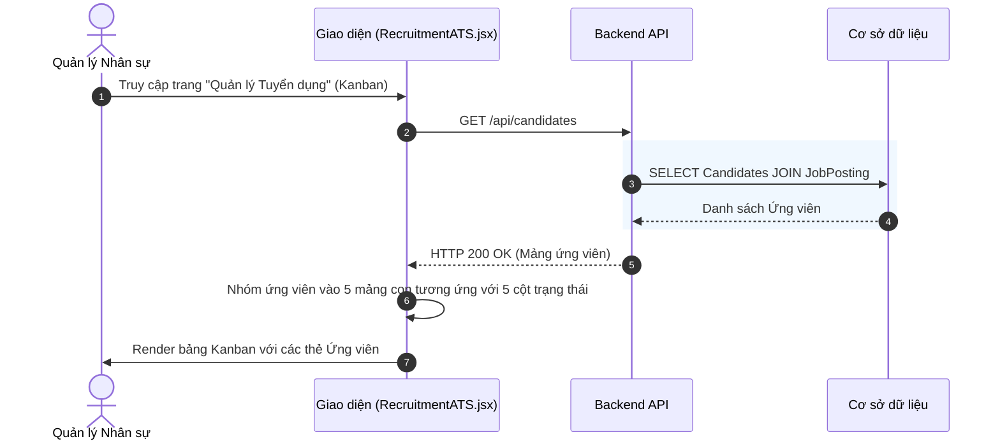
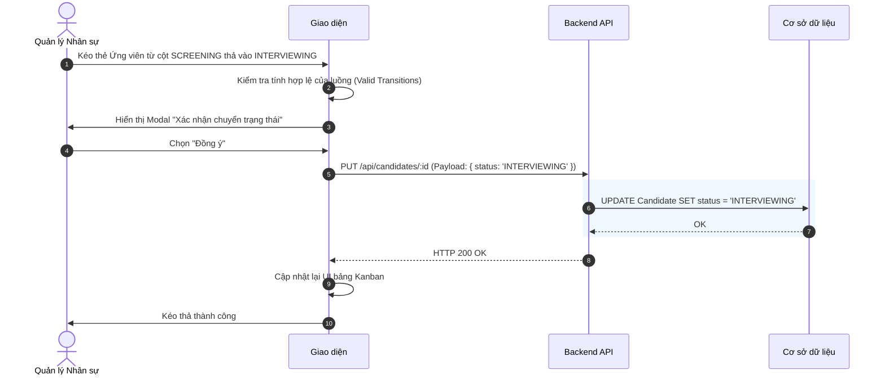
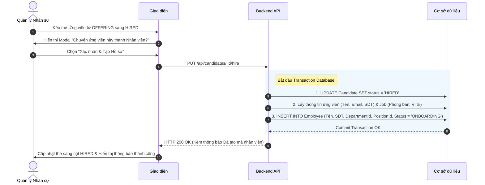

# Đặc tả chức năng: Quản lý Ứng viên bằng Kanban (ATS Board)

## 1. Giới thiệu chức năng
Chức năng cốt lõi của Module Tuyển dụng, cho phép Chuyên viên Tuyển dụng quản lý ứng viên qua một bảng Kanban kéo thả (Tương tự Trello). Mỗi cột tương ứng với một vòng trong phễu tuyển dụng.

## 2. Các quy tắc nghiệp vụ cốt lõi
- **Trạng thái luồng (Strict Pipeline):** Ứng viên phải đi theo luồng chuẩn: `SOURCED` -> `SCREENING` -> `INTERVIEWING` -> `OFFERING` -> `HIRED`. Không được phép kéo lùi lại các vòng trước (chỉ được loại bỏ - `REJECTED`).
- **Auto-provisioning Employee:** Đây là tính năng chuyển đổi dữ liệu trọng tâm. Ngay khi ứng viên được kéo vào trạng thái `HIRED`, hệ thống sẽ kích hoạt một Trigger chạy ngầm để sinh ra Hồ sơ Nhân viên (Core HR) mới, triệt tiêu hoàn toàn thao tác gõ lại dữ liệu bằng tay.

## 3. Sơ đồ luồng chi tiết (Sequence Diagrams)

### 3.1. Luồng Xem bảng Kanban ATS
Hiển thị các ứng viên theo từng cột trạng thái.

### 3.2. Luồng Kéo thả thẻ (Chuyển trạng thái Ứng viên bình thường)
Dành cho việc chuyển ứng viên qua các vòng từ SOURCED đến OFFERING.

### 3.3. Luồng Xác nhận HIRED (Tự động tạo Hồ sơ Nhân sự)
Giai đoạn cuối cùng của phễu. Khi ứng viên nhận việc, hệ thống tự động đẩy dữ liệu sang Module Tổ chức & Nhân sự.

