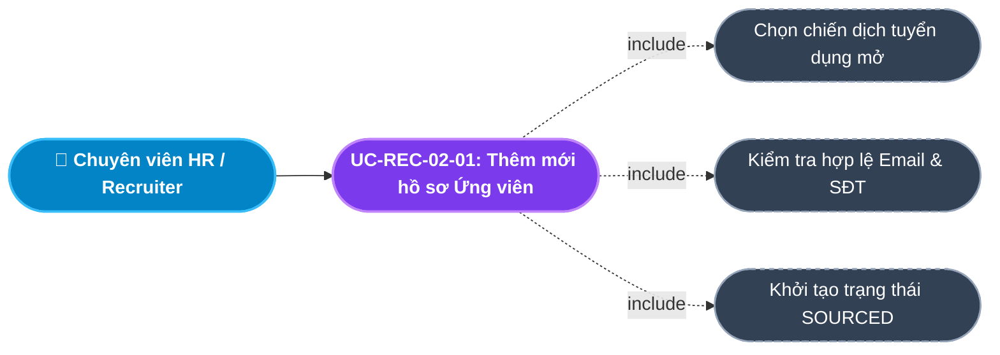
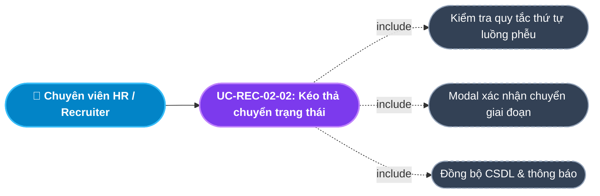
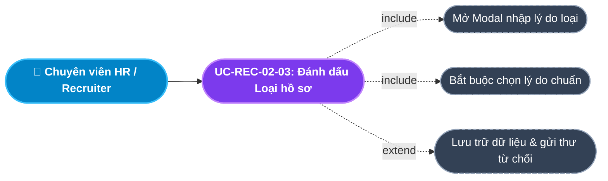
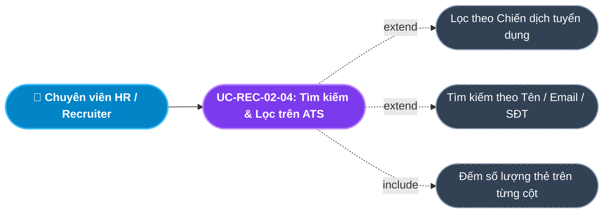
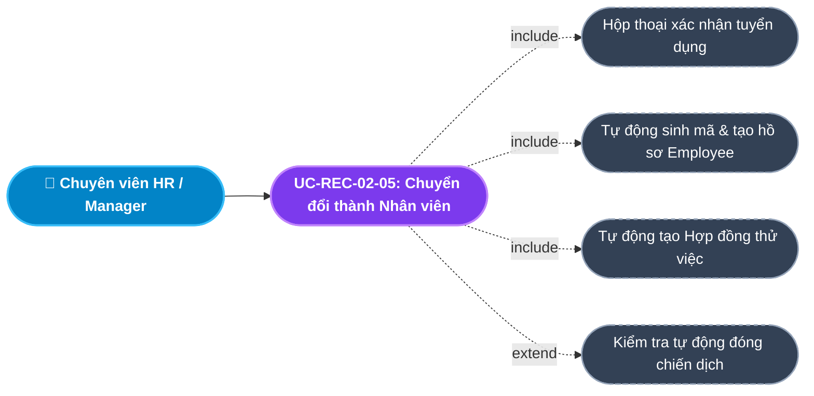
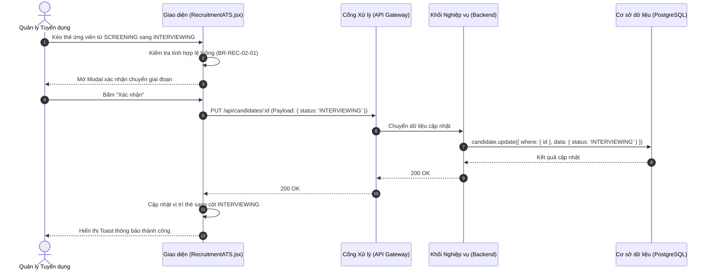
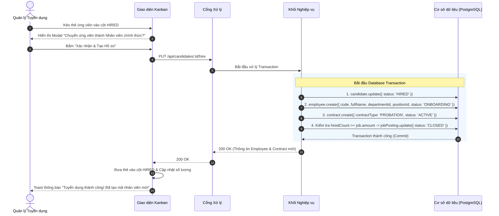

# Usecase: UC-REC-02 - Hệ thống Theo dõi Ứng viên ATS Kanban (Applicant Tracking System)

## 1. Giới thiệu chức năng
- **Mục đích**: Cung cấp giao diện trực quan dạng bảng Kanban tương tác kéo-thả (Drag & Drop) để Chuyên viên Tuyển dụng và Quản lý theo dõi luồng di chuyển của toàn bộ hồ sơ ứng viên qua từng giai đoạn trong phễu tuyển dụng. Đỉnh cao của chức năng là cơ chế **Auto-provisioning**: Tự động chuyển đổi ứng viên trúng tuyển thành Hồ sơ Nhân sự chính thức (Core HR) chỉ bằng 1 thao tác kéo thẻ, loại bỏ hoàn toàn thao tác nhập liệu thủ công dư thừa.
- **Actor (Tác nhân)**: Chuyên viên Tuyển dụng (Recruiter), Trưởng bộ phận phỏng vấn (Interviewer/Manager), Trưởng phòng Nhân sự (HR Manager), Quản trị viên (Admin).
- **Điều kiện tiên quyết**: Người dùng đã đăng nhập và được cấp quyền `MANAGE_RECRUITMENT` hoặc vai trò `ADMIN` / `HR_MANAGER` / `RECRUITER`.

### Danh mục các chức năng con (Sub-features):
1. **UC-REC-02-01: Tiếp nhận & Thêm mới hồ sơ Ứng viên (Source / Add Candidate)**: Thêm ứng viên mới vào hệ thống (thủ công hoặc qua CV nộp).
2. **UC-REC-02-02: Kéo thả chuyển trạng thái ứng viên (Kanban Stage Transition)**: Di chuyển thẻ ứng viên qua các cột trong phễu tuyển dụng chuẩn 5 giai đoạn.
3. **UC-REC-02-03: Đánh dấu Loại hồ sơ ứng viên (Reject Candidate)**: Đưa ứng viên không đạt vào danh sách loại kèm theo lý do cụ thể.
4. **UC-REC-02-04: Tìm kiếm & Lọc hồ sơ ứng viên trên Kanban (Search & Filter ATS)**: Lọc ứng viên theo chiến dịch tuyển dụng, tìm kiếm theo tên hoặc email.
5. **UC-REC-02-05: Chuyển đổi Ứng viên thành Nhân viên (Auto-provision Employee)**: Kéo thẻ vào cột `HIRED`, hệ thống tự động sinh mã nhân viên, tạo hồ sơ nhân sự và hợp đồng thử việc.

---

## 2. Dữ liệu nghiệp vụ đầu vào (Input Data & Parameters)

### 2.1. Biểu mẫu Thông tin Ứng viên (Candidate Form Data)
| Tên trường | Kiểu dữ liệu | Tính chất | Ý nghĩa nghiệp vụ & Ràng buộc |
|---|---|---|---|
| `Họ và tên` (name) | Chuỗi (String) | Bắt buộc | Họ tên đầy đủ của ứng viên (Tối đa 100 ký tự). |
| `Địa chỉ Email` (email) | Chuỗi (String) | Bắt buộc | Email liên hệ cá nhân (Định dạng RFC chuẩn, duy nhất theo từng chiến dịch). |
| `Số điện thoại` (phone) | Chuỗi (String) | Bắt buộc | Số điện thoại liên lạc (10 số, đầu số hợp lệ tại Việt Nam). |
| `Chiến dịch ứng tuyển` (jobPostingId) | UUID / Chuỗi | Bắt buộc | Chiến dịch tuyển dụng đang mở mà ứng viên ứng tuyển vào. |
| `Đường dẫn CV / Hồ sơ` (cvUrl) | Chuỗi / URL | Tùy chọn | Đường link dẫn đến file CV (PDF, DOCX) lưu trữ trên Cloud / Server. |
| `Giai đoạn tuyển dụng` (status) | Enum/String | Mặc định | `SOURCED`, `SCREENING`, `INTERVIEWING`, `OFFERING`, `HIRED`, `REJECTED`. |
| `Ghi chú / Đánh giá sơ bộ` (notes) | Văn bản (Text) | Tùy chọn | Nhận xét ban đầu của HR về kinh nghiệm, bằng cấp và mức độ phù hợp. |

### 2.2. Các giai đoạn trong Phễu Tuyển dụng (Kanban Pipeline Stages)
| Giai đoạn (Stage) | Tên tiếng Việt | Mục đích nghiệp vụ |
|---|---|---|
| `SOURCED` | Nguồn CV / Mới nộp | Tiếp nhận hồ sơ mới từ các kênh (Website, LinkedIn, giới thiệu). |
| `SCREENING` | Sàng lọc sơ bộ | HR liên hệ kiểm tra thông tin, phỏng vấn nhanh qua điện thoại (Phone screen). |
| `INTERVIEWING` | Phỏng vấn chuyên môn | Phỏng vấn trực tiếp hoặc online cùng Trưởng bộ phận chuyên môn. |
| `OFFERING` | Đề nghị nhận việc | Gửi thư mời nhận việc (Job Offer), đàm phán lương thưởng và ngày bắt đầu. |
| `HIRED` | Đã nhận việc | Ứng viên đồng ý đi làm, kích hoạt chuyển đổi sang Hồ sơ Nhân viên (Core HR). |
| `REJECTED` | Từ chối / Loại | Ứng viên không đạt yêu cầu ở bất kỳ vòng nào (Kèm lý do). |

---

## 3. Quy tắc nghiệp vụ (Business Rules)

| Mã Quy tắc | Tình huống nghiệp vụ | Cách hệ thống xử lý | Thông báo hiển thị |
|---|---|---|---|
| **BR-REC-02-01** | **Ràng buộc luồng chuyển trạng thái (Strict Pipeline)**: Kéo lùi thẻ ứng viên từ vòng sau về vòng trước (VD: Từ `INTERVIEWING` lùi về `SOURCED`). | Chặn thao tác kéo lùi. Chỉ cho phép tiến về phía trước theo thứ tự hoặc chuyển sang `REJECTED`. | "Không được phép di chuyển hồ sơ lùi lại giai đoạn trước" |
| **BR-REC-02-02** | **Kích hoạt tự động tạo Nhân viên (Auto-provisioning)**: Thẻ ứng viên được kéo vào cột `HIRED`. | Mở Modal xác nhận. Khi HR bấm đồng ý $\rightarrow$ Chạy ngầm Transaction DB: Tạo bản ghi `Employee` mới, gán `departmentId`, `positionId` từ Job, tạo `Contract` thử việc, gán `status = 'ONBOARDING'`. | "Hệ thống đã tự động tạo Hồ sơ Nhân sự cho ứng viên [TÊN]" |
| **BR-REC-02-03** | **Bắt buộc lý do khi Loại ứng viên**: HR chuyển ứng viên sang trạng thái `REJECTED`. | Mở Popup bắt buộc chọn Lý do loại (Chuyên môn không đạt, Mức lương không thỏa thuận được, Không phản hồi...). | "Vui lòng nhập lý do từ chối ứng viên" |
| **BR-REC-02-04** | **Tự động đóng chiến dịch khi đủ quân số**: Ứng viên cuối cùng chuyển sang `HIRED` làm số người trúng tuyển đạt chỉ tiêu chiến dịch. | Kiểm tra `hiredCount >= job.amount` $\rightarrow$ Tự động chuyển chiến dịch tương ứng sang trạng thái `CLOSED`. | "Chiến dịch đã đủ chỉ tiêu và tự động đóng tuyển dụng" |
| **BR-REC-02-05** | **Ràng buộc xóa ứng viên**: HR bấm xóa một hồ sơ ứng viên khỏi hệ thống. | Chỉ cho phép xóa khi ứng viên đang ở trạng thái `SOURCED` hoặc `REJECTED`. Ứng viên đã có lịch phỏng vấn hoặc Offer phải hủy các liên kết trước. | "Không thể xóa hồ sơ ứng viên đang trong quá trình đánh giá" |

---

## 4. Đặc tả chi tiết các Use Case chức năng con (Sub-Use Cases Specification)

---

### 4.1. UC-REC-02-01: Tiếp nhận & Thêm mới hồ sơ Ứng viên (Source / Add Candidate)

#### Sơ đồ Use Case:

#### Bảng đặc tả nghiệp vụ:

| STT | Hạng mục | Nội dung chi tiết |
|:---:|---|---|
| **1** | **Thông tin chung** | - **UC ID**: `UC-REC-02-01` - **UC Name**: Tiếp nhận & Thêm mới hồ sơ Ứng viên (Source / Add Candidate) - **Actor**: Chuyên viên Tuyển dụng (Recruiter), Quản lý Nhân sự - **Mục tiêu**: Đưa thông tin ứng viên mới vào hệ thống quản lý phễu tuyển dụng để bắt đầu quy trình đánh giá. - **Mô tả**: Người dùng nhập thông tin cá nhân của ứng viên (Tên, Email, SĐT, Link CV) và chỉ định chiến dịch tuyển dụng tương ứng. - **Priority**: High (Bắt buộc) |
| **2** | **Trigger** | Người dùng nhấn nút **"+ Thêm ứng viên"** trên thanh công cụ của màn hình Quản lý Tuyển dụng (ATS). |
| **3** | **Pre-condition** | 1. Có quyền quản lý tuyển dụng. 2. Đang có ít nhất 01 chiến dịch tuyển dụng ở trạng thái `PUBLISHED`. |
| **4** | **Post-condition** | 1. Bản ghi ứng viên mới được thêm vào CSDL với trạng thái `SOURCED`. 2. Thẻ ứng viên xuất hiện ngay ở cột đầu tiên (`SOURCED`) trên bảng Kanban. 3. Ghi nhận Audit Log hệ thống. |
| **5** | **Main Flow** | 1. Người dùng nhấn nút **"+ Thêm ứng viên"**. 2. Hệ thống hiển thị Modal Form *Thêm mới Ứng viên*, nạp danh sách các chiến dịch tuyển dụng đang mở. 3. Người dùng chọn Chiến dịch ứng tuyển (`Job Posting`). 4. Người dùng nhập: Họ và tên, Email, Số điện thoại, Link CV và Ghi chú. 5. Người dùng nhấn nút **"Lưu hồ sơ"**. 6. Giao diện kiểm tra định dạng email và số điện thoại. 7. Gửi request `POST /api/candidates` kèm payload dữ liệu. 8. Backend tạo bản ghi với `status = 'SOURCED'`, trả về `HTTP 201 Created`. 9. Giao diện đóng Modal, nạp lại danh sách và hiển thị thẻ mới trên cột SOURCED. |
| **6** | **Alternative / Exception Flow** | - **AF-01 (Ứng viên tự ứng tuyển)**: Ứng viên nộp CV qua Cổng tuyển dụng công khai $\rightarrow$ Hệ thống tự động gọi API này tạo bản ghi `SOURCED` mà không cần HR nhập tay. - **EF-01 (Sai định dạng Email / SĐT)**: Nhập email không hợp lệ hoặc SĐT không đủ 10 số $\rightarrow$ Báo lỗi *"Email hoặc Số điện thoại không đúng định dạng!"*. - **EF-02 (Chiến dịch đã đóng)**: Chiến dịch được chọn vừa bị đóng bởi người khác $\rightarrow$ Báo lỗi *"Chiến dịch tuyển dụng đã đóng, không thể tiếp nhận thêm hồ sơ!"*. |
| **7** | **Business Rules & Validation** | - `name`: Bắt buộc, chuỗi 1-100 ký tự. - `email`: Bắt buộc, định dạng email chuẩn. - `phone`: Bắt buộc, 10 chữ số hợp lệ. - `jobPostingId`: Bắt buộc, phải là ID của chiến dịch đang `PUBLISHED`. - Trạng thái khởi tạo luôn là `SOURCED`. |
| **8** | **Acceptance Criteria** | - **AC-01**: Bấm "+ Thêm ứng viên" hiển thị đúng danh sách chiến dịch đang mở. - **AC-02**: Nhập sai định dạng email hoặc SĐT $\rightarrow$ Hệ thống chặn lại và báo lỗi chi tiết. - **AC-03**: Thêm thành công $\rightarrow$ Thẻ ứng viên xuất hiện ngay lập tức ở cột SOURCED trên bảng Kanban. |

---

### 4.2. UC-REC-02-02: Kéo thả chuyển trạng thái ứng viên (Kanban Stage Transition)

#### Sơ đồ Use Case:

#### Bảng đặc tả nghiệp vụ:

| STT | Hạng mục | Nội dung chi tiết |
|:---:|---|---|
| **1** | **Thông tin chung** | - **UC ID**: `UC-REC-02-02` - **UC Name**: Kéo thả chuyển trạng thái ứng viên (Kanban Stage Transition) - **Actor**: Chuyên viên Tuyển dụng, Quản lý Nhân sự - **Mục tiêu**: Cập nhật tiến độ của ứng viên qua từng vòng đánh giá (Sàng lọc, Phỏng vấn, Đề nghị nhận việc) một cách trực quan, nhanh chóng. - **Mô tả**: Người dùng kéo thẻ ứng viên từ cột hiện tại và thả sang cột tiếp theo trên bảng Kanban. - **Priority**: High (Tính năng cốt lõi) |
| **2** | **Trigger** | Người dùng thực hiện thao tác kéo (Drag) thẻ ứng viên và thả (Drop) vào một cột trạng thái khác. |
| **3** | **Pre-condition** | 1. Có quyền quản lý tuyển dụng. 2. Thẻ ứng viên đang hiển thị trên bảng Kanban. |
| **4** | **Post-condition** | 1. Trạng thái ứng viên trong CSDL được cập nhật theo cột mới. 2. Thẻ ứng viên chuyển sang nằm ở vị trí mới trên giao diện. 3. Ghi nhận Audit Log: Thời gian, Actor, chuyển đổi trạng thái cũ $\rightarrow$ mới. |
| **5** | **Main Flow** | 1. Người dùng kéo thẻ ứng viên từ cột hiện tại (ví dụ: `SOURCED`) sang cột tiếp theo (ví dụ: `SCREENING`). 2. Hệ thống kiểm tra quy tắc thứ tự luồng phễu (`BR-REC-02-01`). 3. Hệ thống hiển thị hộp thoại xác nhận: *"Xác nhận chuyển ứng viên [TÊN] sang giai đoạn [TÊN VÒNG]?"*. 4. Người dùng bấm **"Xác nhận"**. 5. Giao diện gửi request `PUT /api/candidates/:id` với `{ status: newStatus }`. 6. Backend cập nhật trường `status` trong CSDL và trả về `HTTP 200 OK`. 7. Giao diện cập nhật vị trí thẻ trên cột mới và hiển thị Toast thông báo: *"Chuyển giai đoạn ứng viên thành công"*. |
| **6** | **Alternative / Exception Flow** | - **AF-01 (Kéo sang HIRED)**: Nếu kéo vào cột `HIRED` $\rightarrow$ Tự động chuyển tiếp sang luồng `UC-REC-02-05` (Auto-provisioning Employee). - **EF-01 (Vi phạm thứ tự luồng phễu)**: Người dùng cố tình kéo lùi thẻ về cột trước $\rightarrow$ Hệ thống trả thẻ về vị trí cũ và cảnh báo: *"Không được phép chuyển hồ sơ lùi lại vòng trước!"*. - **EF-02 (Lỗi kết nối server)**: Mất kết nối server $\rightarrow$ Trả thẻ về cột ban đầu và báo lỗi *"Không thể cập nhật trạng thái. Vui lòng thử lại sau"*. |
| **7** | **Business Rules & Validation** | - `BR-REC-02-01`: Thứ tự hợp lệ: `SOURCED` $\rightarrow$ `SCREENING` $\rightarrow$ `INTERVIEWING` $\rightarrow$ `OFFERING` $\rightarrow$ `HIRED`. Không được nhảy cóc hoặc kéo lùi. - Trạng thái chỉ được phép nhận các giá trị Enum hợp lệ. |
| **8** | **Acceptance Criteria** | - **AC-01**: Kéo thả mượt mà, phản hồi giao diện tức thì (< 16ms). - **AC-02**: Kéo lùi thẻ về vòng trước $\rightarrow$ Hệ thống tự động chặn và đưa thẻ về vị trí ban đầu. - **AC-03**: Xác nhận chuyển vòng $\rightarrow$ CSDL cập nhật chính xác và Toast thông báo hiển thị. |

---

### 4.3. UC-REC-02-03: Đánh dấu Loại hồ sơ ứng viên (Reject Candidate)

#### Sơ đồ Use Case:

#### Bảng đặc tả nghiệp vụ:

| STT | Hạng mục | Nội dung chi tiết |
|:---:|---|---|
| **1** | **Thông tin chung** | - **UC ID**: `UC-REC-02-03` - **UC Name**: Đánh dấu Loại hồ sơ ứng viên (Reject Candidate) - **Actor**: Chuyên viên Tuyển dụng, Quản lý Nhân sự - **Mục tiêu**: Loại bỏ ứng viên không phù hợp khỏi phễu tuyển dụng đang chạy và ghi nhận lý do để phục vụ báo cáo chất lượng tuyển dụng. - **Mô tả**: Người dùng bấm nút "Từ chối / Loại" tại thẻ ứng viên, chọn lý do loại và chuyển trạng thái sang `REJECTED`. - **Priority**: High |
| **2** | **Trigger** | Người dùng nhấn nút **"Từ chối" (Reject)** trên thẻ ứng viên hoặc kéo thẻ vào vùng Loại hồ sơ. |
| **3** | **Pre-condition** | 1. Có quyền quản lý tuyển dụng. 2. Ứng viên chưa ở trạng thái `HIRED`. |
| **4** | **Post-condition** | 1. Trạng thái ứng viên đổi thành `REJECTED` trong CSDL kèm lý do loại. 2. Thẻ ứng viên biến mất khỏi phễu Kanban đang hoạt động (chuyển vào danh sách lưu trữ Đã loại). 3. Ghi nhận Audit Log hệ thống. |
| **5** | **Main Flow** | 1. Người dùng nhấn nút **"Từ chối / Loại"** tại thẻ ứng viên cần loại. 2. Hệ thống hiển thị Modal *Xác nhận Từ chối Ứng viên*. 3. Người dùng chọn Lý do loại từ danh mục (Không đủ kinh nghiệm, Mức lương kỳ vọng quá cao, Không đạt bài test, Không phản hồi...). 4. Người dùng nhập thêm ghi chú chi tiết (tùy chọn) và bấm **"Xác nhận loại"**. 5. Giao diện gửi request `PUT /api/candidates/:id` với `{ status: 'REJECTED', rejectReason: reason }`. 6. Backend cập nhật bản ghi trong CSDL và trả về `HTTP 200 OK`. 7. Giao diện loại bỏ thẻ ứng viên khỏi bảng Kanban và hiển thị Toast thông báo: *"Đã chuyển ứng viên vào danh sách từ chối"*. |
| **6** | **Alternative / Exception Flow** | - **AF-01 (Hủy thao tác)**: Nhấn "Hủy" $\rightarrow$ Đóng modal, giữ nguyên trạng thái ứng viên. - **EF-01 (Chưa chọn lý do)**: Bấm lưu khi chưa chọn lý do $\rightarrow$ Cảnh báo: *"Vui lòng chọn lý do từ chối ứng viên!"* (`BR-REC-02-03`). |
| **7** | **Business Rules & Validation** | - `BR-REC-02-03`: Bắt buộc phải có lý do loại khi chuyển sang `REJECTED`. - Ứng viên bị loại không được phép xóa vật lý (Hard Delete) để phục vụ tra cứu lịch sử khi ứng viên nộp lại trong tương lai. |
| **8** | **Acceptance Criteria** | - **AC-01**: Bấm Từ chối phải hiển thị Modal chọn lý do rõ ràng. - **AC-02**: Bỏ trống lý do và bấm xác nhận $\rightarrow$ Hệ thống chặn lại và báo lỗi. - **AC-03**: Xác nhận thành công $\rightarrow$ Thẻ ứng viên biến mất khỏi cột Kanban và CSDL cập nhật trạng thái `REJECTED`. |

---

### 4.4. UC-REC-02-04: Tìm kiếm & Lọc hồ sơ ứng viên trên Kanban (Search & Filter ATS)

#### Sơ đồ Use Case:

#### Bảng đặc tả nghiệp vụ:

| STT | Hạng mục | Nội dung chi tiết |
|:---:|---|---|
| **1** | **Thông tin chung** | - **UC ID**: `UC-REC-02-04` - **UC Name**: Tìm kiếm & Lọc hồ sơ ứng viên trên Kanban (Search & Filter ATS) - **Actor**: Toàn bộ người dùng có quyền xem tuyển dụng (HR, Quản lý, Admin) - **Mục tiêu**: Tra cứu nhanh hồ sơ ứng viên và lọc bảng Kanban theo từng chiến dịch tuyển dụng cụ thể để làm việc tập trung. - **Mô tả**: Lọc danh sách theo Dropdown chiến dịch tuyển dụng, tìm kiếm tức thì theo tên hoặc email của ứng viên. - **Priority**: High |
| **2** | **Trigger** | Người dùng chọn một chiến dịch trong Dropdown hoặc gõ từ khóa vào ô tìm kiếm trên thanh công cụ ATS. |
| **3** | **Pre-condition** | 1. Đang ở màn hình Quản lý Tuyển dụng (ATS Kanban). 2. Dữ liệu ứng viên đã được tải về Client. |
| **4** | **Post-condition** | 1. Bảng Kanban chỉ hiển thị các thẻ ứng viên khớp với chiến dịch và từ khóa tìm kiếm. 2. Tiêu đề các cột Kanban cập nhật số lượng thẻ tương ứng (ví dụ: `PHỎNG VẤN (3)`). |
| **5** | **Main Flow** | 1. Người dùng chọn chiến dịch trong Dropdown `Chọn chiến dịch tuyển dụng` (ví dụ: `"Senior ReactJS"`). 2. Người dùng nhập tên ứng viên vào ô `Tìm ứng viên...` (ví dụ: `"Nguyễn Văn A"`). 3. Hệ thống áp dụng lọc kết hợp: `matchJob = (selectedJob === '' || jobPostingId === selectedJob)` `matchKeyword = name.toLowerCase().includes(term) || email.toLowerCase().includes(term)` `filteredCandidates = candidates.filter(matchJob && matchKeyword)`. 4. Phân chia danh sách vào 5 mảng tương ứng với 5 cột trạng thái. 5. Cập nhật Badge đếm số lượng trên đỉnh mỗi cột. 6. Kết xuất lại bảng Kanban trong vòng < 16ms. |
| **6** | **Alternative / Exception Flow** | - **AF-01 (Xem tất cả chiến dịch)**: Chọn "Tất cả chiến dịch" $\rightarrow$ Hiển thị toàn bộ ứng viên đang có trong hệ thống. - **AF-02 (Cột rỗng)**: Cột nào không có ứng viên phù hợp $\rightarrow$ Hiển thị ô trống mờ thân thiện (Empty column). |
| **7** | **Business Rules & Validation** | - Tìm kiếm không phân biệt hoa thường (Case-insensitive). - Không reload lại trang khi lọc (Client-side filtering tức thì). |
| **8** | **Acceptance Criteria** | - **AC-01**: Chọn chiến dịch A $\rightarrow$ Toàn bộ thẻ thuộc chiến dịch khác biến mất ngay lập tức. - **AC-02**: Nhập từ khóa tên $\rightarrow$ Thẻ hiển thị lọc đúng theo tên trong thời gian thực. - **AC-03**: Số lượng đếm trên đầu mỗi cột luôn bằng đúng số thẻ hiển thị bên dưới. |

---

### 4.5. UC-REC-02-05: Chuyển đổi Ứng viên thành Nhân viên (Auto-provision Employee)

#### Sơ đồ Use Case:

#### Bảng đặc tả nghiệp vụ:

| STT | Hạng mục | Nội dung chi tiết |
|:---:|---|---|
| **1** | **Thông tin chung** | - **UC ID**: `UC-REC-02-05` - **UC Name**: Chuyển đổi Ứng viên thành Nhân viên (Auto-provision Employee) - **Actor**: Trưởng phòng Nhân sự (HR Manager), Recruiter có thẩm quyền - **Mục tiêu**: Tự động hóa hoàn toàn việc tạo mới Hồ sơ Nhân viên (Module Core HR) và Hợp đồng thử việc khi ứng viên trúng tuyển, triệt tiêu 100% việc nhập liệu thủ công lặp lại. - **Mô tả**: Khi kéo ứng viên sang cột `HIRED`, hệ thống chạy một Transaction CSDL tự động ánh xạ thông tin sang bảng Nhân viên và bảng Hợp đồng. - **Priority**: High (Tính năng tinh hoa Enterprise) |
| **2** | **Trigger** | Người dùng kéo thẻ ứng viên từ cột `OFFERING` và thả vào cột `HIRED`. |
| **3** | **Pre-condition** | 1. Có quyền quản lý tuyển dụng và nhân sự. 2. Ứng viên đang ở trạng thái `OFFERING` (Đã có thỏa thuận nhận việc). |
| **4** | **Post-condition** | 1. Trạng thái ứng viên đổi thành `HIRED`. 2. Bản ghi `Employee` mới được tạo tại Module Hồ sơ với trạng thái `ONBOARDING`. 3. Bản ghi `Contract` thử việc mới được tạo liên kết với nhân viên đó. 4. Tự động đóng chiến dịch nếu đã đủ số lượng tuyển (`BR-REC-02-04`). 5. Ghi nhận Audit Log chuyển đổi dữ liệu. |
| **5** | **Main Flow** | 1. Người dùng kéo thẻ ứng viên thả vào cột **HIRED**. 2. Hệ thống hiển thị Modal xác nhận: *"Xác nhận tuyển dụng ứng viên [TÊN]? Hệ thống sẽ tự động tạo Hồ sơ Nhân sự và Hợp đồng thử việc."*. 3. Người dùng nhấn nút **"Xác nhận & Tạo Hồ sơ"**. 4. Giao diện gửi request `PUT /api/candidates/:id/hire`. 5. Backend mở một Database Transaction (`$transaction`): - Bước 5.1: Cập nhật Candidate `status = 'HIRED'`. - Bước 5.2: Tự động sinh mã nhân viên mới (`EMPxxxx`). - Bước 5.3: Tạo bản ghi `Employee` với thông tin lấy từ Candidate và Vị trí/Phòng ban lấy từ Job. - Bước 5.4: Tạo bản ghi `Contract` loại `PROBATION` (Thử việc). - Bước 5.5: Đếm số lượng đã tuyển, nếu `hiredCount >= job.amount` $\rightarrow$ Đổi Job sang `CLOSED`. 6. Backend commit Transaction và trả về `HTTP 200 OK` kèm thông tin nhân viên mới. 7. Giao diện đưa thẻ vào cột HIRED và hiển thị Toast thông báo thành công: *"Tuyển dụng thành công! Đã tạo hồ sơ cho nhân viên [MÃ NV]"*. |
| **6** | **Alternative / Exception Flow** | - **AF-01 (Hủy bỏ)**: Người dùng bấm "Hủy" $\rightarrow$ Thẻ trả về cột OFFERING, không sinh dữ liệu nhân sự. - **EF-01 (Lỗi Transaction)**: Lỗi CSDL trong quá trình tạo Employee $\rightarrow$ Backend Rollback toàn bộ Transaction, giữ nguyên trạng thái ứng viên và hiển thị cảnh báo lỗi: *"Có lỗi xảy ra trong quá trình tạo hồ sơ nhân viên. Dữ liệu đã được hoàn tác!"*. |
| **7** | **Business Rules & Validation** | - `BR-REC-02-02`: Đảm bảo tính nguyên tố (Atomic) qua Database Transaction: Nếu lỗi tạo Employee thì không đổi trạng thái Candidate. - `BR-REC-02-04`: Tự động đóng chiến dịch khi đủ chỉ tiêu tuyển dụng. - Trạng thái khởi tạo của nhân viên mới luôn là `ONBOARDING`. |
| **8** | **Acceptance Criteria** | - **AC-01**: Kéo thẻ vào cột HIRED bắt buộc phải hiển thị Modal xác nhận có ghi rõ hành động tự động tạo hồ sơ. - **AC-02**: Bấm xác nhận $\rightarrow$ Hồ sơ nhân viên mới lập tức xuất hiện bên màn hình Danh sách Nhân viên (Core HR) mà không cần F5. - **AC-03**: Nếu chiến dịch đã đủ quân số $\rightarrow$ Tự động chuyển chiến dịch sang trạng thái `CLOSED`. |

---

## 5. Sơ đồ tuần tự nghiệp vụ (Sequence Diagrams)

### 5.1. Sơ đồ: Kéo thả chuyển trạng thái ứng viên trên Kanban

### 5.2. Sơ đồ: Tuyển dụng & Tự động tạo Hồ sơ Nhân sự (Auto-provisioning Transaction)

---

## 6. Kịch bản kiểm thử & Nghiệm thu (Test Scenarios)

### Kịch bản 1: Kéo thả tuần tự qua các vòng phễu tuyển dụng
- **Given**: Ứng viên `Trần Thị B` đang ở cột `SCREENING`.
- **When**: HR kéo thẻ của ứng viên này sang cột `INTERVIEWING` và bấm xác nhận.
- **Then**: Thẻ chuyển sang cột `INTERVIEWING`, CSDL cập nhật `status = 'INTERVIEWING'`.

### Kịch bản 2: Ngăn chặn kéo lùi thẻ về vòng trước
- **Given**: Ứng viên đang ở cột `OFFERING`.
- **When**: HR kéo thẻ lùi về cột `SOURCED`.
- **Then**: Hệ thống từ chối chuyển, đưa thẻ về vị trí cũ và hiển thị cảnh báo: *"Không được phép di chuyển hồ sơ lùi lại giai đoạn trước"*.

### Kịch bản 3: Tự động tạo Nhân viên khi chuyển sang HIRED
- **Given**: Ứng viên `Lê Văn C` ứng tuyển vị trí `Backend Developer` phòng `Công nghệ`.
- **When**: HR kéo thẻ của ứng viên này vào cột `HIRED` và bấm "Xác nhận & Tạo Hồ sơ".
- **Then**: Hệ thống tạo thành công bản ghi `Employee` mới mang tên `Lê Văn C`, đúng phòng Công nghệ và vị trí Backend Developer, trạng thái là `ONBOARDING`. Hợp đồng thử việc tự động được kích hoạt.
