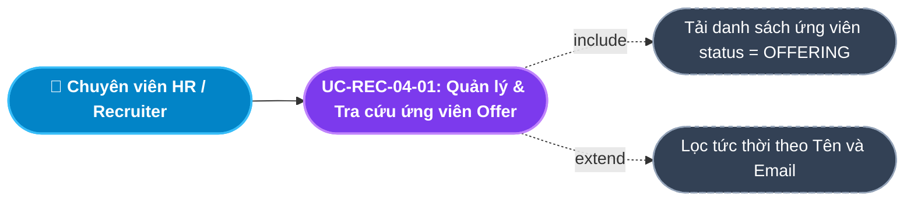
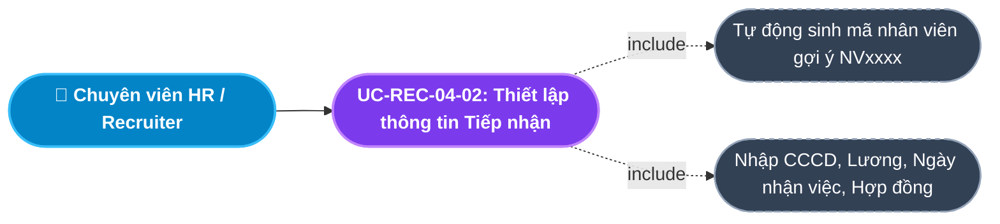
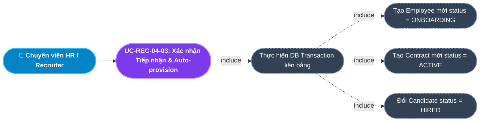
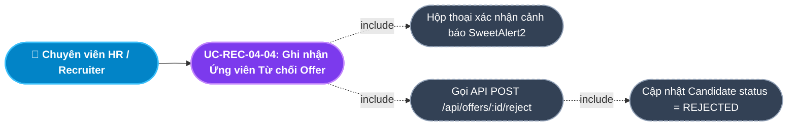
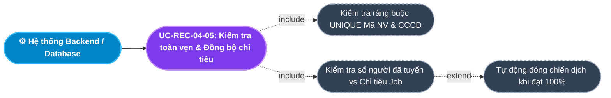
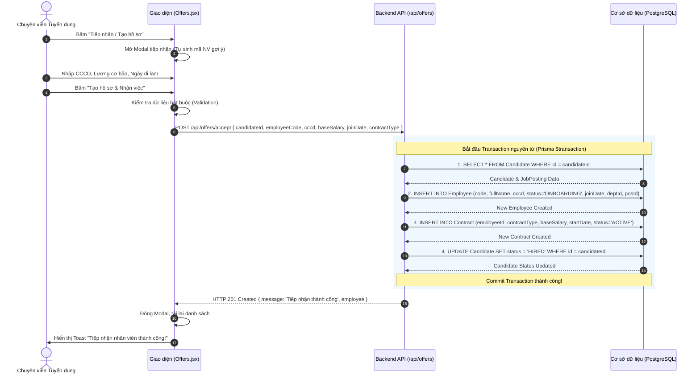
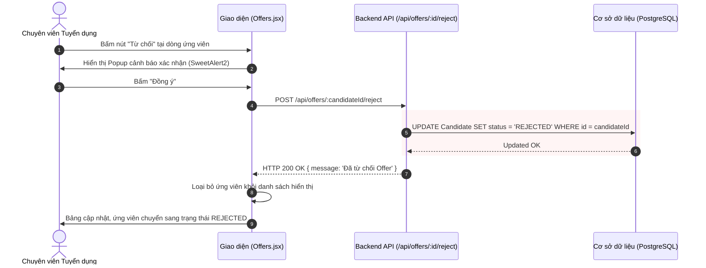

# Usecase: UC-REC-04 - Quản lý Đề nghị nhận việc và Tiếp nhận Nhân sự (Job Offer & Onboarding Provisioning)

## 1. Giới thiệu chức năng
- **Mục đích**: Quản lý giai đoạn kết thúc của quy trình tuyển dụng: Chốt điều kiện tuyển dụng với ứng viên (Mã nhân viên, CCCD, Lương cơ bản, Loại hợp đồng, Ngày nhận việc) và thực hiện **Tiếp nhận nhân sự (Onboarding)**. Khi ứng viên đồng ý nhận việc, hệ thống thực hiện một chu trình cơ sở dữ liệu nguyên tử (Database Transaction) tự động khởi tạo Hồ sơ Nhân viên (`Employee`), tạo Hợp đồng lao động (`Contract`), cập nhật trạng thái ứng viên thành `HIRED` và đồng bộ chỉ tiêu tuyển dụng vào Module Tổ chức.
- **Actor (Tác nhân)**: Chuyên viên Tuyển dụng (Recruiter), Trưởng phòng Nhân sự (HR Manager), Quản trị viên (Admin).
- **Điều kiện tiên quyết**: Người dùng đã đăng nhập và được cấp quyền quản lý tuyển dụng hoặc vai trò `ADMIN` / `HR_MANAGER`.

### Danh mục các chức năng con (Sub-features):
1. **UC-REC-04-01: Tra cứu & Quản lý danh sách ứng viên chờ Offer (View & Search Offering Candidates)**: Theo dõi danh sách ứng viên đã vượt qua vòng phỏng vấn và đang ở trạng thái `OFFERING`, hỗ trợ tìm kiếm tức thời theo tên hoặc email.
2. **UC-REC-04-02: Thiết lập thông tin Tiếp nhận & Hợp đồng (Prepare Onboarding Offer Terms)**: Nhập liệu các điều khoản tiếp nhận: Mã nhân viên, CCCD, Mức lương cơ bản, Loại hợp đồng (Thử việc/Chính thức) và Ngày bắt đầu làm việc.
3. **UC-REC-04-03: Xác nhận Tiếp nhận & Tự động tạo Nhân viên Core HR (Accept Offer & Auto-provision Employee)**: Thực hiện Transaction tự động sinh bản ghi Nhân viên mới (`ONBOARDING`), bản ghi Hợp đồng và đánh dấu ứng viên `HIRED`.
4. **UC-REC-04-04: Ghi nhận Ứng viên Từ chối Offer (Reject Offer)**: Cập nhật trạng thái ứng viên sang `REJECTED` khi ứng viên từ chối điều kiện làm việc hoặc không đến nhận việc.
5. **UC-REC-04-05: Kiểm tra toàn vẹn định danh & Chỉ tiêu tuyển dụng (Integrity & Headcount Synchronization)**: Ngăn chặn trùng lặp Mã NV / CCCD và tự động đóng chiến dịch tuyển dụng khi số người nhận việc đạt đủ chỉ tiêu ban đầu.

---

## 2. Dữ liệu nghiệp vụ đầu vào (Input Data & Parameters)

### 2.1. Biểu mẫu Tiếp nhận & Thiết lập Offer (Onboarding Terms Form)
| Tên trường | Kiểu dữ liệu | Tính chất | Ý nghĩa nghiệp vụ & Ràng buộc |
|---|---|---|---|
| `Mã ứng viên` (candidateId) | UUID / Chuỗi | Bắt buộc | ID định danh của ứng viên đang ở trạng thái `OFFERING`. |
| `Mã nhân viên mới` (employeeCode) | Chuỗi (String) | Bắt buộc | Định danh duy nhất cho nhân viên mới (VD: `NV0142`). Hệ thống tự động gợi ý ngẫu nhiên, cho phép sửa đổi thủ công. |
| `Số CCCD / CMND` (cccd) | Chuỗi (String) | Bắt buộc | Căn cước công dân của nhân viên mới (9 hoặc 12 số, duy nhất trong hệ thống). |
| `Mức lương cơ bản` (baseSalary) | Số (Number) | Bắt buộc | Mức lương thỏa thuận hàng tháng (VNĐ), tối thiểu lớn hơn 0 (VD: `15000000`). |
| `Loại hợp đồng` (contractType) | Enum/String | Bắt buộc | Loại hợp đồng ban đầu: `PROBATION` (Thử việc), `OFFICIAL` (Xác định thời hạn), `INDEFINITE` (Không thời hạn). Mặc định là `PROBATION`. |
| `Ngày nhận việc` (joinDate) | Ngày (Date) | Bắt buộc | Ngày đầu tiên nhân viên đến công ty làm việc (Định dạng `YYYY-MM-DD`). |

---

## 3. Quy tắc nghiệp vụ (Business Rules)

| Mã Quy tắc | Tình huống nghiệp vụ | Cách hệ thống xử lý | Thông báo hiển thị |
|---|---|---|---|
| **BR-REC-04-01** | **Điều kiện ứng viên được cấp Offer**: Truy cập danh sách Offer. | Chỉ những ứng viên đang ở trạng thái `OFFERING` mới xuất hiện trên giao diện. Các ứng viên ở trạng thái khác không được phép mở form tiếp nhận. | "Chỉ ứng viên ở giai đoạn Chốt Offer mới đủ điều kiện tạo hồ sơ!" |
| **BR-REC-04-02** | **Tính nguyên tử của Tiếp nhận (Onboarding Transaction)**: Bấm "Tạo hồ sơ & Nhận việc". | Chạy trong một Transaction DB duy nhất:  1. Kiểm tra tồn tại Candidate. 2. Tạo mới `Employee` (status `ONBOARDING`, kế thừa `departmentId`, `positionId` từ Job). 3. Tạo mới `Contract` (status `ACTIVE`, gắn với `employeeId`). 4. Cập nhật `Candidate.status = 'HIRED'`. Nếu bất kỳ bước nào lỗi $\rightarrow$ Rollback toàn bộ. | "Tiếp nhận nhân viên thành công!" |
| **BR-REC-04-03** | **Kiểm tra trùng lặp định danh (Uniqueness Validation)**: Trùng `employeeCode` hoặc `cccd`. | Backend bắt mã lỗi `P2002` từ Prisma và chặn giao dịch, trả về thông báo lỗi cụ thể cho người dùng. | "Mã nhân viên hoặc CCCD đã tồn tại trong hệ thống." |
| **BR-REC-04-04** | **Từ chối Offer (Offer Rejection)**: Ứng viên từ chối đi làm hoặc không phản hồi. | Yêu cầu xác nhận cảnh báo. Khi đồng ý $\rightarrow$ Cập nhật `Candidate.status = 'REJECTED'`, chuyển thẻ trên Kanban sang cột Từ chối và loại khỏi danh sách chờ Offer. | "Bạn có chắc chắn muốn Từ chối Offer của ứng viên này?" |
| **BR-REC-04-05** | **Khóa chỉnh sửa sau tiếp nhận (Immutability)**: Ứng viên đã trở thành `HIRED`. | Bản ghi ứng viên tự động rời khỏi màn hình Quản lý Offer. Mọi thông tin sau đó được quản lý tại Module Hồ sơ Nhân viên (Core HR). | "Ứng viên đã được tiếp nhận thành công sang Module Nhân sự." |

---

## 4. Đặc tả chi tiết các Use Case chức năng con (Sub-Use Cases Specification)

---

### 4.1. UC-REC-04-01: Tra cứu & Quản lý danh sách ứng viên chờ Offer (View & Search Offering Candidates)

#### Sơ đồ Use Case:

#### Bảng đặc tả nghiệp vụ:

| STT | Hạng mục | Nội dung chi tiết |
|:---:|---|---|
| **1** | **Thông tin chung** | - **UC ID**: `UC-REC-04-01` - **UC Name**: Tra cứu & Quản lý danh sách ứng viên chờ Offer (View & Search Offering Candidates) - **Actor**: Chuyên viên Tuyển dụng (Recruiter), Trưởng phòng Nhân sự - **Mục tiêu**: Theo dõi và tra cứu toàn bộ ứng viên đã vượt qua phỏng vấn và đang trong giai đoạn thương lượng/chờ ký nhận việc. - **Mô tả**: Hiển thị bảng danh sách ứng viên `OFFERING` cùng thông tin vị trí, phòng ban ứng tuyển, và thanh tìm kiếm tức thời theo tên hoặc email. - **Priority**: High |
| **2** | **Trigger** | Người dùng truy cập menu **"Quản lý Offer"** (`/internal/recruitment/offers`). |
| **3** | **Pre-condition** | Người dùng đã đăng nhập với vai trò có quyền quản lý tuyển dụng. |
| **4** | **Post-condition** | Danh sách ứng viên chờ Offer hiển thị đầy đủ, cho phép thao tác tiếp nhận hoặc từ chối. |
| **5** | **Main Flow** | 1. Người dùng mở trang Quản lý Offer & Tiếp nhận. 2. Hệ thống gọi API `GET /api/offers`. 3. Backend truy vấn CSDL lấy tất cả các bản ghi `Candidate` có `status = 'OFFERING'` kèm thông tin phòng ban và vị trí từ `jobPosting`. 4. Giao diện hiển thị danh sách dạng bảng gồm: Họ tên, Email, Số điện thoại, Vị trí ứng tuyển, Phòng ban, Trạng thái và Các nút hành động. 5. Người dùng nhập từ khóa vào ô tìm kiếm $\rightarrow$ Danh sách được lọc tức thời theo thời gian thực (Client-side filtering). |
| **6** | **Alternative / Exception Flow** | - **AF-01 (Chưa có ứng viên nào)**: Không có ứng viên ở giai đoạn OFFERING $\rightarrow$ Giao diện hiển thị thông báo *"Chưa có ứng viên nào đang ở giai đoạn chờ chốt Offer"*. |
| **7** | **Business Rules & Validation** | - Chỉ nạp các ứng viên có trạng thái chính xác là `OFFERING` (BR-REC-04-01). |
| **8** | **Acceptance Criteria** | - **AC-01**: Hiển thị đúng các ứng viên ở trạng thái OFFERING. - **AC-02**: Nhập từ khóa tìm kiếm lọc ngay lập tức theo tên hoặc email. |

---

### 4.2. UC-REC-04-02: Thiết lập thông tin Tiếp nhận & Hợp đồng (Prepare Onboarding Offer Terms)

#### Sơ đồ Use Case:

#### Bảng đặc tả nghiệp vụ:

| STT | Hạng mục | Nội dung chi tiết |
|:---:|---|---|
| **1** | **Thông tin chung** | - **UC ID**: `UC-REC-04-02` - **UC Name**: Thiết lập thông tin Tiếp nhận & Hợp đồng (Prepare Onboarding Offer Terms) - **Actor**: Chuyên viên Tuyển dụng (Recruiter), Trưởng phòng Nhân sự - **Mục tiêu**: Chuẩn bị đầy đủ các tham số pháp lý và đãi ngộ để khởi tạo hồ sơ nhân viên chính thức trong công ty. - **Mô tả**: Mở Modal Form tiếp nhận, hệ thống tự động sinh mã nhân viên gợi ý (`NVxxxx`), người dùng nhập CCCD, Mức lương cơ bản, Chọn loại hợp đồng và Ngày bắt đầu làm việc. - **Priority**: High |
| **2** | **Trigger** | Người dùng bấm nút **"Tiếp nhận / Tạo hồ sơ"** tại dòng ứng viên trên bảng danh sách Offer. |
| **3** | **Pre-condition** | Ứng viên đang ở trạng thái `OFFERING`. |
| **4** | **Post-condition** | Modal tiếp nhận mở ra với đầy đủ thông tin định danh ứng viên và các trường dữ liệu sẵn sàng nhập. |
| **5** | **Main Flow** | 1. Người dùng bấm **"Tiếp nhận / Tạo hồ sơ"** tại một ứng viên. 2. Hệ thống mở Modal *Tiếp nhận Nhân viên & Tạo Hồ sơ* qua Portal DOM. 3. Hệ thống tự sinh mã gợi ý (VD: `NV` + 4 chữ số ngẫu nhiên). 4. Hệ thống điền sẵn ngày làm việc mặc định là ngày hôm nay và loại hợp đồng mặc định là `PROBATION` (Thử việc). 5. Người dùng điền CCCD/CMND, điều chỉnh Mức lương cơ bản thỏa thuận và Ngày chính thức đi làm. 6. Form sẵn sàng để xác nhận lưu. |
| **6** | **Alternative / Exception Flow** | - **AF-01 (Đóng modal mà không lưu)**: Người dùng bấm icon X hoặc nút "Hủy" $\rightarrow$ Modal đóng lại, không có thay đổi nào được ghi vào CSDL. |
| **7** | **Business Rules & Validation** | - Mã nhân viên không được để trống. - Mức lương cơ bản phải là số dương lớn hơn 0. - Ngày nhận việc phải hợp lệ. |
| **8** | **Acceptance Criteria** | - **AC-01**: Bấm mở modal hiển thị chính xác tên ứng viên và vị trí tuyển dụng. - **AC-02**: Mã nhân viên tự động sinh tiền tố `NV` kèm 4 số. |

---

### 4.3. UC-REC-04-03: Xác nhận Tiếp nhận & Tự động tạo Nhân viên Core HR (Accept Offer & Auto-provision Employee)

#### Sơ đồ Use Case:

#### Bảng đặc tả nghiệp vụ:

| STT | Hạng mục | Nội dung chi tiết |
|:---:|---|---|
| **1** | **Thông tin chung** | - **UC ID**: `UC-REC-04-03` - **UC Name**: Xác nhận Tiếp nhận & Tự động tạo Nhân viên Core HR (Accept Offer & Auto-provision Employee) - **Actor**: Chuyên viên Tuyển dụng (Recruiter), Trưởng phòng Nhân sự - **Mục tiêu**: Chuyển giao thông suốt ứng viên từ phễu tuyển dụng sang hệ thống nhân sự chính thức chỉ với 1 cú click chuột, xóa bỏ 100% việc nhập liệu lại. - **Mô tả**: Gửi yêu cầu tiếp nhận qua API. Backend chạy Transaction tạo `Employee`, tạo `Contract`, chuyển `Candidate` thành `HIRED`. - **Priority**: High (Cốt lõi) |
| **2** | **Trigger** | Người dùng nhấn nút **"Tạo hồ sơ & Nhận việc"** trên Modal Tiếp nhận Nhân viên. |
| **3** | **Pre-condition** | Toàn bộ các trường trong form tiếp nhận đã được điền hợp lệ. |
| **4** | **Post-condition** | 1. Một bản ghi `Employee` mới được tạo với trạng thái `ONBOARDING`. 2. Một bản ghi `Contract` thử việc mới được tạo gắn liền với nhân viên vừa sinh. 3. Trạng thái `Candidate` chuyển thành `HIRED`. 4. Ứng viên rời khỏi danh sách Offer và xuất hiện tại cột HIRED trên bảng ATS. 5. Nhân viên mới hiển thị trên Danh sách Nhân viên Module Hồ sơ. |
| **5** | **Main Flow** | 1. Người dùng bấm **"Tạo hồ sơ & Nhận việc"**. 2. Giao diện kiểm tra dữ liệu bắt buộc (`employeeCode`, `cccd`, `baseSalary`, `joinDate`, `contractType`). 3. Hệ thống gửi request `POST /api/offers/accept` kèm toàn bộ payload. 4. Backend mở `prisma.$transaction`:    a. Tìm bản ghi ứng viên theo `candidateId` kèm quan hệ `jobPosting`.    b. Tạo mới bản ghi `Employee` (`code`, `fullName`, `cccd`, `joinDate`, `status = 'ONBOARDING'`, kế thừa `departmentId`, `positionId`).    c. Tạo mới bản ghi `Contract` (`employeeId`, `contractType`, `baseSalary`, `startDate = joinDate`, `status = 'ACTIVE'`).    d. Cập nhật `Candidate.status = 'HIRED'`.    e. Commit Transaction. 5. Backend trả về `HTTP 201 Created` kèm thông tin nhân viên mới. 6. Giao diện đóng Modal, báo Toast: *"Tiếp nhận nhân viên thành công!"*, và nạp lại danh sách. |
| **6** | **Alternative / Exception Flow** | - **EF-01 (Trùng mã NV hoặc CCCD)**: Database vi phạm ràng buộc UNIQUE $\rightarrow$ Backend bắt lỗi `P2002`, trả về `HTTP 400` với thông báo *"Mã nhân viên hoặc CCCD đã tồn tại trong hệ thống."* $\rightarrow$ Giữ nguyên Modal để người dùng đổi mã khác. - **EF-02 (Thiếu trường dữ liệu)**: Bỏ trống một trường bắt buộc $\rightarrow$ Báo Toast lỗi *"Vui lòng nhập đầy đủ thông tin."*, chặn gọi API. |
| **7** | **Business Rules & Validation** | - Tính toàn vẹn dữ liệu: Bắt buộc dùng Database Transaction để không sinh dữ liệu rác (BR-REC-04-02). - Mã nhân viên và CCCD là duy nhất trên toàn hệ thống (BR-REC-04-03). - Lương cơ bản tự động chuyển đổi sang số nguyên hợp lệ. |
| **8** | **Acceptance Criteria** | - **AC-01**: Bấm tiếp nhận thành công sinh đúng bản ghi Employee và Contract trong CSDL. - **AC-02**: Thẻ của ứng viên trên bảng ATS tự động chuyển sang cột HIRED. - **AC-03**: Nhập mã NV hoặc CCCD trùng lặp bị chặn và báo lỗi rõ ràng. |

---

### 4.4. UC-REC-04-04: Ghi nhận Ứng viên Từ chối Offer (Reject Offer)

#### Sơ đồ Use Case:

#### Bảng đặc tả nghiệp vụ:

| STT | Hạng mục | Nội dung chi tiết |
|:---:|---|---|
| **1** | **Thông tin chung** | - **UC ID**: `UC-REC-04-04` - **UC Name**: Ghi nhận Ứng viên Từ chối Offer (Reject Offer) - **Actor**: Chuyên viên Tuyển dụng (Recruiter), Trưởng phòng Nhân sự - **Mục tiêu**: Đóng hồ sơ ứng viên khi ứng viên không đồng ý với mức đãi ngộ hoặc từ chối nhận việc. - **Mô tả**: Chuyển trạng thái ứng viên từ `OFFERING` sang `REJECTED`, đưa ứng viên vào danh sách bị loại trên hệ thống ATS. - **Priority**: Medium |
| **2** | **Trigger** | Người dùng bấm nút **"Từ chối"** tại dòng ứng viên trên bảng danh sách Offer. |
| **3** | **Pre-condition** | Ứng viên đang ở trạng thái `OFFERING`. |
| **4** | **Post-condition** | 1. Trạng thái `Candidate.status` đổi thành `REJECTED`. 2. Ứng viên biến mất khỏi danh sách chờ Offer. 3. Thẻ ứng viên trên bảng ATS được chuyển sang cột REJECTED. |
| **5** | **Main Flow** | 1. Người dùng bấm nút **"Từ chối"**. 2. Hệ thống hiển thị hộp thoại xác nhận (SweetAlert2): *"Bạn có chắc chắn muốn Từ chối Offer của ứng viên này? Họ sẽ bị chuyển về trạng thái REJECTED."* 3. Người dùng chọn **"Đồng ý"**. 4. Hệ thống gửi request `POST /api/offers/:candidateId/reject`. 5. Backend cập nhật `Candidate.status = 'REJECTED'`. 6. Giao diện nạp lại danh sách, ứng viên không còn hiển thị trong bảng Offer. |
| **6** | **Alternative / Exception Flow** | - **AF-01 (Người dùng bấm Hủy)**: Hộp thoại đóng lại, không có thay đổi nào diễn ra. |
| **7** | **Business Rules & Validation** | - Ứng viên đã bị từ chối sẽ không thể tạo hồ sơ tiếp nhận trừ khi được chuyển trạng thái lại bởi quản trị viên. |
| **8** | **Acceptance Criteria** | - **AC-01**: Phải có hộp thoại xác nhận trước khi từ chối. - **AC-02**: Từ chối thành công loại bỏ ứng viên khỏi danh sách Offer ngay lập tức. |

---

### 4.5. UC-REC-04-05: Kiểm tra toàn vẹn định danh & Chỉ tiêu tuyển dụng (Integrity & Headcount Synchronization)

#### Sơ đồ Use Case:

#### Bảng đặc tả nghiệp vụ:

| STT | Hạng mục | Nội dung chi tiết |
|:---:|---|---|
| **1** | **Thông tin chung** | - **UC ID**: `UC-REC-04-05` - **UC Name**: Kiểm tra toàn vẹn định danh & Chỉ tiêu tuyển dụng (Integrity & Headcount Synchronization) - **Actor**: Hệ thống Backend, Quản trị viên hệ thống - **Mục tiêu**: Đảm bảo dữ liệu nhân sự không bao giờ bị trùng lặp định danh pháp lý và tự động đóng chiến dịch tuyển dụng khi hoàn thành chỉ tiêu. - **Mô tả**: Tự động xác thực tính duy nhất của Mã NV/CCCD khi tiếp nhận, và tự động kiểm tra số lượng nhân viên đã tuyển so với chỉ tiêu tuyển dụng của chiến dịch. - **Priority**: High |
| **2** | **Trigger** | Được kích hoạt tự động trong tiến trình xử lý request `POST /api/offers/accept`. |
| **3** | **Pre-condition** | Có yêu cầu tiếp nhận nhân sự được gửi lên từ giao diện. |
| **4** | **Post-condition** | Dữ liệu nhân sự được lưu toàn vẹn, chiến dịch tuyển dụng tự động chuyển `CLOSED` nếu đủ quân số. |
| **5** | **Main Flow** | 1. Backend tiếp nhận dữ liệu tiếp nhận từ client. 2. Kiểm tra tính duy nhất của `employeeCode` và `cccd` trong bảng `Employee`. Nếu trùng $\rightarrow$ Báo lỗi `P2002` và hủy transaction (EF-01). 3. Sau khi commit tạo nhân viên và cập nhật `Candidate.status = 'HIRED'`, kiểm tra tổng số lượng ứng viên có `status = 'HIRED'` thuộc chiến dịch tuyển dụng này. 4. Nếu `hiredCount >= jobPosting.amount` $\rightarrow$ Tự động cập nhật `JobPosting.status = 'CLOSED'`. 5. Trả kết quả thành công về cho client. |
| **6** | **Alternative / Exception Flow** | - **AF-01 (Chưa đủ chỉ tiêu)**: Số người tuyển vẫn nhỏ hơn chỉ tiêu $\rightarrow$ Chiến dịch tiếp tục duy trì trạng thái `PUBLISHED` để nhận thêm ứng viên. |
| **7** | **Business Rules & Validation** | - Tính toàn vẹn CSDL (Referential Integrity): Gán đúng `departmentId` và `positionId` từ chiến dịch vào nhân viên. - Không cho phép tuyển vượt quá chỉ tiêu mà không có phê duyệt bổ sung. |
| **8** | **Acceptance Criteria** | - **AC-01**: Nhập CCCD trùng với nhân viên hiện có trong công ty $\rightarrow$ Giao dịch bị hủy và báo lỗi chính xác. - **AC-02**: Tuyển người cuối cùng đủ chỉ tiêu chiến dịch $\rightarrow$ Chiến dịch tự động đóng tuyển dụng. |

---

## 5. Sơ đồ tuần tự nghiệp vụ (Sequence Diagrams)

### 5.1. Luồng Tiếp nhận Nhân sự & Khởi tạo Core HR Tự động (UC-REC-04-02 & 03)

### 5.2. Luồng Từ chối Offer (UC-REC-04-04)

---

## 6. Ma trận kịch bản kiểm thử (Test Scenarios & Acceptance Matrix)

| Mã kịch bản | Use Case liên quan | Điều kiện kiểm thử | Các bước thực hiện | Kết quả mong đợi (Expected Outcome) | Đánh giá |
|---|---|---|---|---|:---:|
| **TC-REC-04-01** | UC-REC-04-01 | Tra cứu danh sách | Truy cập màn hình Quản lý Offer | Hiển thị chính xác các ứng viên ở trạng thái `OFFERING`, đầy đủ thông tin vị trí và phòng ban. | **Pass** |
| **TC-REC-04-02** | UC-REC-04-01 | Tìm kiếm tức thời | Nhập tên ứng viên vào ô tìm kiếm | Bảng chỉ hiển thị dòng khớp với từ khóa tìm kiếm. | **Pass** |
| **TC-REC-04-03** | UC-REC-04-03 | Tiếp nhận nhân sự thành công | Điền đầy đủ Mã NV, CCCD, Lương, Ngày nhận việc $\rightarrow$ Bấm Tiếp nhận | Tạo thành công Employee (`ONBOARDING`), tạo Contract (`ACTIVE`), Candidate chuyển sang `HIRED`. | **Pass** |
| **TC-REC-04-04** | UC-REC-04-03 | Bỏ trống dữ liệu bắt buộc | Để trống ô CCCD hoặc Mức lương $\rightarrow$ Bấm Tiếp nhận | Báo Toast lỗi *"Vui lòng nhập đầy đủ thông tin."*, không gửi API. | **Pass** |
| **TC-REC-04-05** | UC-REC-04-05 | Kiểm tra trùng lặp CCCD/Mã NV | Nhập Mã NV hoặc CCCD đã có trong CSDL $\rightarrow$ Bấm Tiếp nhận | Backend trả về lỗi 400 *"Mã nhân viên hoặc CCCD đã tồn tại trong hệ thống"*, giao diện giữ nguyên form để sửa. | **Pass** |
| **TC-REC-04-06** | UC-REC-04-04 | Từ chối Offer | Bấm Từ chối $\rightarrow$ Xác nhận "Đồng ý" trên SweetAlert | Ứng viên chuyển sang trạng thái `REJECTED`, rời khỏi danh sách Offer. | **Pass** |
