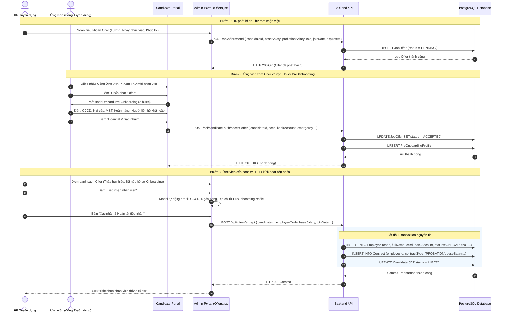

# Usecase: UC-REC-04 - Quản lý Đề nghị nhận việc và Tiếp nhận Nhân sự 2 chiều (Job Offer & Collaborative Onboarding)

## 1. Giới thiệu chức năng
- **Mục đích**: Quản lý giai đoạn kết thúc của quy trình tuyển dụng theo cơ chế phối hợp 2 chiều (Collaborative Onboarding Lifecycle):
  1. Doanh nghiệp (HR) phát hành Thư mời nhận việc (**Job Offer**) với các điều khoản đãi ngộ chi tiết (Lương chính thức, Tỷ lệ lương thử việc, Ngày bắt đầu làm việc, Hạn phản hồi, Ghi chú phúc lợi).
  2. Ứng viên (**Candidate**) xem thư mời trên Cổng Tuyển dụng và chủ động phản hồi (**Chấp nhận** hoặc **Từ chối kèm lý do**).
  3. Khi Ứng viên chấp nhận Offer, hệ thống tự động mở giao diện **Khai báo Hồ sơ Tiền Tiếp nhận (Pre-Onboarding Profile)** để ứng viên tự cung cấp đầy đủ thông tin pháp lý, ngân hàng, gia đình và liên hệ khẩn cấp trước khi đi làm.
  4. Vào ngày nhận việc, khi ứng viên đến công ty nhận bàn giao, HR thực hiện một chu trình cơ sở dữ liệu nguyên tử (**Database Transaction**) xác nhận tiếp nhận: Tự động kế thừa toàn bộ hồ sơ do ứng viên tự khai để tạo Hồ sơ Nhân viên chính thức (`Employee`), tạo Hợp đồng lao động (`Contract`), chuyển ứng viên thành `HIRED` và cập nhật chỉ tiêu tuyển dụng.
- **Actor (Tác nhân)**: Chuyên viên Tuyển dụng (Recruiter), Trưởng phòng Nhân sự (HR Manager), Ứng viên (Candidate), Quản trị viên (Admin).
- **Điều kiện tiên quyết**: Ứng viên đã vượt qua vòng phỏng vấn và chuyển sang trạng thái `OFFERING`.

### Danh mục các chức năng con (Sub-features):
1. **UC-REC-04-01: Tra cứu & Quản lý danh sách ứng viên chờ Offer (View & Search Offering Candidates)**: Theo dõi danh sách ứng viên đang ở trạng thái `OFFERING` và trạng thái Thư mời (`Chờ gửi`, `Chờ phản hồi`, `Đã chấp nhận`, `Đã từ chối`).
2. **UC-REC-04-02: Thiết lập & Phát hành Thư mời nhận việc (Create & Send Job Offer)**: Soạn thảo và gửi Thư mời nhận việc trực tuyến: Mức lương thỏa thuận, Tỷ lệ thử việc (85% - 100%), Ngày bắt đầu làm việc, Hạn phản hồi và Ghi chú đãi ngộ.
3. **UC-REC-04-03: Xem xét Hồ sơ Tiền Tiếp nhận do Ứng viên tự khai (Review Pre-Onboarding Profile)**: Kiểm tra thông tin nhân thân (CCCD, MST, ngày sinh), tài khoản ngân hàng và liên hệ khẩn cấp do ứng viên nộp qua cổng tự phục vụ.
4. **UC-REC-04-04: Tiếp nhận Nhân sự & Tự động tạo Hồ sơ Core HR (Accept Offer & Auto-provision Employee)**: Kích hoạt khi ứng viên có mặt tại công ty; chạy Transaction tạo `Employee`, tạo `Contract`, cập nhật ứng viên thành `HIRED` mà không cần nhập liệu thủ công lại.
5. **UC-REC-04-05: Ghi nhận Ứng viên Từ chối Offer (Record Offer Rejection)**: Cập nhật lý do từ chối (mức lương chưa phù hợp, chọn cơ hội khác, v.v.), chuyển trạng thái ứng viên sang `REJECTED`.
6. **UC-REC-04-06: Kiểm tra toàn vẹn định danh & Tự động đóng chỉ tiêu (Integrity & Headcount Synchronization)**: Ngăn chặn trùng lặp Mã NV / CCCD và tự động đóng chiến dịch tuyển dụng khi đã đạt đủ chỉ tiêu.

---

## 2. Dữ liệu nghiệp vụ đầu vào (Input Data & Parameters)

### 2.1. Biểu mẫu Phát hành Thư mời Nhận việc (Job Offer Form)
| Tên trường | Kiểu dữ liệu | Bắt buộc | Ý nghĩa nghiệp vụ & Ràng buộc |
|---|---|:---:|---|
| `candidateId` | UUID | Có | Định danh ứng viên nhận Offer (phải ở trạng thái `OFFERING`). |
| `baseSalary` | Số (Number) | Có | Mức lương cơ bản thỏa thuận hàng tháng (VNĐ, tối thiểu > 0). |
| `probationSalaryRate` | Số (%) | Có | Tỷ lệ hưởng lương thử việc (Mặc định 85% theo Luật Lao động, 85 - 100%). |
| `joinDate` | Ngày (Date) | Có | Ngày dự kiến bắt đầu làm việc tại công ty. |
| `expiresAt` | Ngày (Date) | Có | Thời hạn tối đa để ứng viên xác nhận đồng ý Offer. |
| `notes` | Văn bản (Text) | Không | Ghi chú phúc lợi, chế độ thưởng, phụ cấp hoặc dặn dò trang phục ngày đầu đi làm. |

### 2.2. Dữ liệu Hồ sơ Tiền Tiếp nhận do Ứng viên tự khai (PreOnboardingProfile)
| Nhóm dữ liệu | Tên trường | Kiểu dữ liệu | Ý nghĩa nghiệp vụ |
|---|---|---|---|
| **Định danh & Nhân thân** | `cccd` | String(12) | Số Căn cước công dân gắn chip (duy nhất trong toàn hệ thống). |
| | `cccdDate` | Date | Ngày cấp CCCD. |
| | `cccdPlace` | String(150) | Nơi cấp CCCD (Cục CSQLHC về TTXH). |
| | `taxCode` | String(20) | Mã số thuế thu nhập cá nhân của ứng viên. |
| | `dob` | Date | Ngày tháng năm sinh của ứng viên. |
| | `gender` | Enum | Giới tính: `MALE`, `FEMALE`, `OTHER`. |
| | `address` | String(255) | Địa chỉ thường trú / Nơi ở hiện tại. |
| **Tài chính & Ngân hàng** | `bankAccount` | String(30) | Số tài khoản ngân hàng để nhận lương hàng tháng. |
| | `bankName` | String(100) | Tên ngân hàng thụ hưởng (Vietcombank, MB, Techcombank, ...). |
| | `bankBranch` | String(150) | Chi nhánh mở tài khoản ngân hàng. |
| **Liên hệ Khẩn cấp** | `emergencyName` | String(100) | Họ tên người thân liên hệ trong trường hợp khẩn cấp. |
| | `emergencyRel` | String(50) | Mối quan hệ với ứng viên (Bố, Mẹ, Vợ/Chồng, Anh/Chị/Em). |
| | `emergencyPhone`| String(15) | Số điện thoại người liên hệ khẩn cấp. |

### 2.3. Trạng thái Vòng đời Thư mời Nhận việc (`JobOffer.status`)
| Trạng thái | Nhãn hiển thị | Ý nghĩa nghiệp vụ |
|---|---|---|
| `PENDING` | Chờ ứng viên phản hồi | HR đã gửi Offer, đang chờ ứng viên mở cổng xác nhận trước thời hạn `expiresAt`. |
| `ACCEPTED` | Đã chấp nhận | Ứng viên đã đồng ý nhận việc và đã hoàn tất khai báo Pre-onboarding. |
| `REJECTED` | Đã từ chối | Ứng viên từ chối điều kiện làm việc (kèm lý do ghi nhận trong `declineReason`). |
| `EXPIRED` | Hết hạn | Quá ngày `expiresAt` nhưng ứng viên không phản hồi, hệ thống hủy Offer. |

---

## 3. Quy tắc nghiệp vụ (Business Rules)

| Mã Quy tắc | Tình huống nghiệp vụ | Cách hệ thống xử lý | Thông báo hiển thị |
|---|---|---|---|
| **BR-REC-04-01** | **Điều kiện cấp Offer**: HR phát hành Thư mời. | Chỉ ứng viên ở trạng thái `OFFERING` mới được cấp Offer. Nếu ứng viên đã có Offer ở trạng thái `ACCEPTED` hoặc đã `HIRED`, hệ thống chặn phát hành trùng lặp. | "Chỉ ứng viên ở giai đoạn Chốt Offer mới đủ điều kiện gửi Thư mời nhận việc!" |
| **BR-REC-04-02** | **Nguyên tắc Tiếp nhận 2 chiều (Collaborative Onboarding)**: HR bấm Tiếp nhận. | HR chỉ được chuyển ứng viên thành Nhân viên chính thức khi ứng viên đã **Chấp nhận Offer** (`JobOffer.status = 'ACCEPTED'`) và ứng viên đã có mặt tại công ty nhận việc. Form tiếp nhận tự động điền các trường do ứng viên khai báo. | "Ứng viên đã xác nhận chấp nhận Offer và nộp hồ sơ Onboarding thành công." |
| **BR-REC-04-03** | **Tính nguyên tử của Tiếp nhận (Onboarding Transaction)**: Bấm "Tiếp nhận nhân viên". | Chạy trong một Transaction DB duy nhất:  1. Lấy thông tin Candidate + PreOnboardingProfile + JobPosting. 2. Tạo mới `Employee` (kế thừa `cccd`, `address`, `bankAccount`, `taxCode`, `emergencyContact` từ hồ sơ tự khai; trạng thái `ONBOARDING`). 3. Tạo mới `Contract` (loại `PROBATION`, lương từ Offer, `status = 'ACTIVE'`). 4. Cập nhật `Candidate.status = 'HIRED'`. Nếu bất kỳ bước nào lỗi $\rightarrow$ Rollback toàn bộ. | "Tiếp nhận nhân viên thành công! Hồ sơ đã được đồng bộ vào Core HR." |
| **BR-REC-04-04** | **Kiểm tra trùng lặp định danh (Uniqueness Validation)**: Trùng `employeeCode` hoặc `cccd`. | Backend bắt mã lỗi `P2002` từ Prisma và chặn giao dịch, trả về thông báo lỗi chi tiết cho HR. | "Mã nhân viên hoặc CCCD đã tồn tại trong hệ thống." |
| **BR-REC-04-05** | **Ghi nhận Lý do Từ chối Offer**: Ứng viên từ chối Offer. | Lưu lý do vào `JobOffer.declineReason`, thời gian phản hồi vào `respondedAt`, cập nhật trạng thái Offer thành `REJECTED` và Candidate thành `REJECTED`. | "Đã ghi nhận phản hồi từ chối Offer của ứng viên." |
| **BR-REC-04-06** | **Tự động đóng chiến dịch khi đạt chỉ tiêu**: Sau khi ứng viên thành `HIRED`. | Kiểm tra tổng số `HIRED` của `jobPostingId`. Nếu $\ge$ `amount` $\rightarrow$ Tự động đổi trạng thái Job sang `CLOSED`. | "Chiến dịch tuyển dụng đã hoàn thành đủ chỉ tiêu và tự động đóng tuyển dụng!" |

---

## 4. Đặc tả chi tiết các Use Case chức năng con (Sub-Use Cases Specification)

### 4.1. UC-REC-04-01 & UC-REC-04-02: Thiết lập & Phát hành Thư mời nhận việc (Send Job Offer)

#### Bảng đặc tả nghiệp vụ:
| STT | Hạng mục | Nội dung chi tiết |
|:---:|---|---|
| **1** | **Thông tin chung** | - **UC ID**: `UC-REC-04-02` - **UC Name**: Thiết lập & Phát hành Thư mời nhận việc (Create & Send Job Offer) - **Actor**: Chuyên viên Tuyển dụng (Recruiter), Trưởng phòng Nhân sự - **Mục tiêu**: Chuẩn hóa thông tin đãi ngộ và phát hành Thư mời nhận việc trực tuyến tới ứng viên. - **Priority**: High |
| **2** | **Trigger** | HR nhấn nút **"Gửi Offer"** hoặc **"Chỉnh sửa Offer"** tại bảng danh sách ứng viên Offer. |
| **3** | **Pre-condition** | Ứng viên đang ở trạng thái `OFFERING`. |
| **4** | **Post-condition** | Bản ghi `JobOffer` được tạo hoặc cập nhật ở trạng thái `PENDING`, hiển thị trực tiếp trên tài khoản cổng ứng viên. |
| **5** | **Main Flow** | 1. HR mở Modal Gửi Thư mời nhận việc. 2. Hệ thống điền sẵn họ tên, email, vị trí tuyển dụng. 3. HR nhập: Lương cơ bản, Tỷ lệ thử việc (85%), Ngày nhận việc, Hạn phản hồi (mặc định 5 ngày tới), Ghi chú phúc lợi. 4. HR bấm "Phát hành Offer". 5. Backend gọi `POST /api/offers/send` $\rightarrow$ tạo/cập nhật bản ghi `JobOffer` (`status = PENDING`). 6. Giao diện báo Toast thành công và đổi badge của ứng viên sang "Đang chờ phản hồi". |
| **6** | **Alternative Flow** | - **AF-01**: HR hủy modal $\rightarrow$ Không có dữ liệu nào thay đổi. |
| **7** | **Acceptance Criteria** | - **AC-01**: Lương cơ bản và ngày nhận việc bắt buộc nhập. - **AC-02**: Sau khi phát hành, ứng viên đăng nhập Cổng Ứng viên lập tức xem được Thư mời. |

---

### 4.2. UC-REC-04-03: Xem xét Hồ sơ Pre-Onboarding do Ứng viên tự khai

#### Bảng đặc tả nghiệp vụ:
| STT | Hạng mục | Nội dung chi tiết |
|:---:|---|---|
| **1** | **Thông tin chung** | - **UC ID**: `UC-REC-04-03` - **UC Name**: Xem xét Hồ sơ Tiền Tiếp nhận (Review Pre-Onboarding Profile) - **Actor**: Chuyên viên Tuyển dụng, HR Manager - **Mục tiêu**: Giúp HR nắm bắt đầy đủ thông tin chi tiết của nhân sự tương lai trước ngày tiếp nhận. - **Priority**: Medium |
| **2** | **Trigger** | HR nhấn nút **"Xem hồ sơ tự khai"** tại dòng ứng viên đã có trạng thái Offer `ACCEPTED`. |
| **3** | **Pre-condition** | Ứng viên đã hoàn tất gửi biểu mẫu Pre-Onboarding trên Cổng Ứng viên. |
| **4** | **Post-condition** | Modal hiển thị đầy đủ CCCD, ngày cấp, nơi cấp, MST, ngân hàng, liên hệ khẩn cấp. |
| **5** | **Main Flow** | 1. HR bấm xem hồ sơ. 2. Giao diện hiển thị bảng tóm tắt 3 khối dữ liệu: Định danh cá nhân, Thông tin thanh toán lương, Thông tin liên hệ khẩn cấp. 3. HR rà soát tính hợp lệ trước khi tiến hành thủ tục tiếp nhận ngày đầu tiên. |

---

### 4.3. UC-REC-04-04: Tiếp nhận Nhân sự & Tự động tạo Hồ sơ Core HR (Accept Offer & Auto-provision)

#### Bảng đặc tả nghiệp vụ:
| STT | Hạng mục | Nội dung chi tiết |
|:---:|---|---|
| **1** | **Thông tin chung** | - **UC ID**: `UC-REC-04-04` - **UC Name**: Tiếp nhận Nhân sự & Tự động tạo Hồ sơ Core HR (Accept Offer & Auto-provision Employee) - **Actor**: Chuyên viên Tuyển dụng (Recruiter), Trưởng phòng Nhân sự - **Mục tiêu**: Chuyển giao toàn bộ dữ liệu ứng viên + hồ sơ tự khai sang nhân viên chính thức trong Core HR mà không cần gõ lại bất kỳ trường thông tin nào. - **Priority**: Critical (Cốt lõi) |
| **2** | **Trigger** | Ứng viên đến công ty làm việc ngày đầu tiên; HR bấm **"Tiếp nhận nhân viên"**. |
| **3** | **Pre-condition** | Ứng viên đã có Offer trạng thái `ACCEPTED` và có hồ sơ `PreOnboardingProfile`. |
| **4** | **Post-condition** | Bản ghi `Employee` và `Contract` được tạo mới; ứng viên chuyển thành `HIRED`. |
| **5** | **Main Flow** | 1. HR nhấn **"Tiếp nhận nhân viên"**. 2. Modal tiếp nhận mở ra: Hệ thống tự động sinh mã nhân viên gợi ý (`NVxxxx`) và tự động nạp sẵn CCCD, Lương cơ bản, Ngày nhận việc, Địa chỉ, Ngân hàng từ hồ sơ Pre-onboarding. 3. HR kiểm tra lần cuối, điều chỉnh mã nhân viên hoặc phòng ban nếu cần. 4. HR bấm "Xác nhận & Hoàn tất tiếp nhận". 5. Backend thực thi Database Transaction (`prisma.$transaction`):    - Tạo `Employee` (gắn CCCD, địa chỉ, tài khoản ngân hàng, liên hệ khẩn cấp).    - Tạo `Contract` thử việc gắn với nhân viên.    - Đổi `Candidate.status = 'HIRED'`. 6. Giao diện báo Toast: *"Tiếp nhận nhân viên thành công!"*, đóng modal và nạp lại bảng. |
| **6** | **Exception Flow** | - **EF-01**: Trùng mã NV hoặc CCCD $\rightarrow$ Báo lỗi `400` rõ ràng, giữ nguyên form để sửa mã khác. |
| **7** | **Acceptance Criteria** | - **AC-01**: Tự động điền 100% dữ liệu do ứng viên đã khai báo. - **AC-02**: Nhân viên mới lập tức xuất hiện trong danh sách Nhân sự Core HR. |

---

## 5. Sơ đồ tuần tự nghiệp vụ (Sequence Diagrams)

### 5.1. Luồng Phát hành Offer $\rightarrow$ Ứng viên Chấp nhận & Khai Pre-onboarding $\rightarrow$ HR Tiếp nhận

---

## 6. Ma trận kịch bản kiểm thử (Test Scenarios & Acceptance Matrix)

| Mã kịch bản | Use Case | Kịch bản kiểm thử | Dữ liệu đầu vào | Kết quả mong đợi | Đánh giá |
|---|---|---|---|---|:---:|
| **TC-REC-04-01** | UC-REC-04-02 | Phát hành Offer thành công | Lương: 18.000.000, Ngày đi làm: 15/10, Tỷ lệ: 85% | Tạo bản ghi JobOffer (`PENDING`), bảng hiển thị trạng thái "Chờ phản hồi". | **Pass** |
| **TC-REC-04-02** | UC-REC-04-03 | Ứng viên nộp Pre-onboarding | CCCD 12 số, Vietcombank, Mẹ 0912345678 | Lưu `PreOnboardingProfile`, JobOffer chuyển sang `ACCEPTED`. | **Pass** |
| **TC-REC-04-03** | UC-REC-04-04 | Tiếp nhận tự động kế thừa hồ sơ | Bấm Tiếp nhận nhân sự khi đã có PreOnboarding | Modal tự điền đầy đủ CCCD và tài khoản ngân hàng; tạo Employee `ONBOARDING` thành công. | **Pass** |
| **TC-REC-04-04** | UC-REC-04-05 | Ứng viên từ chối Offer | Bấm Từ chối kèm lý do "Đã nhận lời công ty khác" | JobOffer cập nhật `REJECTED`, lý do lưu vào `declineReason`. | **Pass** |
| **TC-REC-04-05** | UC-REC-04-06 | Kiểm tra trùng lặp CCCD/Mã NV | Nhập trùng Mã NV hoặc CCCD đã có trong DB | Backend chặn giao dịch, trả về HTTP 400 kèm thông báo rõ ràng. | **Pass** |
