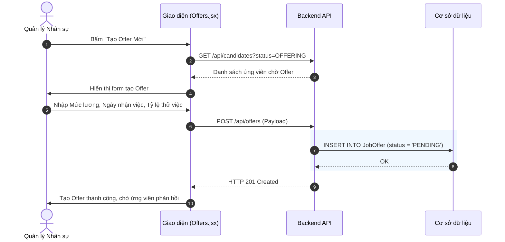
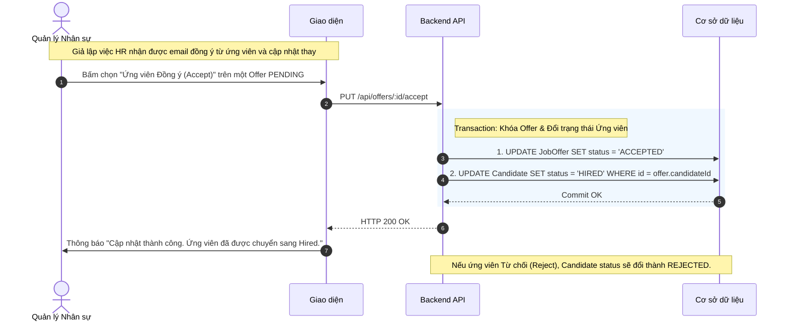

# Đặc tả chức năng: Quản lý Đề nghị nhận việc (Job Offers)

## 1. Giới thiệu chức năng
Giai đoạn cuối cùng của vòng đời ứng viên. HR sẽ tạo và gửi Thư mời nhận việc (Job Offer), chốt mức lương và các thỏa thuận đi làm để ứng viên phản hồi.

## 2. Các quy tắc nghiệp vụ cốt lõi
- **Điều kiện kích hoạt:** Chỉ ứng viên ở cột `OFFERING` mới được cấp Job Offer.
- **Khóa dữ liệu (Data Locking):** Khi ứng viên xác nhận đồng ý (Accepted), Bản ghi Job Offer lập tức bị khóa (Read-only) và tự động kích hoạt luồng di chuyển thẻ Kanban của ứng viên đó sang cột `HIRED`.
- **Tái sử dụng dữ liệu:** Thông tin `Mức lương cơ bản` và `Ngày đi làm` nhập ở Offer này sẽ là nguồn cấp dữ liệu (Source of truth) để sinh tự động Hợp đồng thử việc bên Module Quản lý Nhân sự sau này.

## 3. Sơ đồ luồng chi tiết (Sequence Diagrams)

### 3.1. Luồng Tạo mới Job Offer
Thiết lập thỏa thuận gửi ứng viên.

### 3.2. Luồng Xác nhận Offer (Ứng viên Đồng ý / Từ chối)
Luồng này xử lý logic liên kết ngược lại bảng Kanban (ATS).

