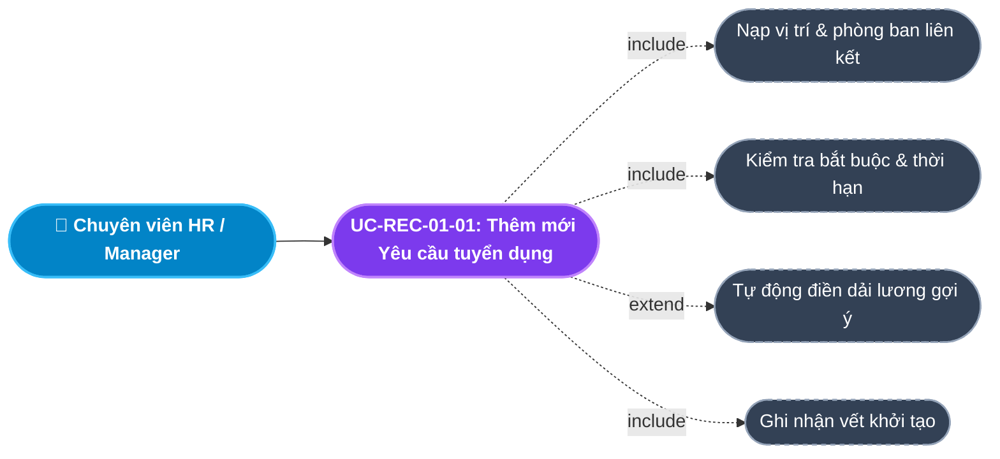
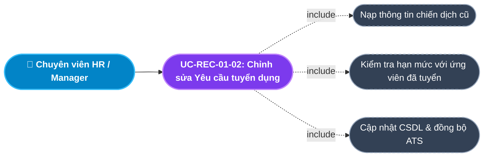
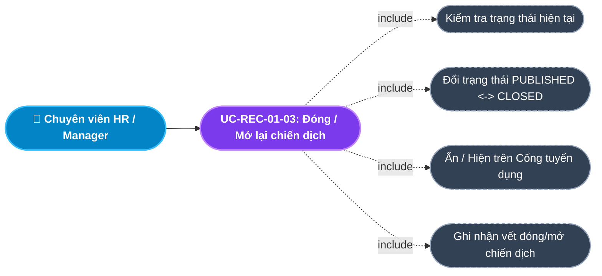
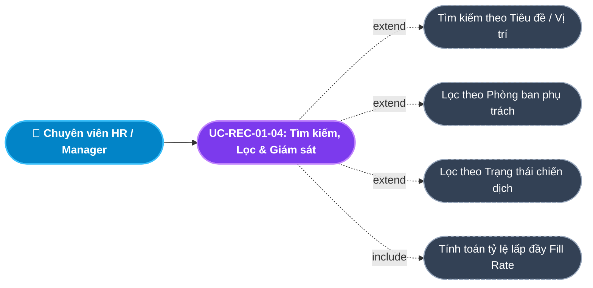
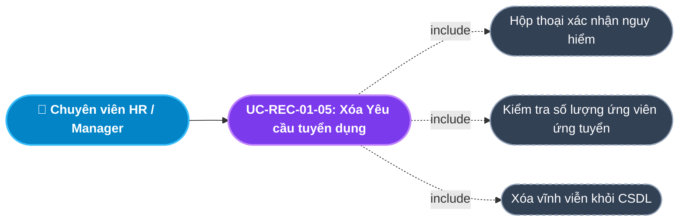
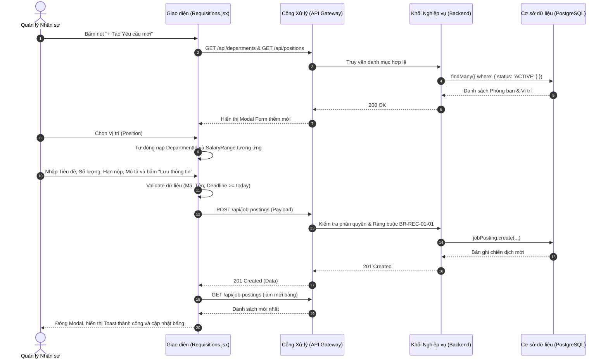
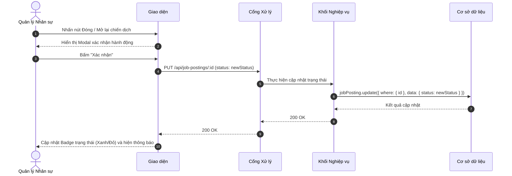
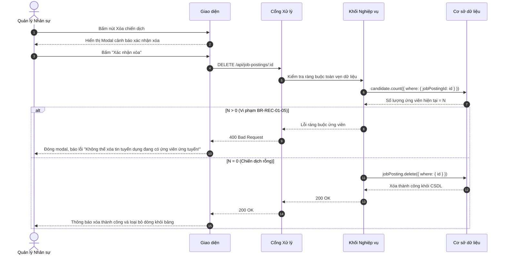

# Usecase: UC-REC-01 - Quản lý Yêu cầu Tuyển dụng (Job Requisitions)

## 1. Giới thiệu chức năng
- **Mục đích**: Cung cấp công cụ cho Phòng Nhân sự và Trưởng các bộ phận khởi tạo, quản lý và theo dõi tiến độ các chiến dịch tuyển dụng (Job Requisitions / Postings). Hệ thống đảm bảo mọi yêu cầu tuyển dụng đều gắn liền với định biên nhân sự của Phòng ban và Vị trí (Position) cụ thể, kiểm soát chặt chẽ ngân sách lương và hạn ngạch tuyển dụng (Headcount).
- **Actor (Tác nhân)**: Trưởng bộ phận (Department Head), Chuyên viên Tuyển dụng (Recruiter), Trưởng phòng Nhân sự (HR Manager), Quản trị viên (Admin).
- **Điều kiện tiên quyết**: Người dùng đã đăng nhập và có quyền `MANAGE_RECRUITMENT` hoặc vai trò `ADMIN` / `HR_MANAGER` / `RECRUITER`.

### Danh mục các chức năng con (Sub-features):
1. **UC-REC-01-01: Thêm mới Yêu cầu tuyển dụng**: Tạo chiến dịch tuyển dụng mới liên kết trực tiếp với Phòng ban và Vị trí.
2. **UC-REC-01-02: Chỉnh sửa Yêu cầu tuyển dụng**: Điều chỉnh chỉ tiêu số lượng (Amount), hạn nộp hồ sơ (Deadline), mô tả công việc và mức lương.
3. **UC-REC-01-03: Đóng / Mở lại chiến dịch tuyển dụng**: Đóng chiến dịch khi đủ chỉ tiêu hoặc hết hạn; kích hoạt lại khi có nhu cầu bổ sung.
4. **UC-REC-01-04: Tìm kiếm, Lọc & Giám sát tiến độ lấp đầy (Fill Rate)**: Tra cứu nhanh theo từ khóa, lọc theo phòng ban/trạng thái và hiển thị thanh tiến độ tuyển dụng trực quan.
5. **UC-REC-01-05: Xóa Yêu cầu tuyển dụng (Hard Delete)**: Xóa triệt để các chiến dịch nháp hoặc nhập sai (ràng buộc chưa có ứng viên nộp hồ sơ).

---

## 2. Dữ liệu nghiệp vụ đầu vào (Input Data & Parameters)

### 2.1. Biểu mẫu Yêu cầu tuyển dụng (Job Requisition Form)
| Tên trường | Kiểu dữ liệu | Tính chất | Ý nghĩa nghiệp vụ & Ràng buộc |
|---|---|---|---|
| `Tiêu đề chiến dịch` (title) | Chuỗi (String) | Bắt buộc | Tên hiển thị của vị trí tuyển dụng (VD: `Senior Backend Developer NodeJS`). Tối đa 255 ký tự. |
| `Vị trí công tác` (positionId) | UUID / Chuỗi | Bắt buộc | Vị trí việc làm chuẩn từ Danh mục Vị trí (Module Tổ chức). |
| `Phòng ban` (departmentId) | UUID / Chuỗi | Tự động | Phòng ban trực thuộc vị trí đã chọn (Tự động nạp từ Position, không cho sửa lệch). |
| `Số lượng cần tuyển` (amount) | Số nguyên (Integer) | Bắt buộc | Chỉ tiêu biên chế tuyển dụng cần bổ sung ($\ge 1$, mặc định = 1). |
| `Khung lương dự kiến` (salaryRange) | Chuỗi (String) | Tùy chọn | Dải ngân sách lương (VD: `15 - 25 Triệu` hoặc tự động gợi ý từ dải lương của Vị trí). |
| `Cấp bậc` (level) | Chuỗi (String) | Tùy chọn | Cấp bậc chuyên môn: `Intern`, `Junior`, `Middle`, `Senior`, `Lead`, `Manager`. |
| `Hình thức làm việc` (jobType) | Enum/String | Mặc định | `Full-time`, `Part-time`, `Contract`, `Remote`. Mặc định: `Full-time`. |
| `Hạn chót nộp hồ sơ` (deadline) | Ngày (Date) | Bắt buộc | Ngày kết thúc nhận CV (phải $\ge$ ngày hiện tại). |
| `Mô tả công việc & Yêu cầu` (description) | Văn bản (Text) | Bắt buộc | Chi tiết trách nhiệm công việc, kỹ năng yêu cầu và chế độ đãi ngộ. |
| `Trạng thái` (status) | Enum/String | Mặc định | `DRAFT` (Nháp), `PUBLISHED` (Đang tuyển), `CLOSED` (Đã đóng). |

---

## 3. Quy tắc nghiệp vụ (Business Rules)

| Mã Quy tắc | Tình huống nghiệp vụ | Cách hệ thống xử lý | Thông báo hiển thị |
|---|---|---|---|
| **BR-REC-01-01** | **Ràng buộc toàn vẹn tổ chức**: Tạo yêu cầu tuyển dụng không gắn với Vị trí/Phòng ban. | Bắt buộc chọn `positionId`. Hệ thống tự động truy vấn `departmentId` tương ứng để đảm bảo tính toàn vẹn. | "Vui lòng chọn Vị trí công tác hợp lệ" |
| **BR-REC-01-02** | **Tự động gợi ý ngân sách lương**: Khi HR chọn chức danh vị trí. | Tự động nạp khung lương `minSalary - maxSalary` đã cấu hình ở Module Tổ chức vào ô `salaryRange`. | Tự động điền dữ liệu gợi ý |
| **BR-REC-01-03** | **Kiểm soát hạn nộp hồ sơ**: HR nhập `deadline` trong quá khứ. | Giao diện kiểm tra `deadline >= today()`. Nếu nhỏ hơn $\rightarrow$ Chặn gửi request. | "Hạn chót nộp hồ sơ phải từ ngày hôm nay trở đi" |
| **BR-REC-01-04** | **Tự động đóng chiến dịch khi đủ chỉ tiêu**: Khi số ứng viên đạt trạng thái `HIRED` bằng chỉ tiêu `amount`. | Backend kiểm tra `hiredCount >= amount`. Nếu đủ $\rightarrow$ Tự động đổi `status = 'CLOSED'` và gửi thông báo hoàn thành chiến dịch. | "Chiến dịch tuyển dụng đã hoàn thành đủ chỉ tiêu" |
| **BR-REC-01-05** | **Ràng buộc an toàn khi Xóa (Hard Delete)**: HR bấm xóa chiến dịch đã có ứng viên nộp hồ sơ (`candidates > 0`). | Backend đếm `candidate.count({ where: { jobPostingId } })`. Nếu $> 0 \rightarrow$ Từ chối xóa, trả HTTP 400. Khuyến nghị chuyển sang `CLOSED`. | "Không thể xóa tin tuyển dụng đang có ứng viên ứng tuyển!" |
| **BR-REC-01-06** | **Công thức tính tỷ lệ lấp đầy (Fill Rate)**: Hiển thị tiến độ tuyển dụng trên giao diện bảng. | `Fill Rate (%) = Math.round((hiredCount / amount) * 100)`. Hiển thị thanh tiến độ màu xanh/vàng/đỏ tương ứng. | Hiển thị Progress Bar trực quan |
| **BR-REC-01-07** | **Đóng chiến dịch thủ công (Soft Close)**: HR chủ động dừng nhận hồ sơ trước hạn. | Chuyển `status = 'CLOSED'`. Ẩn tin khỏi Cổng tuyển dụng bên ngoài (Public Portal). Ứng viên không thể nộp thêm CV. | "Đã đóng chiến dịch tuyển dụng thành công" |

---

## 4. Đặc tả chi tiết các Use Case chức năng con (Sub-Use Cases Specification)

Mỗi chức năng con trong Quản lý Yêu cầu Tuyển dụng gồm Sơ đồ Use Case phân rã trực quan và Bảng đặc tả 8 mục nghiệp vụ chuẩn hóa:

---

### 4.1. UC-REC-01-01: Thêm mới Yêu cầu tuyển dụng (Create Job Requisition)

#### Sơ đồ Use Case:

#### Bảng đặc tả nghiệp vụ:

| STT | Hạng mục | Nội dung chi tiết |
|:---:|---|---|
| **1** | **Thông tin chung** | - **UC ID**: `UC-REC-01-01` - **UC Name**: Thêm mới Yêu cầu tuyển dụng (Create Job Requisition) - **Actor**: Chuyên viên Tuyển dụng, Trưởng phòng chuyên môn, HR Manager - **Mục tiêu**: Tạo lập chiến dịch tuyển dụng mới có gắn kết chặt chẽ với Vị trí và Phòng ban theo kế hoạch định biên. - **Mô tả**: Người dùng nhập tiêu đề, chọn vị trí, nhập số lượng cần tuyển, hạn nộp hồ sơ, mô tả công việc và mức lương dự kiến. - **Priority**: High (Bắt buộc) |
| **2** | **Trigger** | Người dùng nhấn nút **"+ Tạo Yêu cầu mới"** trên thanh công cụ của màn hình Yêu cầu tuyển dụng. |
| **3** | **Pre-condition** | 1. Người dùng đã đăng nhập với vai trò có quyền quản lý tuyển dụng. 2. Đã có ít nhất 01 Phòng ban và 01 Vị trí đang hoạt động (`ACTIVE`) trong Module Tổ chức. |
| **4** | **Post-condition** | 1. Bản ghi chiến dịch mới được lưu vào CSDL với trạng thái `PUBLISHED` (hoặc `DRAFT`). 2. Xuất hiện trên bảng danh sách chiến dịch kèm chỉ số tiến độ `0/Amount (0%)`. 3. Hiển thị trên bảng Kanban ATS và Cổng tuyển dụng ứng viên. 4. Ghi nhận Audit Log hệ thống. |
| **5** | **Main Flow** | 1. Người dùng nhấn nút **"+ Tạo Yêu cầu mới"**. 2. Hệ thống tải danh mục Vị trí & Phòng ban, hiển thị Modal Form *Thêm mới Yêu cầu tuyển dụng*. 3. Người dùng chọn Vị trí công tác (`Position`). 4. Hệ thống tự động nạp Phòng ban trực thuộc và điền dải lương gợi ý (`BR-REC-01-02`). 5. Người dùng nhập Tiêu đề, Số lượng tuyển (`amount`), Hạn nộp hồ sơ (`deadline`), Mô tả công việc. 6. Người dùng chọn trạng thái phát hành (`PUBLISHED`) và nhấn **"Lưu thông tin"**. 7. Giao diện kiểm tra tính hợp lệ dữ liệu (Tiêu đề không rỗng, `amount >= 1`, `deadline >= today`). 8. Gửi request `POST /api/job-postings` kèm payload dữ liệu. 9. Backend kiểm tra quyền, tạo bản ghi trong CSDL và trả về `HTTP 201 Created`. 10. Giao diện đóng Modal, nạp lại danh sách và hiển thị Toast thông báo thành công. |
| **6** | **Alternative / Exception Flow** | - **AF-01 (Lưu nháp DRAFT)**: Người dùng chọn trạng thái `DRAFT` $\rightarrow$ Chiến dịch được lưu nhưng chưa hiển thị trên Cổng tuyển dụng ngoài. - **AF-02 (Hủy nhập)**: Nhấn "Hủy" hoặc icon `X` $\rightarrow$ Đóng modal, không lưu dữ liệu. - **EF-01 (Thiếu trường bắt buộc)**: Để trống Tiêu đề hoặc Vị trí $\rightarrow$ Báo lỗi *"Vui lòng nhập đủ các trường bắt buộc!"*. - **EF-02 (Hạn nộp không hợp lệ)**: Chọn `deadline` trong quá khứ $\rightarrow$ Báo lỗi *"Hạn chót nộp hồ sơ phải từ ngày hôm nay trở đi!"*. - **EF-03 (Lỗi kết nối server)**: Mất mạng hoặc server lỗi 500 $\rightarrow$ Toast báo lỗi *"Không thể kết nối đến máy chủ"*. |
| **7** | **Business Rules & Validation** | - `BR-REC-01-01`: Bắt buộc liên kết với `positionId` và `departmentId`. - `title`: Chuỗi 1-255 ký tự. - `amount`: Số nguyên dương $\ge 1$, mặc định = 1. - `deadline`: Định dạng ngày hợp lệ $\ge$ ngày hiện tại. - Trạng thái hợp lệ: `DRAFT`, `PUBLISHED`, `CLOSED`. |
| **8** | **Acceptance Criteria** | - **AC-01**: Khi chọn Vị trí, trường Phòng ban và Khung lương phải tự động nạp đúng giá trị tương ứng trong vòng 100ms. - **AC-02**: Nhập hạn nộp trong quá khứ và bấm Lưu $\rightarrow$ Bị chặn lại và cảnh báo rõ ràng. - **AC-03**: Nhập đầy đủ thông tin hợp lệ $\rightarrow$ Lưu thành công, đóng form và xuất hiện ngay trên bảng danh sách. |

---

### 4.2. UC-REC-01-02: Chỉnh sửa Yêu cầu tuyển dụng (Update Job Requisition)

#### Sơ đồ Use Case:

#### Bảng đặc tả nghiệp vụ:

| STT | Hạng mục | Nội dung chi tiết |
|:---:|---|---|
| **1** | **Thông tin chung** | - **UC ID**: `UC-REC-01-02` - **UC Name**: Chỉnh sửa Yêu cầu tuyển dụng (Update Job Requisition) - **Actor**: Chuyên viên Tuyển dụng, HR Manager - **Mục tiêu**: Cập nhật thông tin chiến dịch khi có điều chỉnh về số lượng chỉ tiêu, dải lương, gia hạn deadline hoặc thay đổi mô tả công việc. - **Mô tả**: Người dùng chỉnh sửa các trường thông tin của yêu cầu tuyển dụng hiện có và lưu cập nhật vào CSDL. - **Priority**: High |
| **2** | **Trigger** | Người dùng nhấn biểu tượng cây bút **"Sửa" (Edit)** tại dòng chiến dịch tuyển dụng tương ứng trong bảng. |
| **3** | **Pre-condition** | 1. Có quyền quản lý tuyển dụng. 2. Chiến dịch tuyển dụng đang tồn tại và chưa bị xóa. |
| **4** | **Post-condition** | 1. Dữ liệu chiến dịch được cập nhật chính xác trong CSDL. 2. Thanh tiến độ lấp đầy (Fill Rate) tính toán lại theo chỉ tiêu mới. 3. Ghi nhận Audit Log: Thời gian, Actor, các trường dữ liệu thay đổi. |
| **5** | **Main Flow** | 1. Người dùng tìm đến dòng chiến dịch cần sửa và bấm nút **"Sửa"**. 2. Hệ thống mở Modal Form *Chỉnh sửa Yêu cầu tuyển dụng*, nạp toàn bộ thông tin hiện tại vào form. 3. Người dùng sửa đổi thông tin (Gia hạn Deadline, tăng chỉ tiêu `amount`, cập nhật mức lương hoặc mô tả). 4. Người dùng bấm nút **"Lưu thay đổi"**. 5. Client kiểm tra ràng buộc: `amount` mới không được nhỏ hơn số ứng viên đã tuyển dụng thành công (`hiredCount`). 6. Giao diện gửi request `PUT /api/job-postings/:id` kèm dữ liệu cập nhật. 7. Backend cập nhật bản ghi trong CSDL và trả về `HTTP 200 OK`. 8. Giao diện đóng Modal, nạp lại danh sách và hiển thị Toast thông báo thành công. |
| **6** | **Alternative / Exception Flow** | - **AF-01 (Hủy chỉnh sửa)**: Bấm "Hủy" hoặc click ngoài Modal $\rightarrow$ Hủy bỏ thay đổi, giữ nguyên dữ liệu cũ. - **EF-01 (Giảm chỉ tiêu nhỏ hơn số đã tuyển)**: Nhập `amount < hiredCount` $\rightarrow$ Báo lỗi *"Chỉ tiêu tuyển dụng không thể nhỏ hơn số ứng viên đã trúng tuyển ([HIRED_COUNT])!"*. - **EF-02 (Bản ghi không tồn tại)**: Chiến dịch bị xóa bởi người khác $\rightarrow$ Báo lỗi *"Yêu cầu tuyển dụng không tồn tại hoặc đã bị xóa"*. |
| **7** | **Business Rules & Validation** | - `amount`: Phải $\ge$ số lượng ứng viên đã ở trạng thái `HIRED`. - `deadline`: Cho phép gia hạn về tương lai, cảnh báo nếu chọn ngày đã qua. - Không cho phép đổi Vị trí làm thay đổi bản chất của chiến dịch nếu đã có ứng viên nộp hồ sơ. |
| **8** | **Acceptance Criteria** | - **AC-01**: Bấm nút Sửa mở form hiển thị đúng 100% dữ liệu hiện tại của chiến dịch. - **AC-02**: Nhập chỉ tiêu mới nhỏ hơn số người đã trúng tuyển $\rightarrow$ Hệ thống chặn lại và báo lỗi rõ ràng. - **AC-03**: Cập nhật thành công $\rightarrow$ Giá trị mới lập tức hiển thị trên bảng dữ liệu. |

---

### 4.3. UC-REC-01-03: Đóng / Mở lại chiến dịch tuyển dụng (Toggle Status Published / Closed)

#### Sơ đồ Use Case:

#### Bảng đặc tả nghiệp vụ:

| STT | Hạng mục | Nội dung chi tiết |
|:---:|---|---|
| **1** | **Thông tin chung** | - **UC ID**: `UC-REC-01-03` - **UC Name**: Đóng / Mở lại chiến dịch tuyển dụng (Toggle Status Published / Closed) - **Actor**: Chuyên viên Tuyển dụng, HR Manager - **Mục tiêu**: Đóng mềm chiến dịch tuyển dụng khi đủ chỉ tiêu, hết ngân sách hoặc tạm ngưng nhận hồ sơ mà không làm mất dữ liệu ứng viên đã ứng tuyển. - **Mô tả**: Chuyển đổi trạng thái chiến dịch giữa `PUBLISHED` và `CLOSED` chỉ với một thao tác bấm. - **Priority**: High (Quản trị vận hành) |
| **2** | **Trigger** | Người dùng nhấn nút biểu tượng **Khóa / Đóng chiến dịch** (hoặc nút "Đóng tuyển dụng") tại cột Thao tác của dòng tương ứng. |
| **3** | **Pre-condition** | 1. Có quyền quản lý tuyển dụng. 2. Chiến dịch đang ở trạng thái `PUBLISHED` (để đóng) hoặc `CLOSED` (để mở lại). |
| **4** | **Post-condition** | 1. Trạng thái chiến dịch trong CSDL đổi thành `CLOSED` (khi Đóng) hoặc `PUBLISHED` (khi Mở lại). 2. Badge trạng thái đổi màu (Xanh lá: Đang tuyển; Xám/Đỏ: Đã đóng). 3. Chiến dịch bị đóng sẽ tự động ẩn khỏi Cổng nộp CV ngoài của ứng viên. 4. Ghi nhận Audit Log hệ thống. |
| **5** | **Main Flow** | 1. Người dùng xác định chiến dịch cần thay đổi trạng thái. 2. Người dùng nhấn nút biểu tượng **Đóng / Mở lại chiến dịch**. 3. Hệ thống hiển thị hộp thoại xác nhận: *"Bạn có chắc chắn muốn đóng/mở lại chiến dịch tuyển dụng này?"*. 4. Người dùng bấm **"Xác nhận"**. 5. Hệ thống xác định trạng thái mới: `PUBLISHED` $\rightarrow$ `CLOSED` (hoặc ngược lại). 6. Giao diện gửi request `PUT /api/job-postings/:id` với `{ status: newStatus }`. 7. Backend cập nhật trạng thái trong CSDL và trả về `HTTP 200 OK`. 8. Giao diện cập nhật ngay Badge trạng thái trên dòng đó và hiển thị Toast thông báo thành công. |
| **6** | **Alternative / Exception Flow** | - **AF-01 (Mở lại chiến dịch)**: Chiến dịch đang `CLOSED`, HR mở lại để tuyển bổ sung $\rightarrow$ Đổi thành `PUBLISHED`, tự động mở lại trên Cổng tuyển dụng. - **AF-02 (Tự động đóng do đủ người)**: Khi ứng viên cuối cùng được tuyển dụng thành công đạt đủ chỉ tiêu `amount`, hệ thống tự động kích hoạt luồng đóng này mà không cần HR bấm tay (`BR-REC-01-04`). - **EF-01 (Lỗi kết nối)**: Mất kết nối server $\rightarrow$ Toast báo lỗi, giữ nguyên trạng thái cũ. |
| **7** | **Business Rules & Validation** | - `BR-REC-01-04`: Tự động đóng chiến dịch khi `hiredCount >= amount`. - `BR-REC-01-07`: Khi đóng chiến dịch, toàn bộ hồ sơ ứng viên cũ vẫn được lưu trữ nguyên vẹn để phục vụ tra cứu lịch sử. - `status`: Nhận giá trị Enum: `'PUBLISHED'` hoặc `'CLOSED'`. |
| **8** | **Acceptance Criteria** | - **AC-01**: Bấm Đóng chiến dịch $\rightarrow$ Trạng thái chuyển sang `CLOSED`, Badge đổi màu xám/đỏ. - **AC-02**: Chiến dịch `CLOSED` không xuất hiện trên Cổng nộp hồ sơ của ứng viên bên ngoài. - **AC-03**: Mở lại chiến dịch thành công $\rightarrow$ Badge đổi màu xanh lá và tiếp tục nhận hồ sơ bình thường. |

---

### 4.4. UC-REC-01-04: Tìm kiếm, Lọc & Giám sát tiến độ lấp đầy (Search, Filter & Fill Rate)

#### Sơ đồ Use Case:

#### Bảng đặc tả nghiệp vụ:

| STT | Hạng mục | Nội dung chi tiết |
|:---:|---|---|
| **1** | **Thông tin chung** | - **UC ID**: `UC-REC-01-04` - **UC Name**: Tìm kiếm, Lọc & Giám sát tiến độ lấp đầy (Search, Filter & Fill Rate) - **Actor**: Toàn bộ người dùng có quyền xem tuyển dụng (HR, Quản lý, Giám đốc, Admin) - **Mục tiêu**: Hỗ trợ tra cứu nhanh các chiến dịch tuyển dụng và giám sát tỷ lệ lấp đầy nhân sự theo thời gian thực. - **Mô tả**: Tìm kiếm không phân biệt hoa thường theo tiêu đề, lọc kết hợp theo phòng ban và trạng thái, hiển thị thanh tiến độ lấp đầy (`Fill Rate`). - **Priority**: High |
| **2** | **Trigger** | Người dùng gõ từ khóa vào ô tìm kiếm, chọn Dropdown phòng ban hoặc chọn Dropdown trạng thái. |
| **3** | **Pre-condition** | 1. Đang ở màn hình Yêu cầu tuyển dụng. 2. Dữ liệu danh sách chiến dịch đã được tải về Client. |
| **4** | **Post-condition** | 1. Bảng dữ liệu hiển thị đúng danh sách chiến dịch thỏa mãn đồng thời các tiêu chí lọc. 2. Thanh tiến độ lấp đầy hiển thị chính xác tỷ lệ phần trăm `%` và số lượng `hired / amount`. 3. Hiển thị tổng số chiến dịch tìm thấy. |
| **5** | **Main Flow** | 1. Người dùng nhập từ khóa tìm kiếm (ví dụ: `"ReactJS"`). 2. Người dùng chọn lọc theo Phòng ban (ví dụ: `"Phòng Công nghệ"`). 3. Người dùng chọn lọc theo Trạng thái (ví dụ: `"Đang tuyển"`). 4. Hệ thống áp dụng thuật toán lọc kết hợp đa tiêu chí (AND Logic): `matchSearch = title.toLowerCase().includes(term) || position.toLowerCase().includes(term)` `matchDept = (filterDept === '' || departmentId === filterDept)` `matchStatus = (filterStatus === '' || status === filterStatus)` `filteredJobs = jobPostings.filter(matchSearch && matchDept && matchStatus)`. 5. Với mỗi chiến dịch, hệ thống tính toán: `hiredCount = candidates.filter(c => c.status === 'HIRED').length` `fillRate = Math.round((hiredCount / amount) * 100)`. 6. Kết xuất bảng dữ liệu và thanh tiến độ trong vòng < 16ms. |
| **6** | **Alternative / Exception Flow** | - **AF-01 (Xóa bộ lọc)**: Người dùng bấm "Xóa bộ lọc" $\rightarrow$ Hiển thị lại toàn bộ danh sách chiến dịch. - **EF-01 (Không tìm thấy kết quả)**: Không có chiến dịch nào khớp điều kiện $\rightarrow$ Hiển thị Empty State: *"Không tìm thấy yêu cầu tuyển dụng nào phù hợp"* kèm icon tìm kiếm rỗng. |
| **7** | **Business Rules & Validation** | - `BR-REC-01-06`: Công thức tỷ lệ lấp đầy = `(hiredCount / amount) * 100%`. - Tìm kiếm không phân biệt chữ hoa, chữ thường (Case-insensitive). - Thanh tiến độ: Hiển thị màu xanh lá khi đạt 100%, màu xanh dương khi đang tuyển (> 0%), màu xám khi 0%. |
| **8** | **Acceptance Criteria** | - **AC-01**: Nhập `"java"`, bảng hiển thị ngay các chiến dịch có tiêu đề hoặc chức danh chứa `"Java"`, `"java"` tức thì. - **AC-02**: Khi một ứng viên chuyển sang `HIRED`, thanh tiến độ của chiến dịch tương ứng phải tự động nhảy số. - **AC-03**: Khi lọc không có kết quả, bảng hiển thị thông báo rỗng thân thiện, không bị vỡ bố cục. |

---

### 4.5. UC-REC-01-05: Xóa Yêu cầu tuyển dụng (Hard Delete Job Requisition)

#### Sơ đồ Use Case:

#### Bảng đặc tả nghiệp vụ:

| STT | Hạng mục | Nội dung chi tiết |
|:---:|---|---|
| **1** | **Thông tin chung** | - **UC ID**: `UC-REC-01-05` - **UC Name**: Xóa Yêu cầu tuyển dụng (Hard Delete Job Requisition) - **Actor**: Quản trị viên hệ thống (Admin), HR Manager có thẩm quyền cao nhất - **Mục tiêu**: Xóa bỏ hoàn toàn khỏi CSDL các chiến dịch tuyển dụng nhập sai hoặc chiến dịch nháp không có ràng buộc dữ liệu. - **Mô tả**: Kiểm tra nghiêm ngặt điều kiện an toàn (chưa có bất kỳ ứng viên nào nộp hồ sơ) trước khi cho phép xóa vĩnh viễn. - **Priority**: Medium (Kiểm soát chặt) |
| **2** | **Trigger** | Người dùng nhấn biểu tượng **Thùng rác (Delete)** tại cột Thao tác của dòng chiến dịch cần xóa. |
| **3** | **Pre-condition** | 1. Có quyền `MANAGE_RECRUITMENT` và vai trò `ADMIN` hoặc `HR_MANAGER`. 2. Chiến dịch muốn xóa đang hiển thị trong danh sách. |
| **4** | **Post-condition** | 1. Bản ghi chiến dịch bị xóa hoàn toàn khỏi cơ sở dữ liệu (`DELETE FROM job_postings`). 2. Dòng dữ liệu biến mất khỏi giao diện. 3. Ghi nhận Audit Log: Thời gian, Actor, bản ghi đã xóa để phục vụ thanh tra. |
| **5** | **Main Flow** | 1. Người dùng nhấn nút biểu tượng **Thùng rác** tại dòng chiến dịch cần xóa. 2. Hệ thống hiển thị Modal hộp thoại xác nhận: *"Bạn có chắc chắn muốn xóa chiến dịch tuyển dụng [TIÊU ĐỀ]? Thao tác này không thể hoàn tác!"*. 3. Người dùng nhấn nút **"Xác nhận xóa"**. 4. Giao diện gửi request `DELETE /api/job-postings/:id`. 5. Backend kiểm tra số lượng ứng viên nộp hồ sơ vào chiến dịch (`BR-REC-01-05`). Số lượng = 0. 6. Backend thực hiện lệnh xóa bản ghi khỏi CSDL và trả về `HTTP 200 OK`. 7. Giao diện đóng hộp thoại xác nhận, tự động nạp lại danh sách và hiển thị Toast thông báo: *"Đã xóa tin tuyển dụng thành công"*. |
| **6** | **Alternative / Exception Flow** | - **AF-01 (Hủy bỏ lệnh xóa)**: Tại bước 2, nhấn "Hủy" hoặc click ngoài hộp thoại $\rightarrow$ Đóng hộp thoại, không thực hiện xóa, dữ liệu giữ nguyên. - **EF-01 (Chặn xóa do đã có ứng viên ứng tuyển)**: Tại bước 5, nếu `candidateCount > 0` $\rightarrow$ Backend từ chối với lỗi `HTTP 400 Bad Request`, giao diện cảnh báo lỗi nghiêm trọng: *"Không thể xóa tin tuyển dụng đang có ứng viên ứng tuyển! Vui lòng sử dụng chức năng Đóng chiến dịch."*. - **EF-02 (Không đủ quyền hạn)**: Tài khoản không có quyền quản trị $\rightarrow$ Trả về `HTTP 403 Forbidden`, cảnh báo: *"Bạn không có quyền thực hiện thao tác xóa chiến dịch tuyển dụng"*. |
| **7** | **Business Rules & Validation** | - `BR-REC-01-05`: Tuyệt đối không cho phép xóa vật lý (Hard Delete) chiến dịch đã có ít nhất 01 hồ sơ ứng viên liên kết trong CSDL để bảo vệ tính toàn vẹn dữ liệu tuyển dụng. - Khuyến nghị sử dụng `UC-REC-01-03` (Đóng chiến dịch) thay cho Xóa vật lý. |
| **8** | **Acceptance Criteria** | - **AC-01**: Khi bấm nút Xóa, bắt buộc phải xuất hiện Modal xác nhận để phòng ngừa click nhầm. - **AC-02**: Thử xóa chiến dịch đã có ứng viên nộp CV $\rightarrow$ Bắt buộc hệ thống phải chặn lại, hiện thông báo từ chối rõ ràng và dữ liệu không bị xóa. - **AC-03**: Xóa chiến dịch rỗng hợp lệ $\rightarrow$ Dòng dữ liệu biến mất ngay lập tức và CSDL cập nhật thành công. |

---

## 5. Sơ đồ tuần tự nghiệp vụ (Sequence Diagrams)

### 5.1. Sơ đồ: Thêm mới Yêu cầu tuyển dụng

### 5.2. Sơ đồ: Chuyển đổi trạng thái Đóng / Mở lại chiến dịch

### 5.3. Sơ đồ: Xóa an toàn Yêu cầu tuyển dụng

---

## 6. Kịch bản kiểm thử & Nghiệm thu (Test Scenarios)

### Kịch bản 1: Tự động điền dữ liệu khi chọn chức danh
- **Given**: Hệ thống có vị trí `Frontend Developer` thuộc phòng `Phòng Công nghệ`, mức lương `15 - 25 Triệu`.
- **When**: HR mở Modal tạo mới và chọn vị trí `Frontend Developer`.
- **Then**: Trường Phòng ban tự động hiển thị `Phòng Công nghệ` và trường Khung lương tự động gợi ý `15 - 25 Triệu`.

### Kịch bản 2: Chặn xóa tin tuyển dụng đã có ứng viên nộp hồ sơ
- **Given**: Chiến dịch `Senior NodeJS` đang có 3 ứng viên nộp CV.
- **When**: HR bấm nút Xóa và bấm Xác nhận.
- **Then**: Hệ thống từ chối xóa, hiển thị cảnh báo: *"Không thể xóa tin tuyển dụng đang có ứng viên ứng tuyển!"*. Bản ghi giữ nguyên vẹn.

### Kịch bản 3: Tự động đóng chiến dịch khi tuyển đủ người
- **Given**: Chiến dịch `Kế toán viên` có chỉ tiêu `amount = 2`. Đã tuyển được 1 người (`hiredCount = 1`).
- **When**: Ứng viên thứ 2 được HR kéo thẻ sang trạng thái `HIRED`.
- **Then**: Backend tự động chuyển trạng thái của chiến dịch `Kế toán viên` sang `CLOSED`. Badge trên bảng đổi sang màu xám/đỏ.
