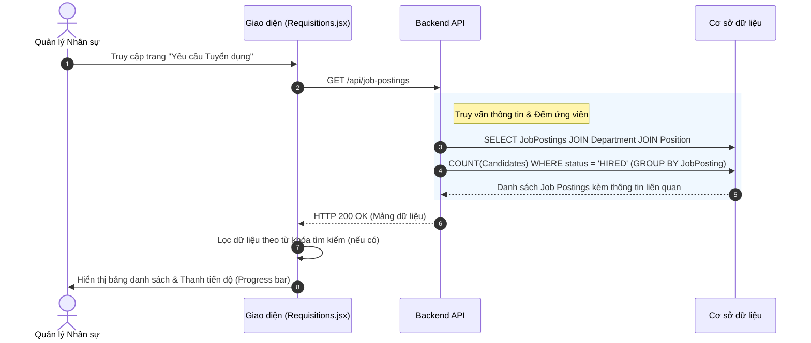
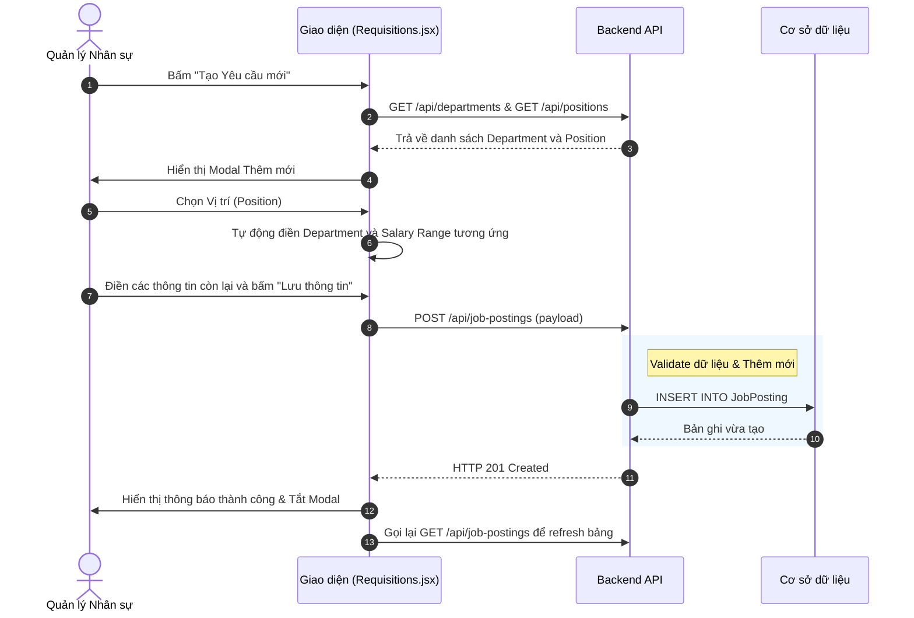
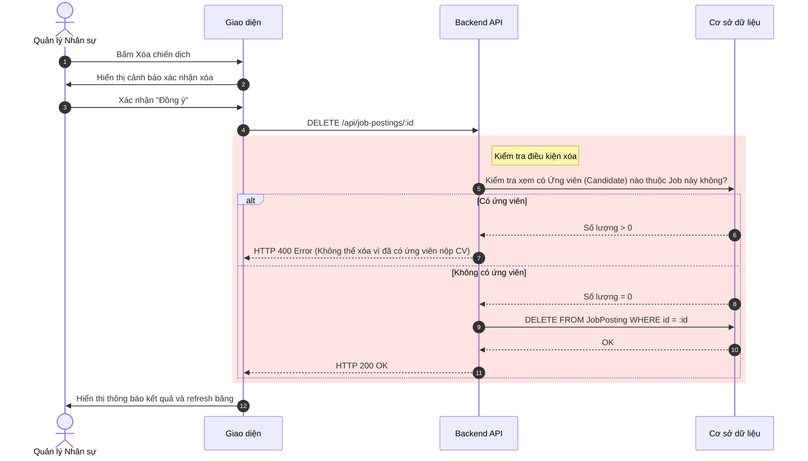

# Đặc tả chức năng: Quản lý Yêu cầu Tuyển dụng (Job Requisitions)

## 1. Giới thiệu chức năng
Chức năng cho phép người dùng (Trưởng phòng, Quản lý nhân sự) thiết lập các chiến dịch tuyển dụng dựa trên nhu cầu định biên. Mọi tin đăng tuyển sau này đều phải tham chiếu tới một Yêu cầu tuyển dụng đã được duyệt.

## 2. Các quy tắc nghiệp vụ cốt lõi
- **Toàn vẹn dữ liệu:** Không được tạo Yêu cầu tuyển dụng trống. Phải bắt buộc liên kết với `DepartmentId` và `PositionId`.
- **Auto-fetch dữ liệu:** Khi chọn Chức danh (Position), hệ thống tự động điền Phòng ban và Ngân sách lương của Chức danh đó.
- **Logic Xóa:** Chỉ được phép xóa chiến dịch khi nó ở trạng thái Nháp (DRAFT) và chưa có ứng viên nào ứng tuyển. Nếu đã có ứng viên, chỉ được Đóng (CLOSED).
- **Tính toán tỷ lệ lấp đầy (Fill Rate):** Tiến độ tuyển dụng = (Số lượng ứng viên đã chuyển sang HIRED / Số lượng cần tuyển) * 100%.

## 3. Sơ đồ luồng chi tiết (Sequence Diagrams)

### 3.1. Luồng Xem danh sách Yêu cầu tuyển dụng
Hiển thị toàn bộ các chiến dịch tuyển dụng kèm theo tỷ lệ lấp đầy của từng chiến dịch.

### 3.2. Luồng Thêm mới Yêu cầu tuyển dụng
Quản lý tạo mới một yêu cầu. Hệ thống tự động fetch phòng ban và lương dựa trên vị trí được chọn.

### 3.3. Luồng Xóa Yêu cầu tuyển dụng
Bảo vệ dữ liệu không bị xóa nhầm nếu chiến dịch đang chạy.

