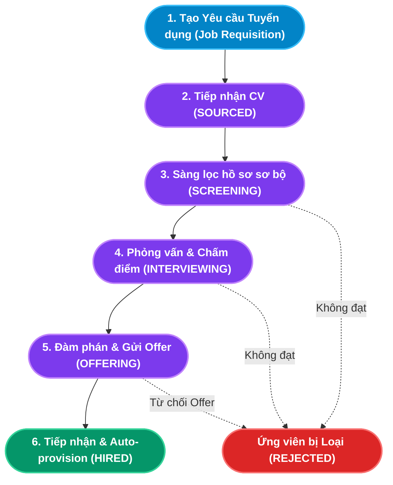

# TÀI LIỆU PHÂN TÍCH NGHIỆP VỤ - MODULE TUYỂN DỤNG (RECRUITMENT & ATS)

## 1. Giới thiệu tổng quan Module
**Module Tuyển dụng (Recruitment & ATS)** là cổng tiếp nhận và sàng lọc nhân sự đầu vào của toàn bộ doanh nghiệp. Được thiết kế theo chuẩn Enterprise HRM, module đóng vai trò cầu nối xuyên suốt giữa hai trụ cột:
- **Module Tổ chức (Organization)**: Cung cấp thông tin định biên nhân sự, sơ đồ tổ chức, cơ cấu phòng ban và vị trí chức danh để xác lập đúng nhu cầu tuyển dụng.
- **Module Hồ sơ Nhân sự (Core HR)**: Tiếp nhận dữ liệu ứng viên trúng tuyển qua cơ chế **Auto-provisioning (Tự động khởi tạo Hồ sơ Nhân viên & Hợp đồng)**, loại bỏ 100% việc nhập liệu thủ công dư thừa.

### Đối tượng sử dụng (Actors):
1. **Chuyên viên Tuyển dụng (Recruiter / HR)**: Quản lý chiến dịch, săn tìm và sàng lọc hồ sơ CV, điều phối lịch hẹn phỏng vấn, đàm phán mức lương đãi ngộ.
2. **Người phỏng vấn / Trưởng bộ phận chuyên môn (Interviewer / Line Manager)**: Tham gia đánh giá năng lực, chấm điểm định lượng (1-10) và viết nhận xét chuyên môn.
3. **Trưởng phòng Nhân sự / Ban Giám đốc (HR Manager / Director)**: Phê duyệt yêu cầu tuyển dụng, ký duyệt Job Offer và tiếp nhận nhân sự chính thức.
4. **Quản trị viên hệ thống (Admin)**: Cấu hình quy trình, phân quyền và kiểm soát toàn vẹn dữ liệu.

---

## 2. Kiến trúc Luồng Dữ liệu Phễu Tuyển dụng (Recruitment Pipeline Architecture)

---

## 3. Ma trận Phân rã Chức năng Chi tiết (Functional Breakdown Matrix)

Hệ thống Tuyển dụng bao gồm **4 nhóm chức năng lớn** với tổng cộng **20 Use Case con (Sub-Use Cases)** được chuẩn hóa toàn diện:

| Nhóm chức năng (Epic) | Mã Use Case | Tên Chức năng Con (Sub-Use Case) | Actor chính | Endpoint Backend |
|---|---|---|---|---|
| **1. Yêu cầu Tuyển dụng** *(Job Requisition)* | `UC-REC-01-01` | Tạo mới Yêu cầu tuyển dụng (Create Requisition) | HR / Manager | `POST /api/job-postings` |
| | `UC-REC-01-02` | Chỉnh sửa thông tin Yêu cầu tuyển dụng (Edit Requisition) | HR / Manager | `PUT /api/job-postings/:id` |
| | `UC-REC-01-03` | Đóng / Mở lại chiến dịch tuyển dụng (Toggle Status) | HR / Manager | `PATCH /api/job-postings/:id/status` |
| | `UC-REC-01-04` | Tra cứu & Thống kê Tỷ lệ lấp đầy (Fill Rate Metric) | Ban Giám đốc / HR | `GET /api/job-postings` |
| | `UC-REC-01-05` | Xóa chiến dịch tuyển dụng (Delete Requisition) | HR / Admin | `DELETE /api/job-postings/:id` |
| **2. Theo dõi Ứng viên ATS** *(ATS Kanban Board)* | `UC-REC-02-01` | Tiếp nhận & Thêm mới hồ sơ Ứng viên (Source Candidate) | HR / Recruiter | `POST /api/candidates` |
| | `UC-REC-02-02` | Kéo thả chuyển trạng thái ứng viên (Kanban Stage Transition) | HR / Recruiter | `PUT /api/candidates/:id` |
| | `UC-REC-02-03` | Đánh dấu Loại hồ sơ ứng viên kèm lý do (Reject Candidate) | HR / Recruiter | `PUT /api/candidates/:id` |
| | `UC-REC-02-04` | Tìm kiếm & Lọc hồ sơ ứng viên trên Kanban | HR / Recruiter | `GET /api/candidates` |
| | `UC-REC-02-05` | Chuyển đổi Ứng viên thành Nhân viên (Auto-provision Employee) | HR / Admin | `PUT /api/candidates/:id` (Transaction) |
| **3. Lịch Phỏng vấn** *(Interview & Feedback)* | `UC-REC-03-01` | Lên lịch phỏng vấn mới (Schedule Interview) | HR / Recruiter | `POST /api/interviews` |
| | `UC-REC-03-02` | Cập nhật & Dời lịch phỏng vấn (Reschedule Interview) | HR / Recruiter | `PUT /api/interviews/:id` |
| | `UC-REC-03-03` | Đánh giá & Chấm điểm ứng viên (Submit Feedback & Score) | Interviewer / Manager | `POST /api/interviews/:id/feedback` |
| | `UC-REC-03-04` | Phê duyệt kết quả sau phỏng vấn - Chốt Offer / Loại | HR / Recruiter | `PUT /api/candidates/:id` |
| | `UC-REC-03-05` | Hủy lịch phỏng vấn (Cancel Interview Round) | HR / Admin | `DELETE /api/interviews/:id` |
| **4. Quản lý Offer** *(Offer & Onboarding)* | `UC-REC-04-01` | Tra cứu danh sách ứng viên chờ Offer (View Offering Candidates) | HR / Recruiter | `GET /api/offers` |
| | `UC-REC-04-02` | Thiết lập thông tin Tiếp nhận & Hợp đồng (Prepare Onboarding) | HR / Recruiter | Form Modal Onboarding |
| | `UC-REC-04-03` | Tiếp nhận & Khởi tạo Nhân viên Core HR (Accept Offer) | HR / Admin | `POST /api/offers/accept` (Transaction) |
| | `UC-REC-04-04` | Ghi nhận Ứng viên Từ chối Offer (Reject Offer) | HR / Recruiter | `POST /api/offers/:id/reject` |
| | `UC-REC-04-05` | Toàn vẹn định danh & Tự động đóng Job khi đủ chỉ tiêu | Backend System | Prisma Transaction & Event Trigger |

---

## 4. Danh mục Hồ sơ Phân tích Chi tiết (Detailed Specifications)

Vui lòng tham khảo tài liệu đặc tả chi tiết của từng chức năng con tại các liên kết dưới đây:

1. [Đặc tả Chức năng Quản lý Yêu cầu Tuyển dụng](file:///c:/Users/truclh/Desktop/HRM-ĐATN/docs/Tài%20liệu%20phân%20tích%20nghiệp%20vụ%20từng%20module/Module%20Tuyển%20dụng/Chuc-nang-Yeu-cau-Tuyen-dung.md)
   - Đặc tả 5 Use Case con: Tạo yêu cầu, Sửa yêu cầu, Đóng/Mở chiến dịch, Thống kê Fill Rate, Xóa chiến dịch.
   - Sơ đồ tuần tự và 5 kịch bản kiểm thử mẫu.

2. [Đặc tả Chức năng Hệ thống Theo dõi Ứng viên ATS Kanban](file:///c:/Users/truclh/Desktop/HRM-ĐATN/docs/Tài%20liệu%20phân%20tích%20nghiệp%20vụ%20từng%20module/Module%20Tuyển%20dụng/Chuc-nang-Quan-ly-ATS.md)
   - Đặc tả 5 Use Case con: Thêm ứng viên Sourced, Kéo thả Kanban, Loại ứng viên, Tìm kiếm lọc CV, Kích hoạt Auto-provisioning khi kéo vào cột HIRED.
   - Sơ đồ tuần tự Transaction liên bảng và 5 kịch bản kiểm thử mẫu.

3. [Đặc tả Chức năng Quản lý Lịch Phỏng vấn và Đánh giá](file:///c:/Users/truclh/Desktop/HRM-ĐATN/docs/Tài%20liệu%20phân%20tích%20nghiệp%20vụ%20từng%20module/Module%20Tuyển%20dụng/Chuc-nang-Phong-van.md)
   - Đặc tả 5 Use Case con: Lên lịch hẹn, Dời lịch, Chấm điểm Feedback định lượng (1-10) sau giờ hẹn, Phê duyệt nhanh kết quả (Chốt Offer / Từ chối), Hủy lịch.
   - Sơ đồ tuần tự Feedback và 6 kịch bản kiểm thử mẫu.

4. [Đặc tả Chức năng Quản lý Đề nghị nhận việc và Tiếp nhận Nhân sự](file:///c:/Users/truclh/Desktop/HRM-ĐATN/docs/Tài%20liệu%20phân%20tích%20nghiệp%20vụ%20từng%20module/Module%20Tuyển%20dụng/Chuc-nang-Quan-ly-Offer.md)
   - Đặc tả 5 Use Case con: Tra cứu danh sách Offer, Thiết lập điều khoản tiếp nhận, Tiếp nhận Onboarding sinh mã NV & hợp đồng tự động, Từ chối Offer, Ràng buộc Unique & Đồng bộ chỉ tiêu.
   - Sơ đồ tuần tự Prisma $transaction Onboarding và 6 kịch bản kiểm thử mẫu.

---

## 5. Điểm nhấn Kỹ thuật & Nghiệp vụ (Key Business Highlights)

1. **Auto-provisioning Nhân sự (Zero Duplicate Data Entry)**:
   - Trong các hệ thống HRM thông thường, khi ứng viên trúng tuyển, phòng Nhân sự phải mở module Core HR để gõ lại toàn bộ Họ tên, Email, SĐT, Vị trí, Lương thỏa thuận và Ngày nhận việc.
   - Trong hệ thống này, khi nhấn "Tiếp nhận / Tạo hồ sơ" hoặc kéo thẻ sang `HIRED`, hệ thống sử dụng một **Database Transaction** khép kín:
     - Tạo bản ghi `Employee` với trạng thái `ONBOARDING`.
     - Tự động liên kết `departmentId` và `positionId` từ chiến dịch tuyển dụng.
     - Tạo bản ghi `Contract` với mức lương và loại hợp đồng đã thỏa thuận.
     - Cập nhật trạng thái `Candidate` thành `HIRED`.

2. **Cơ chế Khóa Đánh giá Phỏng vấn (Interview Feedback Immutability)**:
   - Chỉ cho phép chấm điểm khi buổi phỏng vấn đã diễn ra trong thực tế (`scheduledAt < currentTime`).
   - Kết quả chấm điểm (thang điểm 1-10 kèm bình luận) sau khi nộp sẽ được khóa cố định nhằm đảm bảo tính minh bạch, chống gian lận kết quả thi tuyển.

3. **Tự động đóng chiến dịch khi đạt chỉ tiêu (Headcount Auto-closure)**:
   - Mỗi khi một ứng viên được tiếp nhận thành công, hệ thống tính toán lại tỷ lệ lấp đầy (`Fill Rate`). Nếu số người được tuyển (`hiredCount`) đạt chỉ tiêu (`amount`), chiến dịch tự động chuyển sang trạng thái `CLOSED` để tránh tiếp nhận dư thừa nhân lực.
