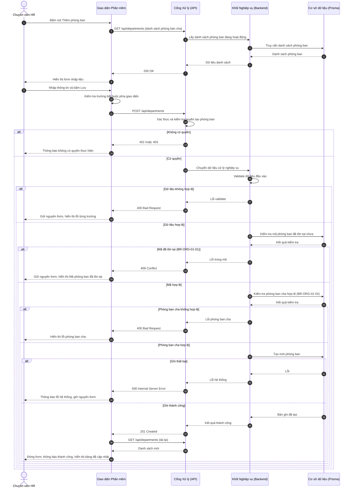
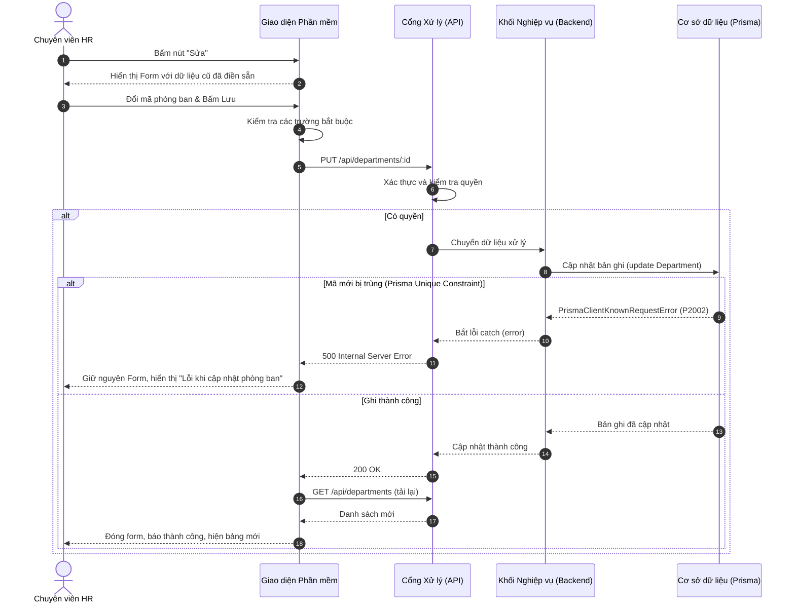
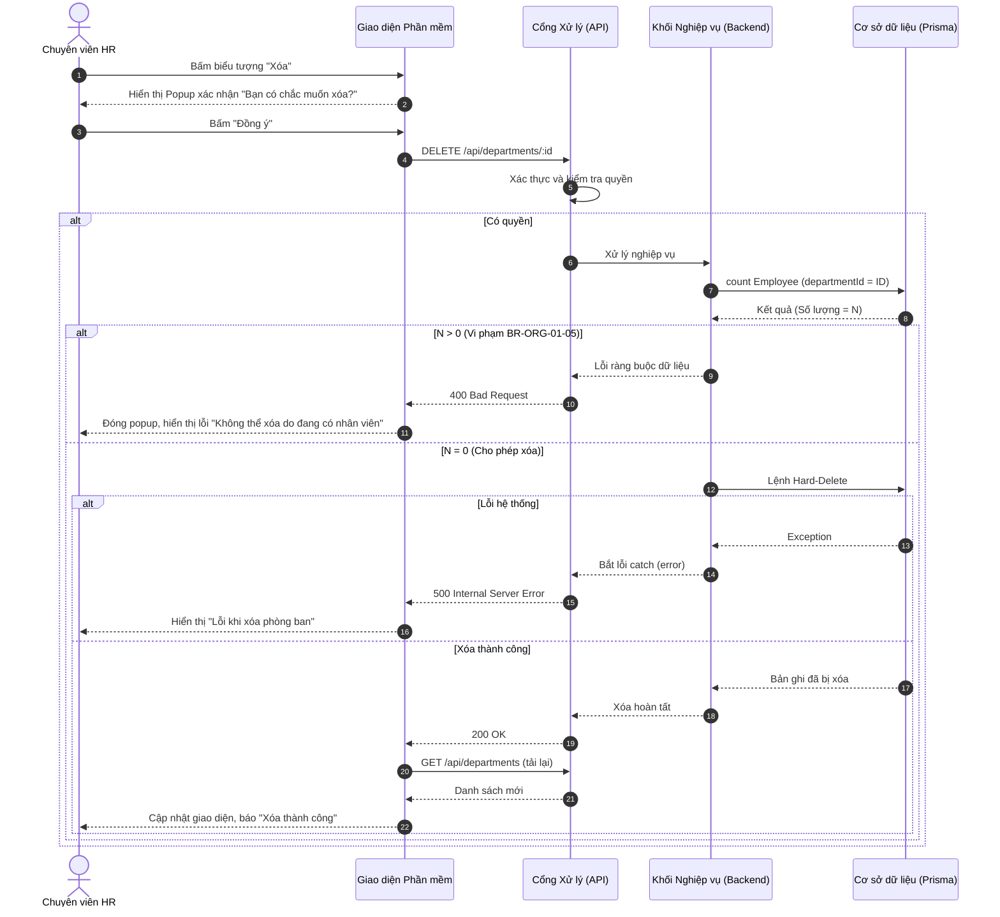

# Usecase: UC-ORG-01 - Quản lý Danh mục Phòng ban

## 1. Giới thiệu chức năng
- **Mục đích**: Cho phép Bộ phận Nhân sự thiết lập danh sách các đơn vị/phòng ban hợp pháp trong công ty. Chức năng này kiểm soát việc mở thêm phòng ban mới, sửa đổi thông tin/định biên nhân sự, hoặc đóng cửa (xóa) các phòng ban cũ.
- **Actor (Tác nhân)**: Trưởng phòng Nhân sự (HR Manager), Quản trị viên hệ thống.
- **Điều kiện tiên quyết**: Nhân sự phải được cấp quyền Quản lý cơ cấu tổ chức.

## 2. Dữ liệu nghiệp vụ đầu vào (Input Data)
| Thông tin | Tính chất | Ý nghĩa nghiệp vụ & Ràng buộc |
|-----------|-----------|-------------------------------|
| `Mã phòng ban` (Code) | Bắt buộc | Định danh viết tắt (VD: IT, SALE, MKT). **Ràng buộc:** Phải là duy nhất toàn công ty. |
| `Tên phòng ban` (Name) | Bắt buộc | Tên hiển thị đầy đủ (VD: Phòng Công nghệ Thông tin). |
| `Định mức nhân sự` (Quota)| Tùy chọn | Số lượng nhân viên tối đa được duyệt. Mặc định là 15 người. |
| `Phòng ban cha` (Parent)| Tùy chọn | Đơn vị quản lý cấp trên trực tiếp. |
| `Trạng thái` (Status) | Tùy chọn | Hoạt động / Ngừng hoạt động. |

## 3. Quy tắc nghiệp vụ (Business Rules)
| Mã Quy tắc | Tình huống nghiệp vụ | Cách hệ thống xử lý | Thông báo cho người dùng |
|---|---|---|---|
| BR-ORG-01-01 | **Kiểm soát trùng lặp**: HR nhập mã phòng ban đã được sử dụng cho một phòng khác. | Backend check `findUnique`. Trả HTTP 409 Conflict. | "Mã phòng ban đã tồn tại" |
| BR-ORG-01-02 | **Kiểm tra phòng cha hợp lệ**: Phòng ban cha được chọn không tồn tại hoặc đã bị xóa. | Backend kiểm tra sự tồn tại. Trả HTTP 400. | "Phòng ban cha không hợp lệ" |
| BR-ORG-01-03 | **Lỗi trùng mã khi Sửa**: HR đổi mã phòng ban thành mã đã tồn tại. | Vi phạm Prisma Unique Constraint. Trả HTTP 500. | "Lỗi khi cập nhật phòng ban" |
| BR-ORG-01-04 | **Giám sát định biên**: Khi HR xem danh sách tổng thể các phòng ban. | Tự động thống kê số lượng nhân viên thực tế đang ngồi ở từng phòng. | (Hiển thị trên bảng) |
| BR-ORG-01-05 | **Chống mất dữ liệu (Xóa an toàn)**: HR yêu cầu giải thể (xóa) một phòng ban đang có nhân sự làm việc. | Đếm số lượng nhân viên. Phát hiện > 0 -> Hủy bỏ lệnh xóa, trả HTTP 400. | "Không thể xóa phòng ban đang có nhân viên" |

## 4. Luồng xử lý nghiệp vụ

### 4.1. Luồng Thêm mới phòng ban
1. HR truy cập module Tổ chức và click chọn menu "Danh mục Phòng ban".
2. HR bấm nút "Thêm phòng ban".
3. Giao diện (FE) gửi request GET lấy danh sách phòng ban đang hoạt động để đổ vào Dropdown chọn "Phòng ban cha". Sau đó hiển thị Form nhập liệu.
4. HR nhập các thông tin (Mã, Tên, Định mức...) và bấm "Lưu".
5. Giao diện kiểm tra các trường bắt buộc (Validate UI). Nếu hợp lệ, gửi POST request xuống API.
6. API kiểm tra phân quyền. Nếu không có quyền: Trả 401/403.
7. Backend xác thực (Validate) dữ liệu đầu vào. Nếu sai: Trả 400 Bad Request.
8. Backend kiểm tra mã phòng ban (BR-ORG-01-01). Nếu trùng: Trả 409 Conflict.
9. Backend kiểm tra phòng ban cha (BR-ORG-01-02). Nếu không hợp lệ: Trả 400.
10. Tiến hành lưu CSDL. Nếu lỗi hệ thống: Trả 500. Thành công: Trả 201 Created.
11. Giao diện đóng Form, tự động gọi lại API GET và hiển thị danh sách mới nhất.

### 4.2. Luồng Cập nhật (Sửa) phòng ban
1. Tại màn hình Danh sách, HR tìm phòng ban cần sửa và bấm "Sửa".
2. Giao diện gọi GET và hiển thị Form với các thông tin cũ đã điền sẵn.
3. HR thay đổi thông tin và ấn "Lưu".
4. Giao diện gửi PUT request xuống API. API xác thực quyền và dữ liệu (như luồng Thêm).
5. Backend cập nhật vào DB.
   - Nếu mã mới bị trùng: DB văng lỗi Prisma Constraint, Backend catch lỗi trả về 500.
   - Nếu hợp lệ: Cập nhật thành công, trả 200 OK.
6. Giao diện đóng Form, gọi GET tải lại bảng.

### 4.3. Luồng Xóa phòng ban
1. HR bấm biểu tượng "Xóa" tại 1 dòng.
2. Hệ thống hiển thị Popup xác nhận "Bạn có chắc chắn muốn xóa?".
3. HR bấm "Đồng ý".
4. Giao diện gửi DELETE request.
5. Backend đếm số lượng nhân sự thuộc phòng này (BR-ORG-01-05).
6. Nếu > 0: Từ chối, trả 400 Bad Request.
7. Nếu = 0: Xóa khỏi CSDL, trả 200 OK (Hoặc 500 nếu lỗi DB).
8. Giao diện tải lại bảng dữ liệu.

## 5. Kết quả đầu ra
- Bảng `Department` trong CSDL được cập nhật (Thêm/Sửa/Xóa).

## 6. Sơ đồ tuần tự (Sequence Diagram)

### 6.1. Sơ đồ: Thêm mới Phòng ban

### 6.2. Sơ đồ: Cập nhật (Sửa) Phòng ban

### 6.3. Sơ đồ: Xóa Phòng ban

## 7. Kịch bản nghiệm thu (Given / When / Then)
- **Kịch bản 1: Cập nhật đổi tên phòng**
  - *Given*: Phòng có mã `IT`, tên là "Phòng Kỹ thuật".
  - *When*: HR mở form sửa, đổi tên thành "Phòng Công nghệ Thông tin" và ấn Lưu.
  - *Then*: Hệ thống update thành công vì không thay đổi mã `code` (không vi phạm tính duy nhất).
- **Kịch bản 2: Giải thể an toàn**
  - *Given*: Công ty có phòng "Dự án A" vừa hoàn thành, tất cả nhân sự đã chuyển sang phòng khác (Số nhân sự = 0).
  - *When*: HR ấn nút xóa phòng "Dự án A" và xác nhận đồng ý.
  - *Then*: Hệ thống xóa thành công phòng ban khỏi danh mục.
