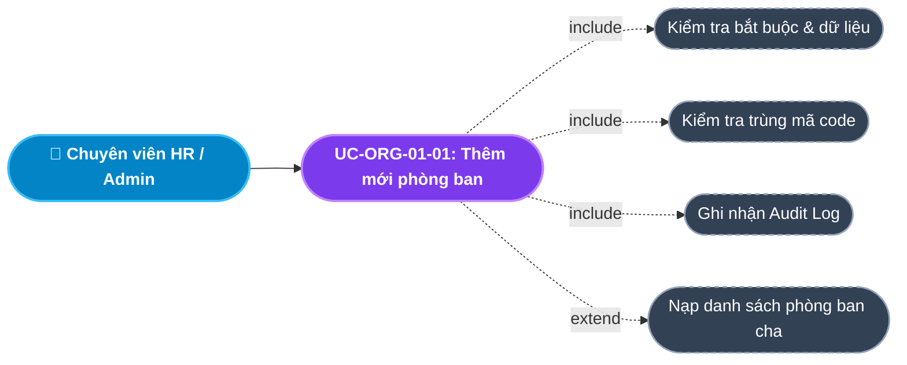
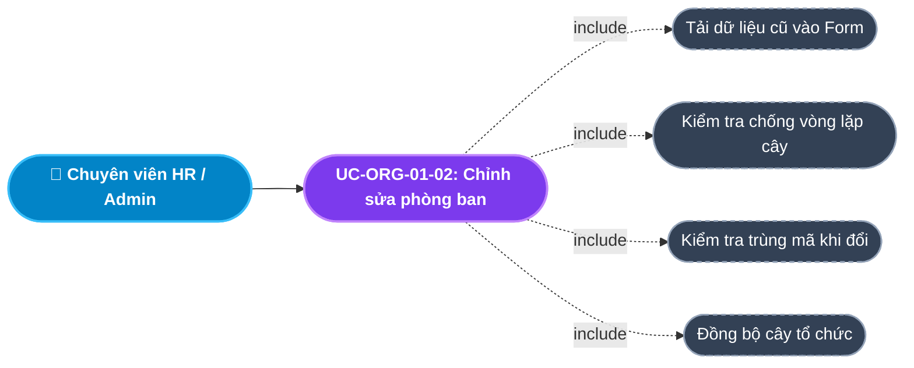
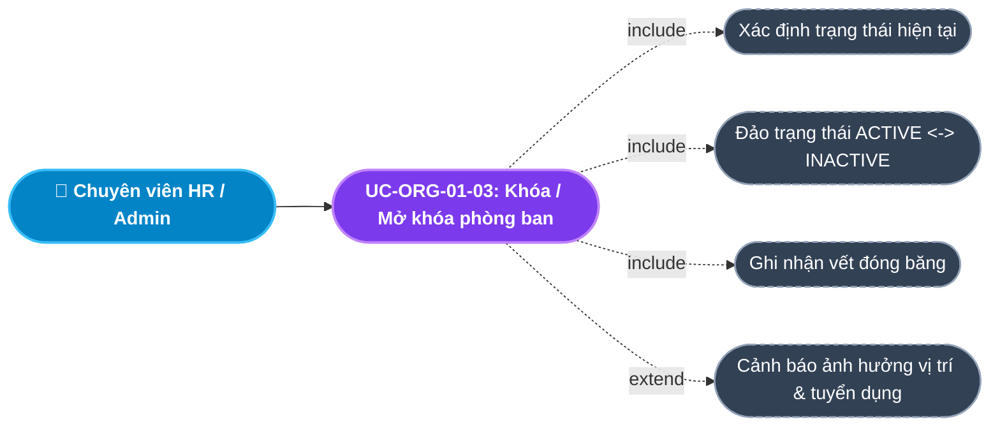
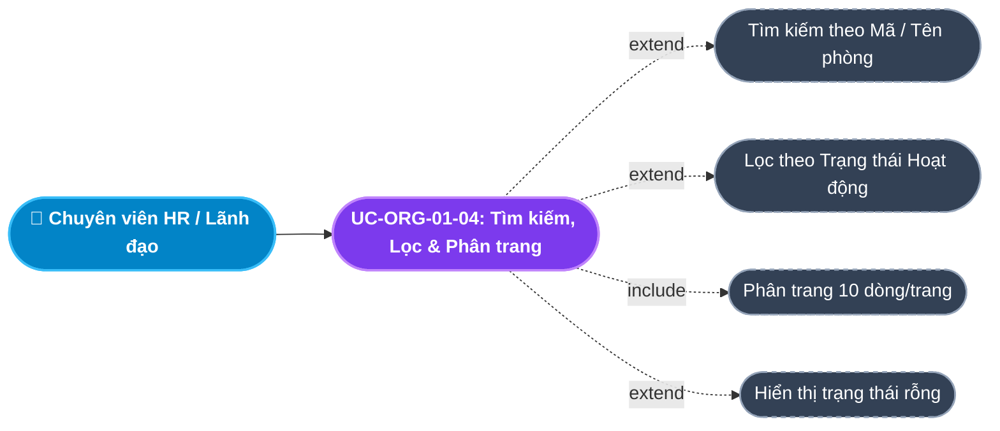
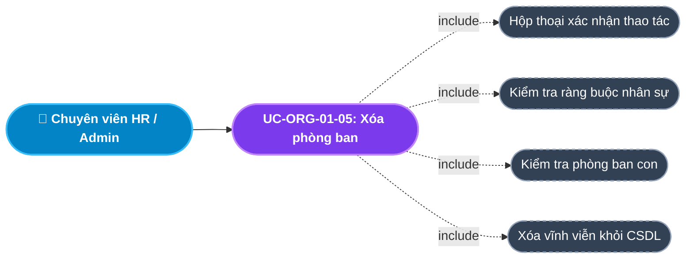
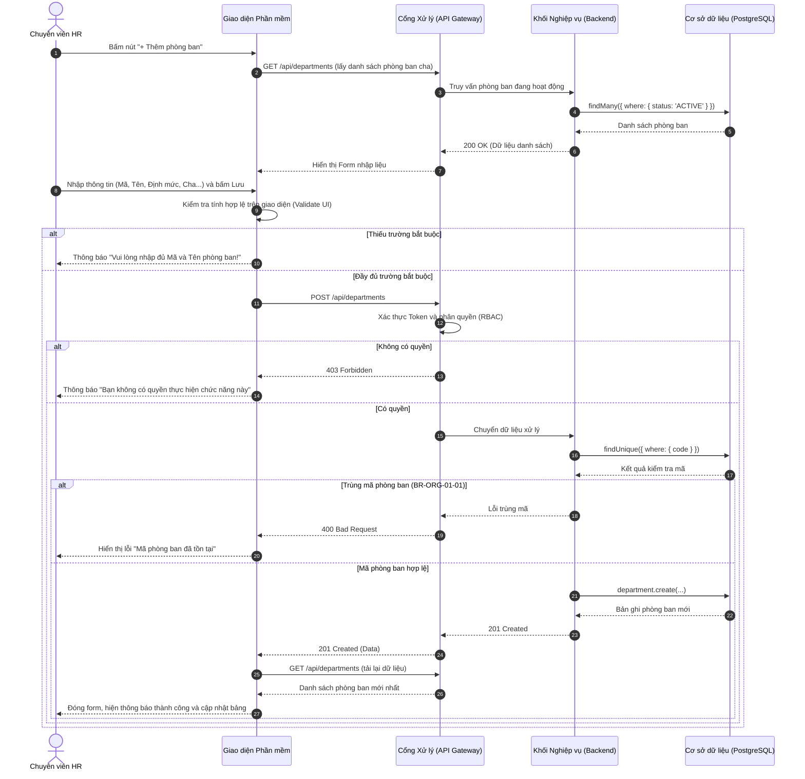
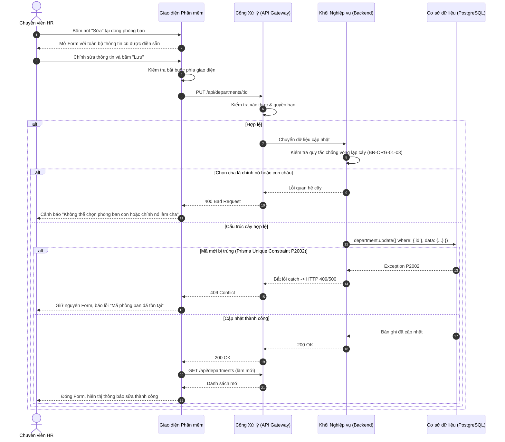
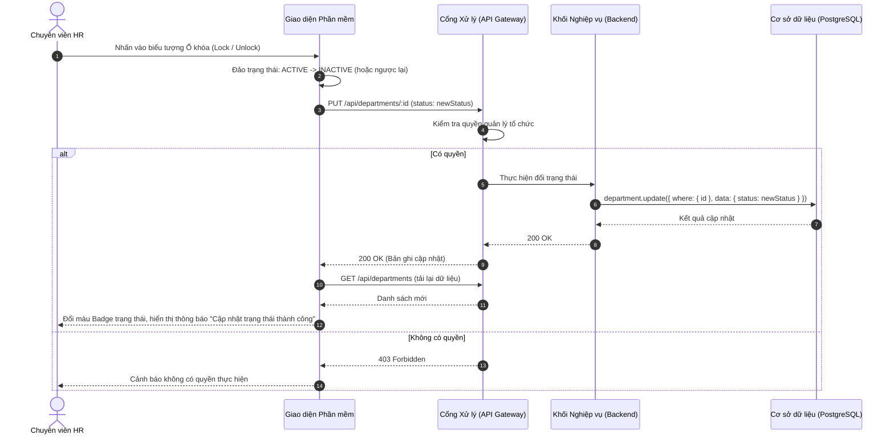
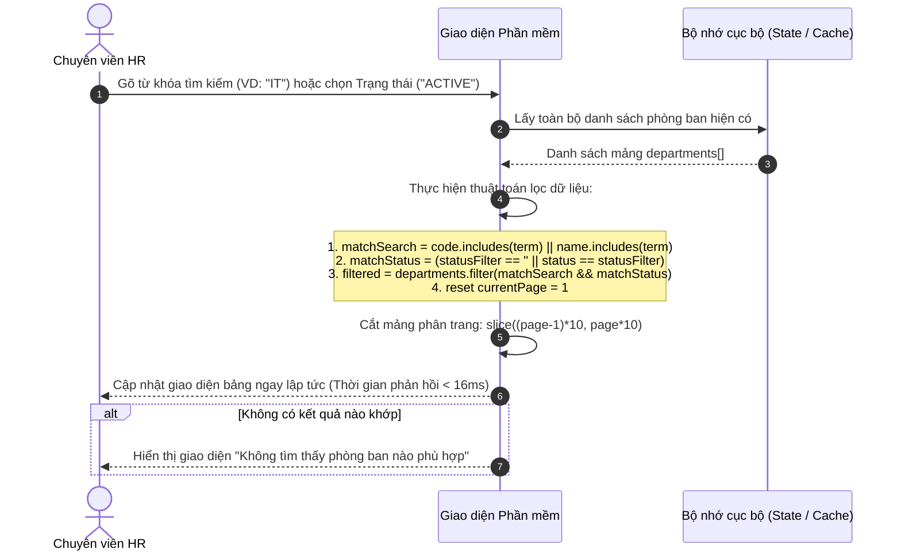
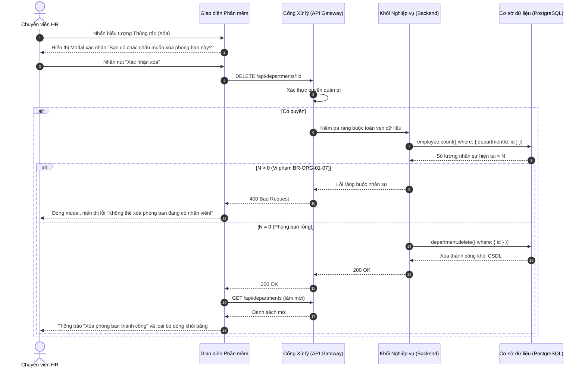

# Usecase: UC-ORG-01 - Quản lý Danh mục Phòng ban (Department Management)

## 1. Giới thiệu chức năng
- **Mục đích**: Cung cấp bộ công cụ toàn diện cho Bộ phận Nhân sự (HR) để quản lý cơ cấu các đơn vị, phòng ban trong toàn doanh nghiệp. Hệ thống không chỉ hỗ trợ CRUD cơ bản mà còn phục vụ các nghiệp vụ quản trị chuyên sâu như: tìm kiếm/lọc đa chiều, đóng băng/khóa phòng ban ngưng hoạt động, kiểm soát định mức nhân sự (Quota) và ngăn chặn thất thoát dữ liệu.
- **Actor (Tác nhân)**: Giám đốc Nhân sự (HR Manager), Chuyên viên Tổ chức & Định biên, Quản trị viên hệ thống (Admin).
- **Điều kiện tiên quyết**: Người dùng đã đăng nhập và được gán quyền `MANAGE_ORGANIZATION` hoặc vai trò `ADMIN`/`HR_MANAGER`.

### Danh mục các chức năng con (Sub-features):
1. **UC-ORG-01-01: Thêm mới phòng ban**: Thiết lập đơn vị mới vào cơ cấu tổ chức (có chỉ định phòng ban cha).
2. **UC-ORG-01-02: Chỉnh sửa thông tin phòng ban**: Đổi tên, thay đổi người quản lý, điều chỉnh định biên quota, luân chuyển phòng ban cha.
3. **UC-ORG-01-03: Khóa / Mở khóa phòng ban (Đổi trạng thái Active / Inactive)**: Đóng băng phòng ban tạm ngưng hoạt động hoặc giải thể mềm mà không làm mất lịch sử nhân sự.
4. **UC-ORG-01-04: Tìm kiếm & Lọc danh sách phòng ban**: Tìm nhanh theo từ khóa (Mã, Tên phòng), lọc theo trạng thái hoạt động và phân trang.
5. **UC-ORG-01-05: Xóa phòng ban (Hard Delete)**: Xóa triệt để các phòng ban nhập sai hoặc không còn sử dụng (chỉ xóa khi phòng ban rỗng).
6. **UC-ORG-01-06: Giám sát định biên & Tỷ lệ lấp đầy**: Theo dõi số lượng nhân sự thực tế đang làm việc so với chỉ tiêu định biên tối đa được duyệt.

---

## 2. Dữ liệu nghiệp vụ đầu vào (Input Data & Parameters)

### 2.1. Dữ liệu biểu mẫu Phòng ban (Department Form Data)
| Tên trường | Kiểu dữ liệu | Tính chất | Ý nghĩa nghiệp vụ & Ràng buộc |
|---|---|---|---|
| `Mã phòng ban` (code) | Chuỗi (String) | Bắt buộc | Mã định danh viết tắt (VD: `IT`, `SALE`, `HR`). **Ràng buộc:** Duy nhất trên toàn hệ thống, không phân biệt hoa thường. |
| `Tên phòng ban` (name) | Chuỗi (String) | Bắt buộc | Tên gọi chính thức đầy đủ (VD: `Phòng Kỹ thuật & Công nghệ`). Tối đa 255 ký tự. |
| `Người quản lý` (managerName) | Chuỗi (String) | Tùy chọn | Họ tên hoặc mã của Trưởng bộ phận phụ trách. |
| `Định mức nhân sự` (quota) | Số nguyên (Integer) | Bắt buộc | Số lượng nhân sự tối đa được phép bố trí vào phòng. Giá trị mặc định là `15` người (ngưỡng tối thiểu ≥ 1). |
| `Phòng ban cha` (parentId) | UUID / Chuỗi | Tùy chọn | Đơn vị cấp trên trực tiếp. Nếu để trống -> Phòng ban cấp cao nhất (Root Department). |
| `Trạng thái` (status) | Enum/String | Mặc định | `ACTIVE` (Đang hoạt động) hoặc `INACTIVE` (Ngừng hoạt động / Tạm khóa). |

### 2.2. Dữ liệu Tìm kiếm & Bộ lọc (Search & Filter Criteria)
| Tiêu chí | Loại điều khiển | Giá trị lựa chọn | Hành vi hệ thống |
|---|---|---|---|
| `Từ khóa tìm kiếm` (searchTerm) | Input Text | Ký tự bất kỳ | Lọc real-time theo Mã phòng ban hoặc Tên phòng ban (chứa chuỗi tìm kiếm). |
| `Lọc theo trạng thái` (statusFilter) | Dropdown Select | `Tất cả` / `ACTIVE` / `INACTIVE` | Chỉ hiển thị các phòng ban có trạng thái tương ứng. |
| `Phân trang` (Pagination) | Nút chuyển trang | Trang hiện tại (`currentPage`), 10 dòng/trang | Tính toán cắt mảng dữ liệu hiển thị đúng 10 bản ghi trên mỗi trang. |

---

## 3. Quy tắc nghiệp vụ (Business Rules)

| Mã Quy tắc | Tình huống nghiệp vụ | Cách hệ thống xử lý | Thông báo hiển thị cho người dùng |
|---|---|---|---|
| **BR-ORG-01-01** | **Kiểm soát trùng lặp mã khi tạo**: HR nhập mã phòng ban đã tồn tại trong CSDL. | Backend kiểm tra `findUnique({ where: { code } })`. Nếu tồn tại -> Từ chối, trả HTTP 400 hoặc 409. | "Mã phòng ban đã tồn tại" |
| **BR-ORG-01-02** | **Kiểm tra phòng ban cha hợp lệ**: HR chọn phòng ban cha không tồn tại hoặc đã bị xóa. | Backend kiểm tra sự tồn tại của `parentId`. Nếu không thấy -> Trả HTTP 400. | "Phòng ban cha không hợp lệ" |
| **BR-ORG-01-03** | **Chống vòng lặp cây đệ quy khi Sửa**: HR sửa phòng ban cha thành chính nó hoặc chọn phòng con trực thuộc làm cha. | Backend kiểm tra chuỗi phả hệ cây (Hierarchy Path). Nếu phát hiện vòng lặp vô tận -> Từ chối, trả HTTP 400. | "Không thể chọn phòng ban con hoặc chính nó làm phòng ban cha" |
| **BR-ORG-01-04** | **Lỗi trùng mã khi Sửa**: HR sửa mã phòng ban trùng với mã của một phòng ban khác. | Prisma ném ngoại lệ `P2002 Unique Constraint`. Backend bắt lỗi trả về HTTP 409/500. | "Mã phòng ban đã tồn tại trên hệ thống" |
| **BR-ORG-01-05** | **Khóa phòng ban (Soft Lock / Inactive)**: HR bấm chuyển trạng thái phòng ban sang `INACTIVE`. | Cập nhật `status = 'INACTIVE'`. Hệ thống chuyển biểu tượng sang Ổ khóa (Lock). Cấm tạo thêm vị trí hoặc tuyển dụng mới vào phòng này. | "Đã chuyển trạng thái phòng ban sang Ngừng hoạt động" |
| **BR-ORG-01-06** | **Mở khóa phòng ban (Unlock / Activate)**: HR kích hoạt lại phòng ban đang bị khóa. | Cập nhật `status = 'ACTIVE'`. Mở lại toàn bộ quyền tuyển dụng, luân chuyển và bổ nhiệm. | "Đã kích hoạt lại phòng ban thành công" |
| **BR-ORG-01-07** | **Ràng buộc an toàn khi Xóa (Hard Delete)**: HR bấm xóa một phòng ban đang có nhân viên làm việc (`employees > 0`). | Backend đếm số lượng nhân sự `employee.count({ where: { departmentId } })`. Nếu > 0 -> Hủy bỏ lệnh xóa, trả HTTP 400. | "Không thể xóa phòng ban đang có nhân viên" |
| **BR-ORG-01-08** | **Ràng buộc phòng ban con khi Xóa**: HR xóa một phòng ban cha đang chứa các phòng ban con trực thuộc. | Kiểm tra `children.count > 0`. Nếu còn phòng con -> Từ chối xóa để tránh gãy cây cấu trúc. | "Vui lòng chuyển hoặc xóa các phòng ban con trước khi xóa phòng ban cha" |
| **BR-ORG-01-09** | **Quy tắc tìm kiếm không phân biệt hoa thường (Case-insensitive)**: HR gõ từ khóa `it`, `It` hay `IT`. | Hệ thống chuẩn hóa chuỗi về chữ thường trước khi so khớp `toLowerCase().includes()`. | Hiển thị kết quả khớp chính xác |
| **BR-ORG-01-10** | **Tự động reset trang khi lọc**: Người dùng đang ở trang 3 nhưng đổi từ khóa tìm kiếm hoặc đổi bộ lọc trạng thái. | Hệ thống tự động đặt lại `currentPage = 1` để tránh tình trạng trang trống rỗng. | Hiển thị trang 1 của kết quả lọc mới |

---

## 4. Đặc tả chi tiết các Use Case chức năng con (Sub-Use Cases Specification)

Mỗi chức năng con trong module Quản lý Danh mục Phòng ban gồm Sơ đồ Use Case phân rã trực quan và Bảng đặc tả 8 mục nghiệp vụ chuẩn hóa:

---

### 4.1. UC-ORG-01-01: Thêm mới phòng ban (Create Department)

#### Sơ đồ Use Case:

#### Bảng đặc tả nghiệp vụ:

| STT | Hạng mục | Nội dung chi tiết |
|:---:|---|---|
| **1** | **Thông tin chung** | - **UC ID**: `UC-ORG-01-01` - **UC Name**: Thêm mới phòng ban (Create Department) - **Actor**: Chuyên viên HR, Trưởng phòng Nhân sự (HR Manager), Quản trị viên (Admin) - **Mục tiêu**: Thiết lập phòng ban/đơn vị mới vào cơ cấu tổ chức để quản lý nhân sự và phân bổ định biên. - **Mô tả**: Người dùng nhập thông tin định danh (Mã, Tên), định mức nhân sự (Quota), quản lý và chọn phòng ban cấp trên. - **Priority**: High (Bắt buộc) |
| **2** | **Trigger** | Người dùng nhấn nút **"+ Thêm phòng ban"** trên thanh công cụ của màn hình Danh mục phòng ban. |
| **3** | **Pre-condition** | 1. Đã đăng nhập thành công vào hệ thống HRM. 2. Có quyền `MANAGE_ORGANIZATION` hoặc vai trò `ADMIN` / `HR_MANAGER`. 3. Màn hình Danh mục phòng ban đã tải xong dữ liệu. |
| **4** | **Post-condition** | 1. Bản ghi phòng ban mới được lưu vào CSDL với trạng thái mặc định `ACTIVE`. 2. Bảng danh sách hiển thị ngay phòng ban mới. 3. Phòng ban xuất hiện trong dropdown chọn phòng ban ở module Nhân viên, Vị trí. 4. Ghi nhận Audit Log: Thời gian, Actor, hành động tạo. |
| **5** | **Main Flow** | 1. Bấm nút **"+ Thêm phòng ban"**. 2. Hệ thống mở Modal Form, nạp danh sách phòng ban cha và điền sẵn Định mức Quota = `15`. 3. Nhập đầy đủ: Mã phòng ban, Tên phòng ban, Định mức Quota, Quản lý, chọn Phòng ban cha. 4. Bấm nút **"Lưu"**. 5. Client kiểm tra hợp lệ dữ liệu (Mã, Tên không rỗng, Quota $\ge$ 1). 6. Gửi request `POST /api/departments` kèm payload dữ liệu. 7. Backend kiểm tra quyền và kiểm tra duy nhất mã code (`BR-ORG-01-01`). 8. Backend lưu bản ghi với `status = 'ACTIVE'`, trả về `HTTP 201 Created`. 9. Giao diện đóng Modal, nạp lại danh sách và hiển thị Toast thông báo thành công. |
| **6** | **Alternative / Exception Flow** | - **AF-01 (Hủy bỏ)**: Bấm "Hủy" hoặc icon `X` $\rightarrow$ Đóng modal ngay lập tức, không lưu dữ liệu. - **AF-02 (Tạo phòng Root)**: Không chọn phòng ban cha $\rightarrow$ Lưu `parentId = null`, làm phòng ban cấp cao nhất. - **EF-01 (Thiếu trường bắt buộc)**: Để trống Mã hoặc Tên $\rightarrow$ Highlight viền đỏ, báo lỗi *"Vui lòng nhập đủ Mã và Tên phòng ban!"*. - **EF-02 (Trùng mã code)**: Mã đã tồn tại $\rightarrow$ Backend trả lỗi 400/409, giao diện báo *"Mã phòng ban đã tồn tại!"*, giữ nguyên dữ liệu form. - **EF-03 (Quota sai)**: Nhập Quota $\le$ 0 $\rightarrow$ Báo lỗi *"Định mức nhân sự phải là số nguyên dương $\ge$ 1"*. - **EF-04 (Mất kết nối)**: Lỗi mạng hoặc server 500 $\rightarrow$ Toast báo lỗi *"Không thể kết nối đến máy chủ"*. |
| **7** | **Business Rules & Validation** | - `BR-ORG-01-01`: Mã phòng ban (`code`) duy nhất toàn hệ thống (case-insensitive), tối đa 50 ký tự. - `BR-ORG-01-02`: Phòng ban cha phải đang ở trạng thái `ACTIVE`. - `name`: Bắt buộc, chuỗi 1-255 ký tự, không chứa toàn dấu cách. - `quota`: Bắt buộc, số nguyên dương $\ge$ 1, mặc định = 15. - Trạng thái khởi tạo luôn là `ACTIVE`. |
| **8** | **Acceptance Criteria** | - **AC-01**: Bấm "+ Thêm phòng ban" mở modal < 200ms với quota mặc định là 15. - **AC-02**: Nhập trùng mã $\rightarrow$ Hệ thống chặn lại, báo lỗi rõ ràng và không làm mất dữ liệu đã gõ. - **AC-03**: Nhập hợp lệ và bấm Lưu $\rightarrow$ Lưu CSDL thành công, đóng form và dữ liệu mới hiển thị ngay trên bảng. |

---

### 4.2. UC-ORG-01-02: Chỉnh sửa thông tin phòng ban (Update Department)

#### Sơ đồ Use Case:

#### Bảng đặc tả nghiệp vụ:

| STT | Hạng mục | Nội dung chi tiết |
|:---:|---|---|
| **1** | **Thông tin chung** | - **UC ID**: `UC-ORG-01-02` - **UC Name**: Chỉnh sửa thông tin phòng ban (Update Department) - **Actor**: Chuyên viên HR, HR Manager, Quản trị viên (Admin) - **Mục tiêu**: Cập nhật thông tin phòng ban (Tên, Quản lý, Định biên, Luân chuyển cha) khi có biến động tổ chức. - **Mô tả**: Người dùng chỉnh sửa các trường dữ liệu, hệ thống kiểm tra tính toàn vẹn cây và lưu vào CSDL. - **Priority**: High |
| **2** | **Trigger** | Người dùng nhấn biểu tượng cây bút **"Sửa" (Edit)** tại cột Thao tác của dòng phòng ban tương ứng trong bảng. |
| **3** | **Pre-condition** | 1. Có quyền `MANAGE_ORGANIZATION` hoặc vai trò `ADMIN` / `HR_MANAGER`. 2. Phòng ban cần sửa đang tồn tại trên hệ thống. |
| **4** | **Post-condition** | 1. Dữ liệu phòng ban được cập nhật chính xác trong CSDL. 2. Bảng danh sách và sơ đồ cây tổ chức lập tức cập nhật cấu trúc mới. 3. Ghi nhận Audit Log: Thời gian, Actor, dữ liệu thay đổi (Old Value $\rightarrow$ New Value). |
| **5** | **Main Flow** | 1. Tìm đến dòng phòng ban cần sửa và bấm nút **"Sửa"**. 2. Hệ thống mở Modal Form, tự động nạp toàn bộ giá trị hiện tại của phòng ban đó. 3. Sửa đổi thông tin (Tên phòng, người quản lý, định mức quota, chọn phòng ban cha mới). 4. Bấm nút **"Lưu thay đổi"**. 5. Client kiểm tra tính hợp lệ dữ liệu. 6. Gửi request `PUT /api/departments/:id` kèm dữ liệu cập nhật. 7. Backend kiểm tra cấu trúc cây: Xác minh phòng ban cha mới không phải chính nó và không phải con trực thuộc (`BR-ORG-01-03`). 8. Backend kiểm tra không trùng mã với đơn vị khác (`BR-ORG-01-04`). 9. Backend cập nhật CSDL, trả về `HTTP 200 OK`. 10. Giao diện đóng Modal, nạp lại danh sách và hiển thị Toast thông báo thành công. |
| **6** | **Alternative / Exception Flow** | - **AF-01 (Hủy chỉnh sửa)**: Bấm "Hủy" hoặc click ngoài Modal $\rightarrow$ Hủy bỏ thay đổi, giữ nguyên dữ liệu cũ. - **AF-02 (Không đổi phòng ban cha)**: Chỉ cập nhật quản lý hoặc quota $\rightarrow$ Bỏ qua bước kiểm tra cây, cập nhật trực tiếp. - **EF-01 (Vòng lặp cây đệ quy)**: Chọn phòng ban cha là chính nó hoặc phòng con trực thuộc $\rightarrow$ Báo lỗi *"Không thể chọn phòng ban con hoặc chính nó làm phòng ban cha!"*. - **EF-02 (Trùng mã khi đổi)**: Đổi mã trùng với một phòng ban khác $\rightarrow$ Trả lỗi 409 Conflict, báo *"Mã phòng ban đã tồn tại trên hệ thống!"*. - **EF-03 (Bản ghi đã bị xóa)**: Phòng ban bị người khác xóa trước đó $\rightarrow$ Báo lỗi *"Phòng ban không tồn tại hoặc đã bị xóa"*. |
| **7** | **Business Rules & Validation** | - `BR-ORG-01-03`: Tuyệt đối không cho phép tạo vòng lặp cấu trúc phả hệ (A cha của B $\rightarrow$ B không thể là cha của A). - `BR-ORG-01-04`: Mã phòng ban duy nhất trên toàn hệ thống. - `parentId`: Phải khác `id` của chính phòng ban đang sửa. - `quota`: Số nguyên dương $\ge$ 1; cảnh báo mềm nếu giảm quota nhỏ hơn số nhân viên thực tế đang làm việc. |
| **8** | **Acceptance Criteria** | - **AC-01**: Bấm Sửa mở form hiển thị chính xác 100% dữ liệu hiện tại của phòng ban đó. - **AC-02**: Chọn phòng ban cha là chính nó $\rightarrow$ Bị chặn lại và hiển thị cảnh báo lỗi rõ ràng. - **AC-03**: Cập nhật thành công $\rightarrow$ Giá trị mới lập tức hiển thị trên bảng dữ liệu và sơ đồ cây. |

---

### 4.3. UC-ORG-01-03: Khóa / Mở khóa phòng ban (Đổi trạng thái Active / Inactive)

#### Sơ đồ Use Case:

#### Bảng đặc tả nghiệp vụ:

| STT | Hạng mục | Nội dung chi tiết |
|:---:|---|---|
| **1** | **Thông tin chung** | - **UC ID**: `UC-ORG-01-03` - **UC Name**: Khóa / Mở khóa phòng ban (Toggle Status Active / Inactive) - **Actor**: Chuyên viên HR, HR Manager, Quản trị viên hệ thống (Admin) - **Mục tiêu**: Đóng băng mềm (Soft Lock) đơn vị tạm ngừng hoạt động hoặc giải thể nhằm chặn phát sinh nhân sự mới nhưng bảo toàn 100% lịch sử nhân sự, hợp đồng và bảng lương. - **Mô tả**: Chuyển đổi trạng thái phòng ban giữa `ACTIVE` và `INACTIVE` chỉ với một thao tác bấm. - **Priority**: High (Quản trị vận hành) |
| **2** | **Trigger** | Người dùng nhấn vào biểu tượng **Ổ khóa (Lock / Unlock)** tại cột Thao tác của dòng phòng ban tương ứng trong bảng. |
| **3** | **Pre-condition** | 1. Người dùng có quyền `MANAGE_ORGANIZATION`. 2. Phòng ban tồn tại trên danh sách. |
| **4** | **Post-condition** | 1. Trạng thái phòng ban trong CSDL đổi thành `INACTIVE` (khi Khóa) hoặc `ACTIVE` (khi Mở khóa). 2. Badge trạng thái đổi màu tương ứng (Xanh lá = Hoạt động; Xám/Đỏ = Ngừng hoạt động). 3. Phòng ban bị khóa tự động ẩn khỏi dropdown chọn phòng ban của Tuyển dụng, Tạo Vị trí, Tiếp nhận nhân sự. 4. Ghi nhận Audit Log: Thời gian, Actor, hành động Khóa/Mở khóa. |
| **5** | **Main Flow** | 1. Xác định phòng ban cần đổi trạng thái trong bảng danh sách. 2. Nhấn nút biểu tượng **Ổ khóa**. 3. Hệ thống xác định trạng thái: Nếu đang là `ACTIVE` $\rightarrow$ Đổi thành `INACTIVE`; Nếu `INACTIVE` $\rightarrow$ Đổi thành `ACTIVE`. 4. Giao diện gửi request `PUT /api/departments/:id` với `{ status: newStatus }`. 5. Backend kiểm tra quyền hạn của người dùng. 6. Backend cập nhật trường `status` trong CSDL và ghi nhận Audit Trail. 7. Backend trả về `HTTP 200 OK`. 8. Giao diện cập nhật ngay Badge trạng thái trên dòng đó và hiển thị Toast thông báo thành công. |
| **6** | **Alternative / Exception Flow** | - **AF-01 (Mở khóa lại)**: Nhấn mở khóa phòng ban `INACTIVE` $\rightarrow$ Kích hoạt lại thành `ACTIVE`, mở lại quyền tuyển dụng/bổ nhiệm. - **EF-01 (Không có quyền)**: Người dùng không có quyền quản lý $\rightarrow$ Trả `403 Forbidden`, cảnh báo: *"Bạn không có quyền thay đổi trạng thái phòng ban"*. - **EF-02 (Lỗi kết nối)**: Mất kết nối server $\rightarrow$ Toast báo lỗi, giữ nguyên trạng thái cũ. |
| **7** | **Business Rules & Validation** | - `BR-ORG-01-05`: Khi phòng ban bị khóa (`INACTIVE`), tất cả các chức năng thêm nhân viên, tạo vị trí việc làm mới thuộc phòng ban này đều bị chặn. - `BR-ORG-01-06`: Khóa phòng ban không làm xóa dữ liệu nhân viên, không ảnh hưởng đến việc tính lương lịch sử. - `status`: Chỉ nhận 1 trong 2 giá trị Enum: `'ACTIVE'` hoặc `'INACTIVE'`. |
| **8** | **Acceptance Criteria** | - **AC-01**: Nhấn Ổ khóa tại phòng ban `ACTIVE` $\rightarrow$ Chuyển sang `INACTIVE`, Badge đổi màu xám/đỏ, Toast xuất hiện. - **AC-02**: Nhấn Ổ khóa tại phòng ban `INACTIVE` $\rightarrow$ Chuyển sang `ACTIVE`, Badge đổi màu xanh lá. - **AC-03**: Phòng ban `INACTIVE` không xuất hiện trong dropdown chọn phòng ban khi Thêm vị trí mới. |

---

### 4.4. UC-ORG-01-04: Tìm kiếm, Lọc & Phân trang phòng ban (Search, Filter & Pagination)

#### Sơ đồ Use Case:

#### Bảng đặc tả nghiệp vụ:

| STT | Hạng mục | Nội dung chi tiết |
|:---:|---|---|
| **1** | **Thông tin chung** | - **UC ID**: `UC-ORG-01-04` - **UC Name**: Tìm kiếm, Lọc & Phân trang phòng ban (Search, Filter & Pagination) - **Actor**: Toàn bộ người dùng có quyền xem tổ chức (HR, Quản lý, Giám đốc, Admin) - **Mục tiêu**: Tra cứu nhanh chóng và chính xác các phòng ban theo từ khóa và trạng thái; hiển thị gọn gàng 10 bản ghi/trang. - **Mô tả**: Tìm kiếm không phân biệt hoa thường theo Mã hoặc Tên, kết hợp bộ lọc trạng thái và phân trang client-side tức thì (< 16ms). - **Priority**: High |
| **2** | **Trigger** | Người dùng gõ ký tự vào ô tìm kiếm, chọn Dropdown trạng thái hoặc bấm nút chuyển trang. |
| **3** | **Pre-condition** | 1. Đang ở màn hình Danh mục phòng ban. 2. Dữ liệu danh sách phòng ban đã được tải về Client. |
| **4** | **Post-condition** | 1. Bảng hiển thị danh sách phòng ban thỏa mãn đồng thời tiêu chí tìm kiếm và bộ lọc. 2. Cập nhật dòng: *"Hiển thị X - Y trên tổng số Z phòng ban"*. 3. Trang hiện tại được reset về Trang 1 mỗi khi thay đổi từ khóa hoặc bộ lọc. |
| **5** | **Main Flow** | 1. Nhập từ khóa vào ô `Tìm theo mã, tên phòng ban...` (ví dụ: gõ `"Kỹ thuật"`). 2. Chọn bộ lọc trạng thái (ví dụ: `"Đang hoạt động"`). 3. Hệ thống áp dụng thuật toán lọc kết hợp đa tiêu chí (AND Logic): `matchSearch = code.toLowerCase().includes(term) || name.toLowerCase().includes(term)` `matchStatus = (statusFilter === '' || status === statusFilter)` `filteredList = departments.filter(matchSearch && matchStatus)`. 4. Tự động đặt lại `currentPage = 1`. 5. Tính tổng số trang: `totalPages = Math.ceil(filteredList.length / 10)`. 6. Cắt mảng hiển thị trang 1: `filteredList.slice(0, 10)` và kết xuất lên bảng dữ liệu trong < 16ms. |
| **6** | **Alternative / Exception Flow** | - **AF-01 (Chuyển trang)**: Bấm số trang 2, 3... $\rightarrow$ Render đúng 10 bản ghi của trang đó mà không reload trang. - **AF-02 (Xóa từ khóa)**: Xóa trắng ô tìm kiếm $\rightarrow$ Hiển thị lại toàn bộ danh sách phòng ban theo bộ lọc trạng thái hiện hành. - **EF-01 (Không tìm thấy kết quả)**: Không có bản ghi nào khớp (`filteredList.length === 0`) $\rightarrow$ Hiển thị Empty State: *"Không tìm thấy phòng ban nào phù hợp với điều kiện tìm kiếm"* và ẩn thanh phân trang. |
| **7** | **Business Rules & Validation** | - `BR-ORG-01-09`: Thuật toán tìm kiếm không phân biệt chữ hoa, chữ thường (Case-insensitive) và hỗ trợ tiếng Việt có dấu/không dấu cơ bản. - `BR-ORG-01-10`: Bất kỳ thay đổi nào tại ô tìm kiếm hoặc bộ lọc trạng thái đều phải tự động đưa `currentPage` về 1. - Bộ lọc trạng thái nhận: `""` (Tất cả), `"ACTIVE"`, `"INACTIVE"`. |
| **8** | **Acceptance Criteria** | - **AC-01**: Nhập `"it"`, bảng hiển thị ngay các phòng ban có mã hoặc tên chứa `"IT"`, `"it"`, `"It"` mà không cần bấm nút Tìm kiếm. - **AC-02**: Đang ở trang 3, khi gõ từ khóa mới, trang hiện tại tự động nhảy về Trang 1. - **AC-03**: Khi lọc không có kết quả, bảng hiển thị thông báo rỗng thân thiện, không vỡ giao diện. |

---

### 4.5. UC-ORG-01-05: Xóa phòng ban (Hard Delete Department)

#### Sơ đồ Use Case:

#### Bảng đặc tả nghiệp vụ:

| STT | Hạng mục | Nội dung chi tiết |
|:---:|---|---|
| **1** | **Thông tin chung** | - **UC ID**: `UC-ORG-01-05` - **UC Name**: Xóa phòng ban (Hard Delete Department) - **Actor**: Quản trị viên hệ thống (Admin), HR Manager có thẩm quyền cao nhất - **Mục tiêu**: Xóa bỏ hoàn toàn khỏi CSDL các phòng ban nhập sai, phòng ban nháp không có ràng buộc dữ liệu. - **Mô tả**: Kiểm tra nghiêm ngặt các ràng buộc toàn vẹn dữ liệu (không có nhân viên, không có phòng con) trước khi cho phép xóa vĩnh viễn. - **Priority**: Medium (Thao tác có rủi ro cao, kiểm soát chặt) |
| **2** | **Trigger** | Người dùng nhấn biểu tượng **Thùng rác (Delete)** tại cột Thao tác của dòng phòng ban cần xóa. |
| **3** | **Pre-condition** | 1. Có quyền `MANAGE_ORGANIZATION` và vai trò `ADMIN` hoặc `HR_MANAGER`. 2. Phòng ban muốn xóa đang hiển thị trong danh sách. |
| **4** | **Post-condition** | 1. Bản ghi phòng ban bị xóa hoàn toàn khỏi cơ sở dữ liệu (`DELETE FROM departments`). 2. Dòng dữ liệu biến mất khỏi giao diện. 3. Ghi nhận Audit Log: Thời gian, Actor, bản ghi đã xóa để phục vụ thanh tra. |
| **5** | **Main Flow** | 1. Nhấn nút biểu tượng **Thùng rác** tại dòng phòng ban cần xóa. 2. Hệ thống hiển thị Modal xác nhận: *"Bạn có chắc chắn muốn xóa phòng ban [TÊN PHÒNG]? Thao tác này không thể hoàn tác!"*. 3. Người dùng nhấn nút **"Xác nhận xóa"**. 4. Giao diện gửi request `DELETE /api/departments/:id`. 5. Backend kiểm tra số lượng nhân viên đang thuộc phòng ban (`BR-ORG-01-07`). Số lượng = 0. 6. Backend kiểm tra số lượng phòng ban con trực thuộc (`BR-ORG-01-08`). Số lượng = 0. 7. Backend thực hiện lệnh xóa bản ghi khỏi CSDL và trả về `HTTP 200 OK`. 8. Giao diện đóng modal, tự động nạp lại danh sách và hiển thị Toast thông báo: *"Đã xóa phòng ban thành công"*. |
| **6** | **Alternative / Exception Flow** | - **AF-01 (Hủy lệnh xóa)**: Tại bước 2, nhấn "Hủy" hoặc click ngoài hộp thoại $\rightarrow$ Đóng hộp thoại, không xóa, phòng ban giữ nguyên. - **EF-01 (Chặn xóa do có nhân viên)**: Tại bước 5, nếu `employeeCount > 0` $\rightarrow$ Backend từ chối lỗi `HTTP 400`, cảnh báo: *"Không thể xóa phòng ban đang có nhân viên làm việc! Vui lòng luân chuyển nhân viên hoặc dùng chức năng Khóa phòng ban."*. - **EF-02 (Chặn xóa do có phòng con)**: Tại bước 6, nếu phòng ban có đơn vị con $\rightarrow$ Backend từ chối với `HTTP 400`, cảnh báo: *"Không thể xóa phòng ban đang chứa các đơn vị trực thuộc!"*. - **EF-03 (Không đủ quyền)**: Người dùng thông thường $\rightarrow$ Trả về `HTTP 403 Forbidden`, cảnh báo: *"Bạn không có quyền thực hiện thao tác xóa phòng ban"*. |
| **7** | **Business Rules & Validation** | - `BR-ORG-01-07`: Tuyệt đối không cho phép xóa vật lý (Hard Delete) phòng ban đang có ít nhất 01 nhân viên liên kết trong CSDL để bảo vệ toàn vẹn lịch sử nhân sự và hợp đồng. - `BR-ORG-01-08`: Không cho phép xóa phòng ban cha khi còn phòng ban con trực thuộc để tránh gãy cấu trúc cây. Khuyến nghị sử dụng `UC-ORG-01-03` (Khóa phòng ban) thay cho Xóa vật lý. |
| **8** | **Acceptance Criteria** | - **AC-01**: Khi bấm nút Xóa, bắt buộc phải xuất hiện Modal xác nhận để phòng ngừa click nhầm. - **AC-02**: Thử xóa phòng ban đang có nhân viên $\rightarrow$ Bắt buộc hệ thống phải chặn lại, hiện thông báo từ chối rõ ràng và dữ liệu không bị xóa. - **AC-03**: Xóa phòng ban rỗng hợp lệ $\rightarrow$ Dòng dữ liệu biến mất ngay lập tức và CSDL cập nhật thành công. |

---

## 5. Sơ đồ tuần tự nghiệp vụ (Sequence Diagrams)

### 5.1. Sơ đồ: Thêm mới phòng ban

### 5.2. Sơ đồ: Chỉnh sửa thông tin phòng ban

### 5.3. Sơ đồ: Khóa / Mở khóa phòng ban (Đổi trạng thái Active / Inactive)

### 5.4. Sơ đồ: Tìm kiếm, Lọc & Phân trang phòng ban

### 5.5. Sơ đồ: Xóa phòng ban (Hard Delete)

---

## 6. Kịch bản kiểm thử & Nghiệm thu (Given / When / Then)

### Kịch bản 1: Tìm kiếm phòng ban theo mã hoặc tên
- **Given**: Danh sách có các phòng ban: `IT - Phòng Công nghệ`, `HR - Phòng Nhân sự`, `MKT - Phòng Marketing`.
- **When**: HR nhập từ khóa `công nghệ` vào ô tìm kiếm.
- **Then**: Bảng chỉ hiển thị đúng 01 dòng phòng ban `IT - Phòng Công nghệ`. Số lượng trang hiển thị là 1/1.

### Kịch bản 2: Lọc phòng ban theo trạng thái Ngừng hoạt động
- **Given**: Hệ thống có 8 phòng ban `ACTIVE` và 2 phòng ban `INACTIVE`.
- **When**: HR mở Dropdown Trạng thái và chọn "Ngừng hoạt động".
- **Then**: Bảng lọc và chỉ hiển thị đúng 2 phòng ban có trạng thái `INACTIVE`, ẩn toàn bộ các phòng ban đang hoạt động.

### Kịch bản 3: Khóa phòng ban đang hoạt động
- **Given**: Phòng ban `MKT` đang có trạng thái là `ACTIVE` (Badge xanh lá).
- **When**: HR click vào biểu tượng Ổ khóa tại dòng phòng ban `MKT`.
- **Then**: Hệ thống gửi lệnh cập nhật, trạng thái phòng ban chuyển thành `INACTIVE`, Badge đổi sang màu xám/đỏ. Khi tạo Vị trí mới, phòng ban `MKT` không xuất hiện trong danh sách lựa chọn.

### Kịch bản 4: Xóa phòng ban an toàn (Chặn xóa khi có nhân viên)
- **Given**: Phòng ban `IT` đang có 5 nhân viên làm việc.
- **When**: HR bấm nút Xóa và bấm Xác nhận.
- **Then**: Hệ thống từ chối xóa và hiển thị cảnh báo: *"Không thể xóa phòng ban đang có nhân viên"*. Dữ liệu phòng ban vẫn được giữ nguyên vẹn.

### Kịch bản 5: Xóa thành công phòng ban rỗng
- **Given**: Phòng ban `Dự án Thử nghiệm` mới tạo, chưa có nhân viên nào trực thuộc (`employees = 0`).
- **When**: HR bấm nút Xóa và bấm Xác nhận.
- **Then**: Hệ thống xóa thành công bản ghi khỏi CSDL và tự động loại bỏ dòng này trên giao diện.
