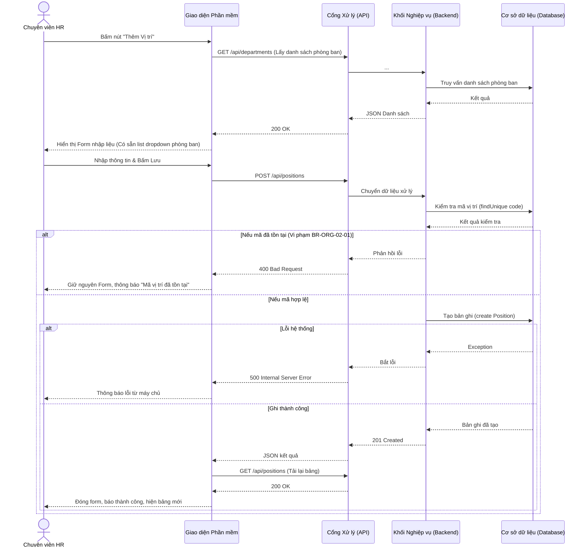
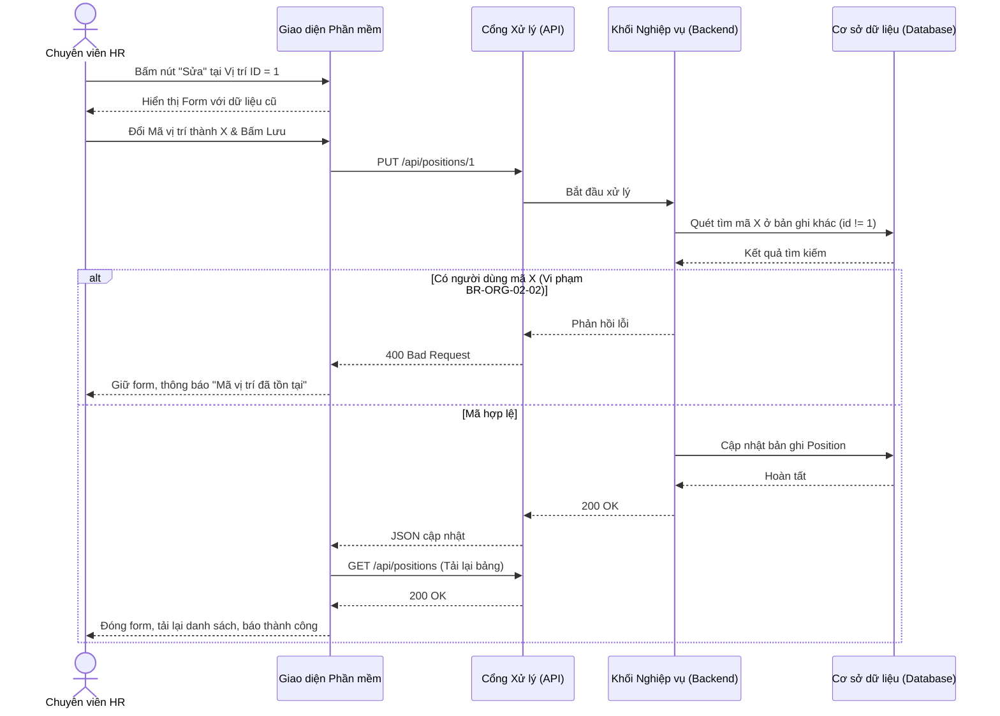
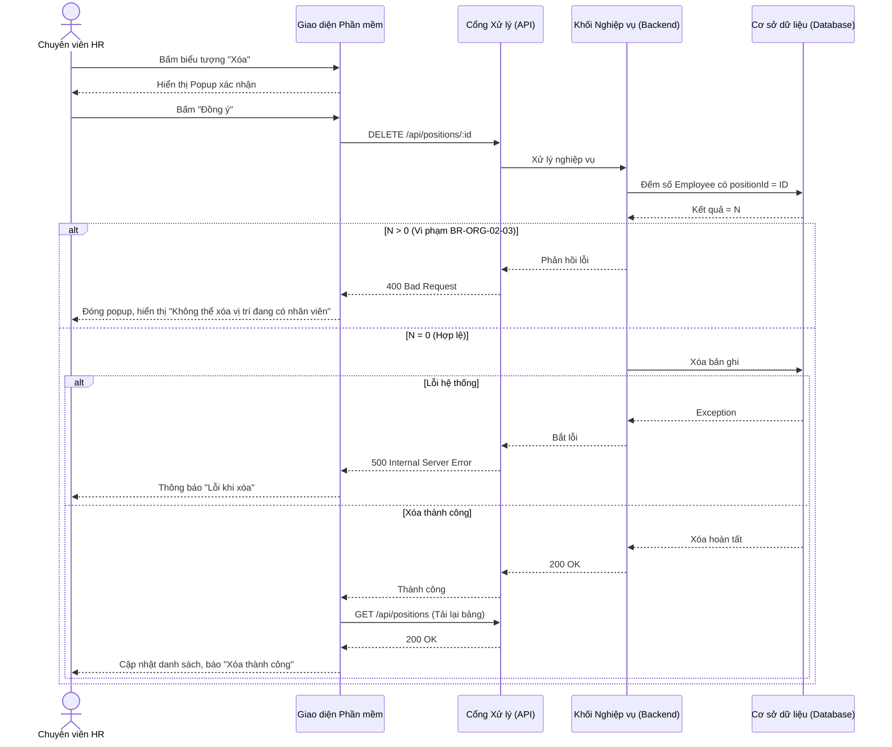

# Usecase: UC-ORG-02 - Quản lý Danh mục Vị trí công tác (Chức danh)

## 1. Giới thiệu chức năng
- **Mục đích**: Cho phép HR định nghĩa bộ khung các ngạch, chức danh công việc trong công ty. Mỗi chức danh sẽ được quy định mức lương trần/sàn và gắn về một phòng ban cụ thể để phân quyền và quản lý.
- **Actor (Tác nhân)**: Trưởng phòng Nhân sự (HR Manager), Quản trị viên hệ thống.
- **Điều kiện tiên quyết**: Khung phòng ban đã được thiết lập.

## 2. Dữ liệu nghiệp vụ đầu vào (Input Data)
| Thông tin | Tính chất | Ý nghĩa nghiệp vụ & Ràng buộc |
|-----------|-----------|-------------------------------|
| `Mã vị trí` (Code) | Bắt buộc | Ký hiệu chuẩn hóa của chức danh (VD: KTT, DEV). **Ràng buộc:** Phải là duy nhất toàn hệ thống. |
| `Tên chức danh` (Title) | Bắt buộc | Tên gọi chính thức trên Hợp đồng Lao động (VD: Kế toán trưởng). |
| `Cấp bậc` (Level) | Bắt buộc | Phân loại thâm niên (Thực tập sinh, Nhân viên, Quản lý...). |
| `Dải lương` (Min-Max) | Tùy chọn | Khung ngân sách lương. Mặc định `0` nếu không điền. |
| `Phòng ban trực thuộc` | Tùy chọn | Chức danh này thuộc biên chế của phòng nào (Map tới bảng Department). |

## 3. Quy tắc nghiệp vụ (Business Rules)
| Mã Quy tắc | Tình huống nghiệp vụ | Cách hệ thống xử lý | Thông báo cho người dùng |
|---|---|---|---|
| BR-ORG-02-01 | **Bảo vệ mã danh mục khi Tạo mới**: HR tạo chức danh nhập mã đã bị sử dụng. | Hệ thống rà soát `findUnique`, phát hiện trùng lặp -> Hủy lưu, trả HTTP 400. | "Mã vị trí đã tồn tại" |
| BR-ORG-02-02 | **Bảo vệ mã danh mục khi Cập nhật**: HR sửa chức danh và đổi mã sang mã đang thuộc về chức danh KHÁC. | Hàm `findFirst(code, id != id)` phát hiện trùng lặp -> Chặn cập nhật, trả HTTP 400. | "Mã vị trí đã tồn tại" |
| BR-ORG-02-03 | **Bảo vệ hợp đồng nhân sự (Xóa)**: HR yêu cầu xóa bỏ chức danh khỏi hệ thống. | Hệ thống đếm nhân sự (`_count.employees`). Nếu > 0 -> Cấm xóa, trả HTTP 400. | "Không thể xóa vị trí đang có nhân viên" |

## 4. Luồng xử lý nghiệp vụ

### 4.1. Luồng Thêm mới Chức danh
1. HR truy cập module Tổ chức, chọn menu "Danh mục Vị trí".
2. HR bấm nút "Thêm Vị trí".
3. Giao diện tự động gọi API `GET /api/departments` để lấy danh sách phòng ban đổ vào Dropdown. Giao diện mở Form.
4. HR điền thông tin (Mã, Tên, Cấp bậc, Khoảng lương, Chọn phòng ban) và ấn "Lưu".
5. Backend rà soát quy tắc trùng mã (BR-ORG-02-01).
6. Nếu hợp lệ, lưu vào DB và trả về 201 Created. Nếu DB lỗi, trả 500.
7. Giao diện đóng Form, tự động gọi API tải lại bảng danh sách.

### 4.2. Luồng Cập nhật (Sửa) Chức danh
1. Trên màn hình danh sách, HR tìm chức danh cần sửa và bấm biểu tượng "Sửa".
2. Giao diện lấy thông tin cũ điền vào Form.
3. HR thay đổi thông tin (VD: đổi Mã `REC_01` thành `HR_REC_01`) và bấm "Lưu".
4. Backend kiểm tra xem mã mới `HR_REC_01` có dính dáng đến chức danh nào KHÁC không (BR-ORG-02-02).
   - Nếu trùng: Trả 400 "Mã vị trí đã tồn tại", bắt HR chọn mã khác.
   - Nếu hợp lệ: Cập nhật CSDL. Trả 200 OK.
5. Giao diện đóng Form, gọi API tải lại bảng danh sách.

### 4.3. Luồng Xóa Chức danh
1. Trên màn hình danh sách, HR bấm biểu tượng "Xóa" tại một chức danh.
2. Màn hình hiện Popup hỏi xác nhận. HR ấn "Đồng ý".
3. Backend quét CSDL kiểm tra xem có nhân sự nào mang chức vụ này không (BR-ORG-02-03).
4. Nếu có người: Trả 400 "Không thể xóa vị trí đang có nhân viên". Giao diện báo lỗi.
5. Nếu không có người: Thực hiện xóa khỏi danh mục vĩnh viễn, trả 200 OK. Giao diện tải lại bảng.

## 5. Kết quả đầu ra
- Danh mục Chức danh (Bảng `Position`) được làm mới (INSERT/UPDATE/DELETE).

## 6. Sơ đồ tuần tự (Sequence Diagram)

### 6.1. Sơ đồ: Thêm mới Vị trí

### 6.2. Sơ đồ: Cập nhật (Sửa) Vị trí

### 6.3. Sơ đồ: Xóa Vị trí

