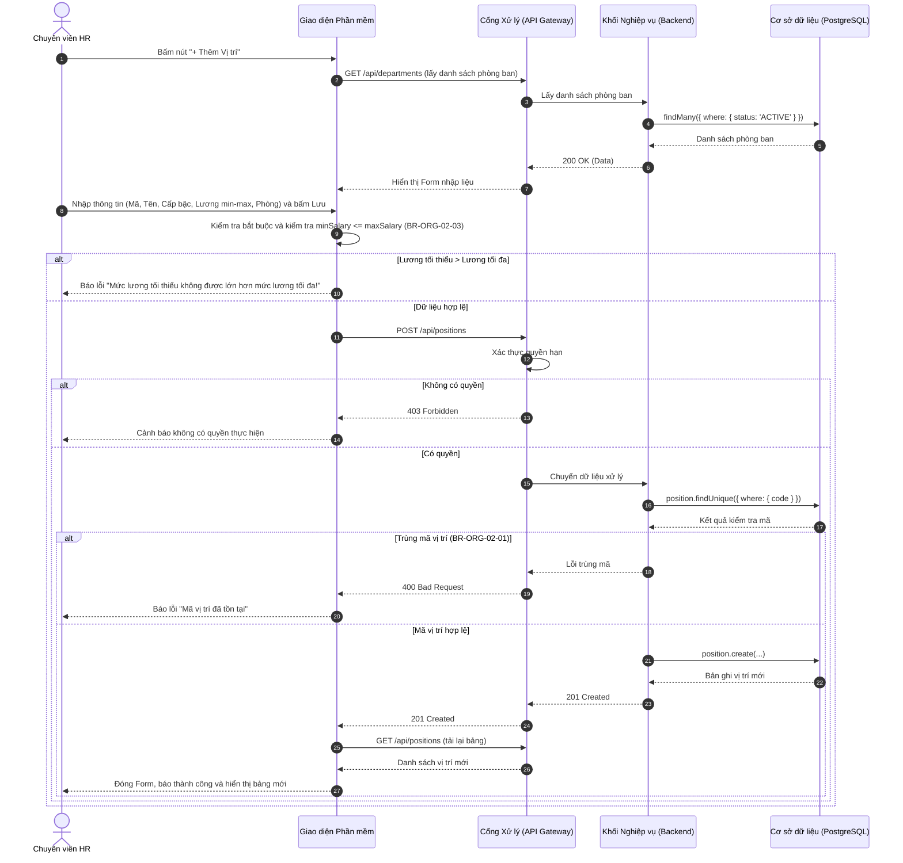
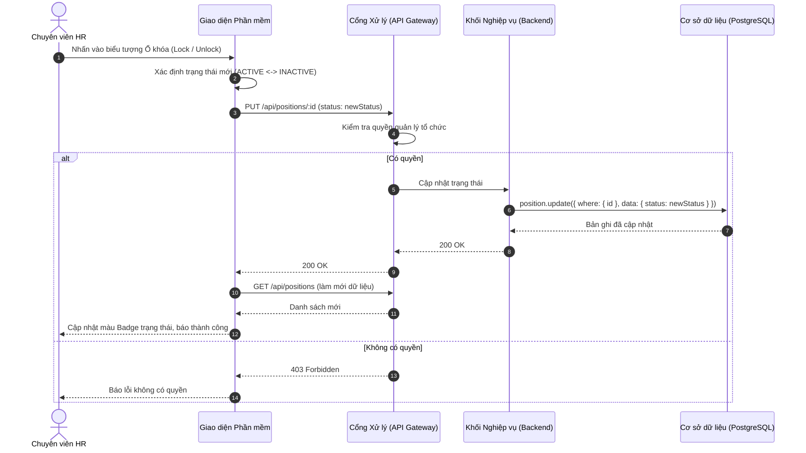
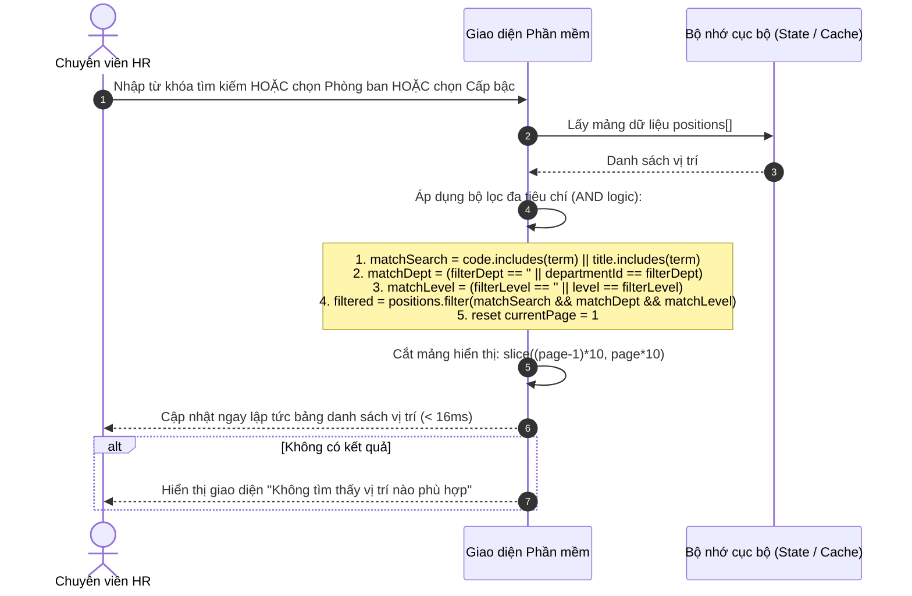
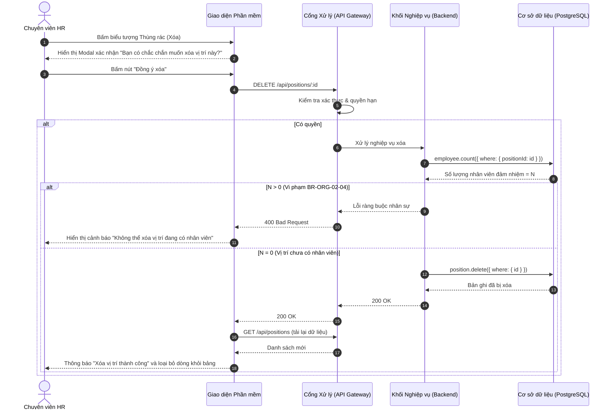

# Usecase: UC-ORG-02 - Quản lý Danh mục Vị trí công tác (Position Management)

## 1. Giới thiệu chức năng
- **Mục đích**: Cho phép Bộ phận Nhân sự (HR) chuẩn hóa danh mục các chức danh, vị trí công tác và ngạch bậc nghề nghiệp trong toàn công ty. Chức năng giúp quy hoạch khung năng lực, dải lương trần/sàn, kiểm soát liên kết giữa vị trí với từng phòng ban, và quản lý vòng đời chức danh (tìm kiếm, lọc theo khối, đóng băng/khóa chức danh không còn tuyển dụng).
- **Actor (Tác nhân)**: Trưởng phòng Nhân sự (HR Manager), Chuyên viên C&B (Tiền lương & Đãi ngộ), Admin hệ thống.
- **Điều kiện tiên quyết**: Khung danh mục Phòng ban đã được thiết lập; Người dùng có quyền `MANAGE_ORGANIZATION`.

### Danh mục các chức năng con (Sub-features):
1. **UC-ORG-02-01: Thêm mới vị trí công tác**: Thiết lập chức danh mới, gán vào phòng ban quản lý, khai báo cấp bậc và dải lương dự kiến.
2. **UC-ORG-02-02: Chỉnh sửa thông tin vị trí**: Cập nhật mô tả công việc, điều chỉnh khung lương, thăng cấp/hạ cấp bậc chức danh.
3. **UC-ORG-02-03: Khóa / Mở khóa vị trí (Đổi trạng thái Active / Inactive)**: Tạm ngưng áp dụng chức danh (đóng băng tuyển dụng và bổ nhiệm) mà vẫn bảo toàn hợp đồng của các nhân sự cũ.
4. **UC-ORG-02-04: Tìm kiếm & Lọc vị trí công tác đa chiều**: Tìm nhanh theo chức danh/mã vị trí; lọc theo phòng ban trực thuộc, lọc theo cấp bậc (Staff, Lead, Manager, Director).
5. **UC-ORG-02-05: Quản lý Dải lương & Kiểm soát ngân sách**: Đảm bảo mức lương tối thiểu (`minSalary`) không vượt quá mức lương tối đa (`maxSalary`).
6. **UC-ORG-02-06: Xóa vị trí an toàn (Hard Delete)**: Xóa triệt để chức danh nhập sai khi chưa từng có nhân sự nào được bổ nhiệm.

---

## 2. Dữ liệu nghiệp vụ đầu vào (Input Data & Parameters)

### 2.1. Dữ liệu biểu mẫu Vị trí (Position Form Data)
| Tên trường | Kiểu dữ liệu | Tính chất | Ý nghĩa nghiệp vụ & Ràng buộc |
|---|---|---|---|
| `Mã vị trí` (code) | Chuỗi (String) | Bắt buộc | Ký hiệu chuẩn hóa chức danh (VD: `DEV_01`, `BA_LEAD`, `ACC_CHIEF`). Duy nhất toàn công ty. |
| `Tên chức danh` (title) | Chuỗi (String) | Bắt buộc | Tên hiển thị trên Hợp đồng Lao động (VD: `Kỹ sư Lập trình Backend`). |
| `Phòng ban trực thuộc` (departmentId) | UUID / Chuỗi | Bắt buộc | Vị trí này thuộc biên chế phòng ban nào (Map tới bảng `Department`). |
| `Cấp bậc` (level) | Enum / String | Bắt buộc | Phân loại thâm niên: `Intern` (Thực tập), `Staff` (Nhân viên), `Team Lead` (Trưởng nhóm), `Manager` (Quản lý), `Director` (Giám đốc). Mặc định là `Staff`. |
| `Mức lương tối thiểu` (minSalary) | Số nguyên (Int) | Tùy chọn | Ngưỡng sàn trong khung đãi ngộ (VNĐ). Mặc định `0`. |
| `Mức lương tối đa` (maxSalary) | Số nguyên (Int) | Tùy chọn | Ngưỡng trần ngân sách cho vị trí (VNĐ). Mặc định `0`. |
| `Mô tả công việc` (description) | Văn bản (Text) | Tùy chọn | Tóm tắt trách nhiệm và yêu cầu công việc chính (JD). |
| `Trạng thái` (status) | Enum / String | Mặc định | `ACTIVE` (Đang sử dụng) hoặc `INACTIVE` (Ngừng tuyển dụng / Tạm khóa). |

### 2.2. Dữ liệu Tìm kiếm & Bộ lọc Vị trí (Search & Filter Criteria)
| Tiêu chí | Loại điều khiển | Giá trị lựa chọn | Hành vi hệ thống |
|---|---|---|---|
| `Từ khóa tìm kiếm` (searchTerm) | Input Text | Ký tự bất kỳ | Lọc theo Mã vị trí hoặc Tên chức danh (`title`). |
| `Lọc theo Phòng ban` (filterDepartment) | Dropdown Select | Danh sách phòng ban (`departments`) | Chỉ hiển thị các vị trí thuộc phòng ban được chọn. |
| `Lọc theo Cấp bậc` (filterLevel) | Dropdown Select | `Tất cả` / `Intern` / `Staff` / `Team Lead` / `Manager` / `Director` | Chỉ hiển thị vị trí thuộc cấp bậc tương ứng. |
| `Phân trang` (Pagination) | Nút chuyển trang | Trang hiện tại (`currentPage`), 10 dòng/trang | Cắt mảng hiển thị đúng 10 bản ghi trên mỗi trang. |

---

## 3. Quy tắc nghiệp vụ (Business Rules)

| Mã Quy tắc | Tình huống nghiệp vụ | Cách hệ thống xử lý | Thông báo hiển thị cho người dùng |
|---|---|---|---|
| **BR-ORG-02-01** | **Kiểm soát trùng mã khi Tạo mới**: HR tạo vị trí nhập mã đã tồn tại trên hệ thống. | Backend kiểm tra `findUnique({ where: { code } })`. Nếu trùng -> Chặn lưu, trả HTTP 400. | "Mã vị trí đã tồn tại" |
| **BR-ORG-02-02** | **Kiểm soát trùng mã khi Cập nhật**: HR sửa chức danh và đổi mã sang mã của một vị trí khác. | Backend kiểm tra `findFirst({ where: { code, NOT: { id } } })`. Nếu trùng -> Trả HTTP 400. | "Mã vị trí đã tồn tại" |
| **BR-ORG-02-03** | **Ràng buộc Dải lương (Min ≤ Max)**: HR nhập mức lương tối thiểu lớn hơn mức lương tối đa (`minSalary > maxSalary`). | Validate logic nghiệp vụ trên cả giao diện và Backend. Nếu vi phạm -> Báo lỗi ngay lập tức. | "Mức lương tối thiểu không được lớn hơn mức lương tối đa!" |
| **BR-ORG-02-04** | **Ràng buộc an toàn khi Xóa (Hard Delete)**: HR yêu cầu xóa vị trí đang có nhân sự đảm nhiệm (`employees > 0`). | Backend đếm `employee.count({ where: { positionId } })`. Nếu > 0 -> Cấm xóa để bảo vệ hồ sơ nhân sự, trả HTTP 400. | "Không thể xóa vị trí đang có nhân viên" |
| **BR-ORG-02-05** | **Khóa vị trí công tác (Soft Lock)**: Doanh nghiệp không còn tuyển dụng chức danh này nhưng cần giữ dữ liệu quá khứ. | HR bấm biểu tượng Ổ khóa -> Đổi `status = 'INACTIVE'`. Chức danh này bị ẩn khỏi Form tuyển dụng và tiếp nhận nhân viên mới. | "Đã tạm dừng áp dụng vị trí công tác" |
| **BR-ORG-02-06** | **Mở khóa vị trí (Unlock)**: Doanh nghiệp có nhu cầu tuyển dụng lại chức danh đã đóng băng. | HR bấm Mở khóa -> Đổi `status = 'ACTIVE'`. Kích hoạt lại quyền tuyển dụng và đề bạt. | "Đã kích hoạt lại vị trí công tác" |
| **BR-ORG-02-07** | **Lọc kết hợp đa chiều (Multi-factor Filter)**: HR vừa gõ từ khóa, vừa chọn Phòng ban và Cấp bậc. | Hệ thống áp dụng toán tử AND trên cả 3 điều kiện: `matchSearch && matchDept && matchLevel`. | Trả về danh sách chính xác tuyệt đối |

---

## 4. Đặc tả chi tiết các luồng nghiệp vụ (Use Case Steps)

### 4.1. Luồng UC-ORG-02-01: Thêm mới Vị trí công tác
1. HR truy cập menu **"Danh mục Vị trí"** trong phân hệ Tổ chức.
2. HR nhấn nút **"+ Thêm Vị trí"**.
3. Giao diện tự động gửi request `GET /api/departments` để tải danh mục phòng ban và mở Modal Form.
4. HR nhập thông tin: Mã, Tên chức danh, Cấp bậc, Phòng ban trực thuộc, Mô tả, Khung lương (Min - Max) và nhấn **"Lưu"**.
5. Giao diện kiểm tra:
   - Các trường bắt buộc: Mã và Tên chức danh không được rỗng.
   - Kiểm tra dải lương: `minSalary <= maxSalary` (BR-ORG-02-03).
6. Gửi request `POST /api/positions` xuống API.
7. Backend kiểm tra trùng mã (BR-ORG-02-01). Nếu hợp lệ -> Ghi vào CSDL, trả về HTTP 201 Created.
8. Giao diện đóng Form, tự động tải lại bảng danh sách và thông báo thành công.

### 4.2. Luồng UC-ORG-02-02: Cập nhật thông tin Vị trí
1. Tại bảng danh sách, HR bấm biểu tượng **"Sửa" (Edit)** tại vị trí cần chỉnh sửa.
2. Giao diện mở Modal Form với dữ liệu hiện tại được điền sẵn.
3. HR điều chỉnh thông tin (nâng cấp bậc từ Staff lên Team Lead, điều chỉnh khung lương...) và nhấn **"Lưu"**.
4. Giao diện gửi request `PUT /api/positions/:id`.
5. Backend kiểm tra tính duy nhất của mã mới (BR-ORG-02-02) và cập nhật CSDL.
6. CSDL cập nhật thành công, trả về HTTP 200 OK.
7. Giao diện làm mới danh sách hiển thị.

### 4.3. Luồng UC-ORG-02-03: Khóa / Mở khóa Vị trí (Đổi trạng thái)
1. HR nhấn biểu tượng **Ổ khóa (Lock / Unlock)** tại dòng vị trí tương ứng.
2. Hệ thống đảo ngược trạng thái: `ACTIVE` <-> `INACTIVE`.
3. Giao diện gửi request `PUT /api/positions/:id` với `{ status: newStatus }`.
4. Backend cập nhật CSDL và trả về HTTP 200 OK.
5. Giao diện cập nhật Badge màu trạng thái ngay lập tức (Xanh: Hoạt động, Đỏ: Tạm khóa).

### 4.4. Luồng UC-ORG-02-04: Tìm kiếm & Lọc vị trí đa chiều
1. Tại thanh công cụ phía trên bảng, HR có thể kết hợp các tiêu chí:
   - Nhập từ khóa: Tìm kiếm theo mã hoặc tên vị trí.
   - Chọn Dropdown Phòng ban: Lọc các vị trí thuộc phòng ban đó.
   - Chọn Dropdown Cấp bậc: Lọc theo cấp bậc (VD: Chỉ xem các vị trí cấp `Manager`).
2. Giao diện áp dụng bộ lọc client-side tức thì, tự động đặt lại `currentPage = 1`.
3. Hiển thị bảng kết quả kèm phân trang tương ứng.

### 4.5. Luồng UC-ORG-02-06: Xóa Vị trí công tác
1. HR nhấn biểu tượng **"Thùng rác" (Delete)** tại vị trí muốn xóa.
2. Hệ thống hiển thị hộp thoại xác nhận: *"Bạn có chắc chắn muốn xóa vị trí này?"*.
3. HR bấm **"Đồng ý xóa"**.
4. Giao diện gửi request `DELETE /api/positions/:id`.
5. Backend đếm số lượng nhân sự thuộc vị trí này (BR-ORG-02-04).
   - Nếu `count > 0` -> Từ chối, trả HTTP 400 *"Không thể xóa vị trí đang có nhân viên"*.
   - Nếu `count == 0` -> Thực hiện xóa trong CSDL, trả HTTP 200 OK.
6. Giao diện cập nhật lại bảng danh sách và thông báo thành công.

---

## 5. Sơ đồ tuần tự nghiệp vụ (Sequence Diagrams)

### 5.1. Sơ đồ: Thêm mới Vị trí công tác

### 5.2. Sơ đồ: Khóa / Mở khóa Vị trí (Đổi trạng thái Active / Inactive)

### 5.3. Sơ đồ: Tìm kiếm & Lọc vị trí đa chiều

### 5.4. Sơ đồ: Xóa Vị trí an toàn

---

## 6. Kịch bản kiểm thử & Nghiệm thu (Given / When / Then)

### Kịch bản 1: Lọc vị trí theo phòng ban và cấp bậc
- **Given**: Công ty có các vị trí: `DEV_01 - Lập trình viên (Staff - Phòng CNTT)`, `DEV_LEAD - Trưởng nhóm lập trình (Team Lead - Phòng CNTT)`, `ACC_01 - Kế toán viên (Staff - Phòng Kế toán)`.
- **When**: HR chọn Phòng ban là "Phòng CNTT" và Cấp bậc là "Staff".
- **Then**: Hệ thống chỉ hiển thị đúng 01 vị trí `DEV_01 - Lập trình viên`. Ẩn toàn bộ các vị trí khác.

### Kịch bản 2: Khóa vị trí tạm ngừng tuyển dụng
- **Given**: Vị trí `MARKETING_INTERN` đang ở trạng thái `ACTIVE`.
- **When**: HR click biểu tượng Ổ khóa tại dòng `MARKETING_INTERN`.
- **Then**: Trạng thái đổi thành `INACTIVE`. Khi tạo tin tuyển dụng mới hoặc tiếp nhận hồ sơ, chức danh này không hiển thị trong danh mục lựa chọn.

### Kịch bản 3: Chặn nhập dải lương không hợp lệ
- **Given**: HR đang mở Form thêm vị trí mới.
- **When**: HR nhập Mức lương tối thiểu là `25,000,000` và Mức lương tối đa là `15,000,000`, sau đó bấm Lưu.
- **Then**: Hệ thống hiển thị thông báo lỗi ngay lập tức: *"Mức lương tối thiểu không được lớn hơn mức lương tối đa!"* và không cho phép gửi request.

### Kịch bản 4: Chặn xóa vị trí đang có nhân viên
- **Given**: Vị trí `Kế toán trưởng` đang có 1 nhân viên đảm nhiệm.
- **When**: HR ấn nút Xóa và bấm Xác nhận.
- **Then**: Hệ thống từ chối xóa và hiển thị thông báo: *"Không thể xóa vị trí đang có nhân viên"*. Dữ liệu vị trí được bảo toàn nguyên vẹn.
