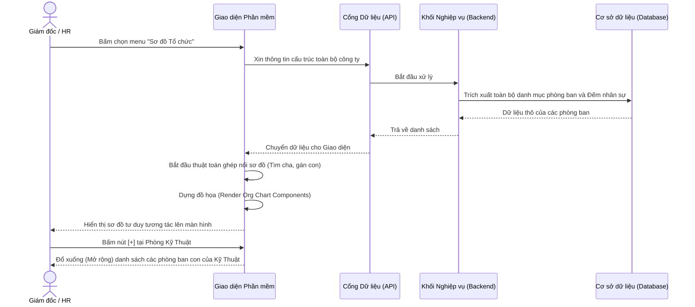

# Usecase: UC-ORG-03 - Xem Sơ đồ Tổ chức (Organization Chart)

## 1. Giới thiệu chức năng
- **Mục đích**: Mang đến bức tranh toàn cảnh, trực quan nhất về cấu trúc phân quyền và bộ máy vận hành của công ty. Thay vì đọc những bảng biểu khô khan, người dùng có thể nhìn thấy sự liên kết giữa các phòng ban thông qua sơ đồ dạng cây.
- **Actor (Tác nhân)**: Ban Lãnh đạo (Để hoạch định chiến lược), HR (Để kiểm tra định biên), Tất cả nhân viên (Để nắm rõ cấu trúc công ty).
- **Điều kiện tiên quyết**: Công ty đã thiết lập danh sách phòng ban và mối quan hệ quản lý cấp trên - cấp dưới.

## 2. Dữ liệu nghiệp vụ đầu vào (Input Data)
- Chức năng này mang tính chất "Báo cáo / Trực quan hóa" (Read-Only). Người dùng không cần nhập liệu.
- Dữ liệu hoàn toàn được hệ thống tự động tổng hợp từ **Danh mục Phòng ban** (Sử dụng thông tin Phòng ban cha và số lượng nhân sự).

## 3. Quy tắc nghiệp vụ (Business Rules)
| Mã Quy tắc | Tình huống nghiệp vụ | Cách hệ thống xử lý | Thông báo cho người dùng |
|---|---|---|---|
| BR-ORG-03-01 | **Xác định Đỉnh chóp sơ đồ (Đơn vị cấp 1)** | Các đơn vị độc lập, không chịu sự quản lý của đơn vị nào khác (Tức là không chọn Phòng ban cha) sẽ được hệ thống đặt làm điểm xuất phát ở đỉnh sơ đồ (Ví dụ: Hội đồng Quản trị, Ban Giám đốc). | |
| BR-ORG-03-02 | **Xác định Cấp dưới (Đơn vị nhánh)** | Bất kỳ phòng ban nào có thiết lập "Phòng ban cha" sẽ tự động được vẽ thành một nhánh cấp dưới, treo trực tiếp bằng một đường thẳng từ đơn vị cha tương ứng. | |
| BR-ORG-03-03 | **Minh bạch thông tin vận hành** | Trên khung thông tin (Card) của mỗi phòng ban, hệ thống bắt buộc phải hiển thị **Chỉ số lấp đầy nhân sự**. (Công thức: Tổng số nhân viên đang làm / Tổng định biên tối đa được duyệt). | |

## 4. Luồng xử lý nghiệp vụ
1. Người dùng truy cập module Tổ chức và chọn menu "Sơ đồ Tổ chức".
2. Hệ thống (Frontend) nhận lệnh và gọi API để lấy toàn bộ danh mục phòng ban hiện có.
3. Backend tiến hành truy xuất CSDL, lấy ra toàn bộ phòng ban (kèm thống kê số nhân sự) và trả dữ liệu thô về cho Frontend.
4. Giao diện (Frontend) phân tích dữ liệu:
   - Các phòng ban cấp 1 (Không có phòng cha) được đặt làm Root (Đỉnh sơ đồ).
   - Các phòng ban có khai báo phòng cha sẽ được ghép nối thành nhánh con bên dưới phòng cha đó.
5. Giao diện vẽ ra sơ đồ tư duy dạng nhánh rễ cây và hiển thị lên màn hình cho người dùng.
6. Người dùng có thể tương tác trực tiếp với giao diện: Kéo thả khung hình, phóng to/thu nhỏ (Zoom), hoặc bấm vào các nút [+] [-] để ẩn/hiện các phòng ban con ở cấp sâu hơn.

## 5. Kết quả đầu ra
- Giao diện đồ họa sinh động. Sơ đồ này phản ánh "thực tế thời gian thực (Real-time)". Nếu HR vừa thêm một phòng mới, sơ đồ sẽ tự động dài thêm một nhánh mà không cần vẽ tay.

## 6. Sơ đồ tuần tự (Sequence Diagram) - Kịch bản Vẽ sơ đồ

## 7. Kịch bản nghiệm thu (Given / When / Then)
- **Kịch bản 1: Cấu trúc đa cấp tự động**
  - *Given*: Công ty có "Ban Giám Đốc". Dưới BGD có "Phòng Kỹ Thuật". Dưới Kỹ Thuật có "Nhóm Tester".
  - *When*: Người dùng mở chức năng Sơ đồ.
  - *Then*: Giao diện hiển thị đúng 3 tầng, đường nối từ BGD thả xuống Kỹ Thuật, và từ Kỹ Thuật thả xuống Tester.
- **Kịch bản 2: Hiển thị thông số định biên (Quota)**
  - *Given*: Phòng Hành chính được duyệt tối đa 5 người, hiện tại đang có 3 người đi làm.
  - *When*: Giám đốc xem thông tin trên thẻ của phòng Hành chính.
  - *Then*: Thẻ hiển thị dòng chỉ số "3/5" báo hiệu phòng vẫn còn được phép tuyển thêm 2 người nữa.
