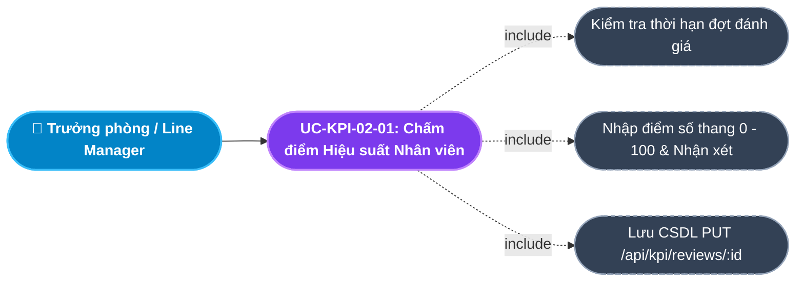
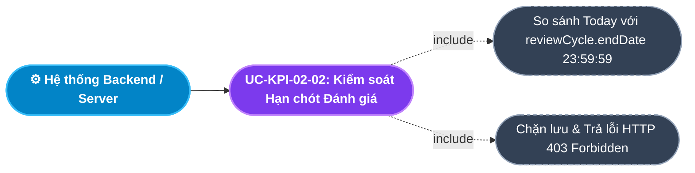
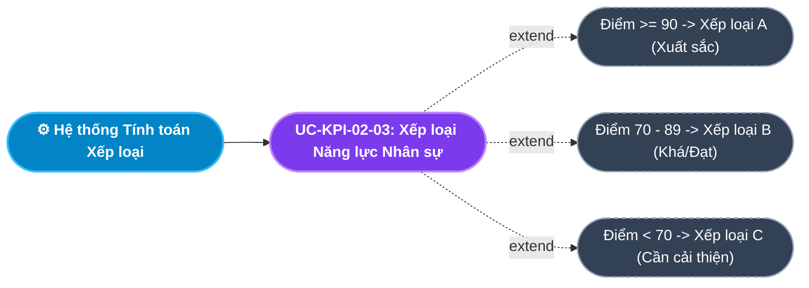
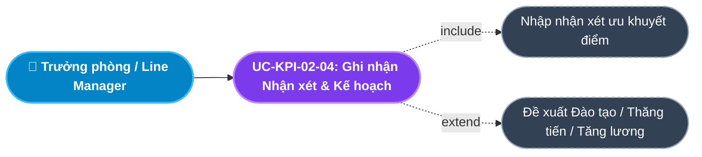
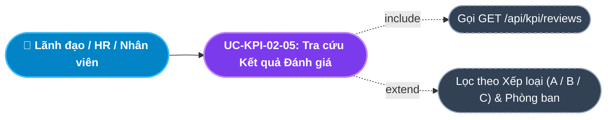
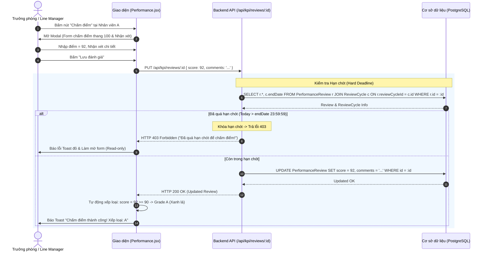

# Usecase: UC-KPI-02 - Chấm điểm Hiệu suất và Xếp loại Nhân sự (Performance Evaluation & Grading)

## 1. Giới thiệu chức năng
- **Mục đích**: Cung cấp giao diện để Trưởng bộ phận (Line Manager) thực hiện thẩm định, chấm điểm định lượng (thang điểm 0 - 100) và viết nhận xét định tính (Feedback) cho từng nhân viên dưới quyền sau khi kết thúc chu kỳ làm việc. Hệ thống tự động phân loại nhân sự theo các mức xếp loại chuẩn (A - Xuất sắc, B - Đạt yêu cầu, C - Cần cải thiện) và kiểm soát chặt chẽ hạn chót nộp điểm (Hard Deadline).
- **Actor (Tác nhân)**: Trưởng bộ phận / Quản lý trực tiếp (Line Manager), Ban Giám đốc (CEO/Director), Chuyên viên HR, Nhân viên (Xem kết quả).
- **Điều kiện tiên quyết**: Chu kỳ đánh giá đang mở và nhân viên đã được khởi tạo phiếu đánh giá (`PerformanceReview`).

### Danh mục các chức năng con (Sub-features):
1. **UC-KPI-02-01: Thẩm định & Chấm điểm Hiệu suất Nhân viên (Submit Performance Score)**: Quản lý nhập điểm số đánh giá chính thức trên thang điểm 100 dựa trên mức độ hoàn thành các chỉ tiêu KPI đã giao.
2. **UC-KPI-02-02: Kiểm soát Khung Thời hạn Đánh giá (Hard Deadline Enforcement)**: Tự động khóa cổng chấm điểm và chuyển form sang chế độ chỉ đọc (Read-only) ngay khi thời gian hiện tại vượt quá hạn chót `endDate` của chu kỳ.
3. **UC-KPI-02-03: Xếp loại Nhân sự & Phân loại Bell Curve (Grade Classification)**: Hệ thống tự động quy đổi điểm số sang mức xếp loại: Loại A ($\ge 90$ điểm), Loại B ($70 - 89$ điểm), Loại C ($< 70$ điểm).
4. **UC-KPI-02-04: Ghi nhận Nhận xét & Kế hoạch Phát triển (Feedback & Development Plan)**: Quản lý ghi nhận nhận xét chi tiết về điểm mạnh, điểm yếu và đề xuất kế hoạch đào tạo, thăng tiến hoặc tăng lương.
5. **UC-KPI-02-05: Tra cứu & Thống kê Kết quả Đánh giá Toàn diện (Audit Performance History)**: Xem lịch sử đánh giá của từng nhân viên qua các năm, hỗ trợ lọc theo phòng ban, mức xếp loại và xuất báo cáo nhân sự xuất sắc.

---

## 2. Dữ liệu nghiệp vụ đầu vào (Input Data & Parameters)

### 2.1. Biểu mẫu Chấm điểm Hiệu suất (Performance Review Form Data)
| Tên trường | Kiểu dữ liệu | Tính chất | Ý nghĩa nghiệp vụ & Ràng buộc |
|---|---|---|---|
| `Phiếu đánh giá` (id) | UUID / Chuỗi | Bắt buộc | Định danh phiếu đánh giá của nhân viên trong chu kỳ. |
| `Điểm số đánh giá` (score) | Số thập phân | Bắt buộc | Thang điểm từ `0` đến `100`. |
| `Nhận xét / Đánh giá chi tiết` (comments) | Văn bản (Text) | Bắt buộc | Nhận xét chuyên môn, thái độ và đề xuất phát triển. Tối thiểu 10 ký tự. |
| `Điểm tự đánh giá` (selfScore) | Số thập phân | Tùy chọn | Điểm do nhân viên tự chấm trước buổi họp đánh giá 1-1. |
| `Mức xếp loại` (finalGrade) | Enum / String | Tự động tính | Xếp loại năng lực: `A` (Xuất sắc), `B` (Khá/Đạt), `C` (Trung bình/Kém). |

### 2.2. Khung Xếp loại Năng lực Chuẩn (Grading Scale)
| Mức xếp loại (Grade) | Khung điểm (Score) | Đánh giá năng lực | Chế độ đãi ngộ đề xuất |
|:---:|:---:|---|---|
| **A** | **$\ge 90$ điểm** | **Xuất sắc (Outstanding)** | Đề xuất thăng chức, tăng lương trước hạn, thưởng KPI mức tối đa. |
| **B** | **$70 - 89$ điểm** | **Đạt yêu cầu (Meets Expectations)** | Đạt chỉ tiêu công việc, tăng lương định kỳ theo quy chế. |
| **C** | **$< 70$ điểm** | **Cần cải thiện (Needs Improvement)** | Đưa vào chương trình đào tạo lại (PIP - Performance Improvement Plan). |

---

## 3. Quy tắc nghiệp vụ (Business Rules)

| Mã Quy tắc | Tình huống nghiệp vụ | Cách hệ thống xử lý | Thông báo hiển thị |
|---|---|---|---|
| **BR-KPI-02-01** | **Khóa Hạn chót Đánh giá Cứng (Hard Deadline Enforcement)**: Quản lý chấm điểm khi thời gian hiện tại đã vượt qua `endDate` của chu kỳ (`today > endDate 23:59:59`). | Backend chặn lưu và trả lỗi `HTTP 403 Forbidden`. Giao diện tự động làm mờ nút Submit và chuyển form sang Read-only. | "Đã quá hạn chót để chấm điểm cho kỳ đánh giá này!" |
| **BR-KPI-02-02** | **Thang điểm Chuẩn hóa (0 - 100 Scale)**: Nhập điểm nhỏ hơn 0 hoặc lớn hơn 100. | Chặn lưu dữ liệu và yêu cầu nhập lại: $0 \le \text{score} \le 100$. | "Điểm số đánh giá phải nằm trong khoảng từ 0 đến 100!" |
| **BR-KPI-02-03** | **Tự động Phân loại Năng lực (Automated Grading)**: Quản lý lưu điểm số đánh giá. | Hệ thống tự động tính `finalGrade`: Nếu $\ge 90 \rightarrow \text{A}$; nếu $\ge 70 \rightarrow \text{B}$; ngược lại $\rightarrow \text{C}$. | "Đã ghi nhận điểm số và tự động xếp loại [A/B/C] cho nhân sự." |
| **BR-KPI-02-04** | **Bắt buộc Nhận xét Định tính**: Chấm điểm nhưng bỏ trống ô nhận xét hoặc viết dưới 10 ký tự. | Chặn lưu và yêu cầu quản lý viết nhận xét cụ thể để đảm bảo tính khách quan và nhân văn trong quản trị nhân sự. | "Vui lòng nhập nhận xét đánh giá chi tiết (tối thiểu 10 ký tự)!" |
| **BR-KPI-02-05** | **Khóa Phiếu sau khi Chốt (Review Immutability)**: Chu kỳ đánh giá đóng sổ hoàn toàn. | Toàn bộ kết quả điểm và nhận xét được lưu vết vĩnh viễn vào Hồ sơ Nhân sự (Module Core HR) để làm căn cứ xét thưởng và thăng tiến. | "Kết quả đánh giá đã được lưu vào hồ sơ nhân sự chính thức." |

---

## 4. Đặc tả chi tiết các Use Case chức năng con (Sub-Use Cases Specification)

---

### 4.1. UC-KPI-02-01: Thẩm định & Chấm điểm Hiệu suất Nhân viên (Submit Performance Score)

#### Sơ đồ Use Case:

#### Bảng đặc tả nghiệp vụ:

| STT | Hạng mục | Nội dung chi tiết |
|:---:|---|---|
| **1** | **Thông tin chung** | - **UC ID**: `UC-KPI-02-01` - **UC Name**: Thẩm định & Chấm điểm Hiệu suất Nhân viên (Submit Performance Score) - **Actor**: Trưởng bộ phận (Line Manager), Quản lý trực tiếp - **Mục tiêu**: Chốt điểm số đánh giá năng lực chính thức cho nhân viên cấp dưới sau khi họp đánh giá hiệu suất. - **Mô tả**: Quản lý mở phiếu đánh giá của nhân viên, đối chiếu mức độ hoàn thành các KPI đã giao, nhập điểm số tổng hợp (thang 0-100) và viết nhận xét chi tiết. - **Priority**: High (Bắt buộc) |
| **2** | **Trigger** | Người dùng bấm nút **"Chấm điểm"** tại dòng nhân viên trên màn hình Đánh giá Hiệu suất (`Performance.jsx`). |
| **3** | **Pre-condition** | 1. Chu kỳ đánh giá chưa hết hạn (`today <= endDate`). 2. Người dùng có quyền quản lý nhân viên đó. |
| **4** | **Post-condition** | 1. Bản ghi `PerformanceReview` được cập nhật `score` và `comments`. 2. Hệ thống tự động xếp loại năng lực `finalGrade`. 3. Kết quả hiển thị ngay trên bảng tổng hợp. |
| **5** | **Main Flow** | 1. Quản lý bấm nút **"Chấm điểm"** tại nhân viên cần đánh giá. 2. Hệ thống mở Modal *Đánh giá Hiệu suất Nhân sự*. 3. Hiển thị thông tin: Họ tên, Mã NV, Phòng ban, và Điểm tự chấm của nhân viên (Self-score). 4. Quản lý nhập: Điểm đánh giá của Quản lý (VD: `88`), và Nhập nhận xét chi tiết. 5. Nhấn nút **"Lưu đánh giá"**. 6. Giao diện kiểm tra thang điểm (0-100) và độ dài nhận xét ($\ge 10$ ký tự). 7. Gửi request `PUT /api/kpi/reviews/:id` kèm `{ score, comments }`. 8. Backend kiểm tra hạn chót: Nếu còn hạn $\rightarrow$ Cập nhật CSDL và trả về `HTTP 200 OK`. 9. Giao diện báo Toast: *"Chấm điểm thành công!"*, đóng Modal và cập nhật dòng dữ liệu. |
| **6** | **Alternative / Exception Flow** | - **EF-01 (Quá hạn chót)**: Ngày nộp sau `endDate` $\rightarrow$ Backend trả lỗi `HTTP 403`: *"Đã quá hạn chót để chấm điểm cho kỳ đánh giá này!"* (BR-KPI-02-01). - **EF-02 (Điểm ngoài khoảng 0-100)**: Nhập điểm âm hoặc $> 100$ $\rightarrow$ Báo lỗi *"Điểm số đánh giá phải nằm trong khoảng từ 0 đến 100!"* (BR-KPI-02-02). |
| **7** | **Business Rules & Validation** | - Điểm số bắt buộc nằm trong khoảng 0 đến 100. - Bắt buộc kiểm tra hạn chót cả ở Frontend và Backend (BR-KPI-02-01). |
| **8** | **Acceptance Criteria** | - **AC-01**: Nhập điểm và nhận xét hợp lệ lưu thành công. - **AC-02**: Nhập sai khung điểm bị chặn lại ngay lập tức. |

---

### 4.2. UC-KPI-02-02: Kiểm soát Khung Thời hạn Đánh giá (Hard Deadline Enforcement)

#### Sơ đồ Use Case:

#### Bảng đặc tả nghiệp vụ:

| STT | Hạng mục | Nội dung chi tiết |
|:---:|---|---|
| **1** | **Thông tin chung** | - **UC ID**: `UC-KPI-02-02` - **UC Name**: Kiểm soát Khung Thời hạn Đánh giá (Hard Deadline Enforcement) - **Actor**: Hệ thống Backend, Quản trị viên hệ thống - **Mục tiêu**: Đảm bảo tính nghiêm minh và kỷ luật trong việc nộp điểm đánh giá, tránh tình trạng dây dưa kéo dài ảnh hưởng đến kỳ tính thưởng. - **Mô tả**: Tự động so sánh thời gian thực của máy chủ với mốc `endDate` của chu kỳ. Nếu quá `23:59:59` của ngày kết thúc, toàn bộ các phiếu đánh giá chưa kịp chấm sẽ bị khóa tự động và từ chối cập nhật. - **Priority**: High |
| **2** | **Trigger** | Được kích hoạt mỗi khi có request cập nhật điểm `PUT /api/kpi/reviews/:id`. |
| **3** | **Pre-condition** | Có request chấm điểm gửi lên hệ thống. |
| **4** | **Post-condition** | Nếu quá hạn: Request bị từ chối và ghi log cảnh báo; nếu trong hạn: Cho phép lưu bình thường. |
| **5** | **Main Flow** | 1. Backend nhận request chấm điểm kèm `reviewId`. 2. Truy vấn CSDL lấy bản ghi phiếu đánh giá kèm quan hệ `reviewCycle`. 3. Đặt mốc thời gian hạn chót: `endDate.setHours(23, 59, 59, 999)`. 4. Lấy thời gian hiện tại `today = new Date()`. 5. So sánh: Nếu `today > endDate` $\rightarrow$ Trả về `HTTP 403 Forbidden` kèm thông báo lỗi *"Đã quá hạn chót để chấm điểm cho kỳ đánh giá này."* 6. Nếu `today <= endDate` $\rightarrow$ Tiến hành lưu điểm. |
| **6** | **Alternative / Exception Flow** | - **AF-01 (HR Admin gia hạn)**: Lãnh đạo phê duyệt gia hạn $\rightarrow$ HR cập nhật lại `endDate` mới cho chu kỳ $\rightarrow$ Cổng chấm điểm tự động mở lại cho các quản lý chưa hoàn tất. |
| **7** | **Business Rules & Validation** | - Kiểm tra 2 lớp: Frontend làm mờ nút bấm, Backend từ chối request (BR-KPI-02-01). |
| **8** | **Acceptance Criteria** | - **AC-01**: Cố tình gửi API khi đã quá hạn bị trả về đúng mã lỗi 403 Forbidden. |

---

### 4.3. UC-KPI-02-03: Xếp loại Nhân sự & Phân loại Bell Curve (Grade Classification)

#### Sơ đồ Use Case:

#### Bảng đặc tả nghiệp vụ:

| STT | Hạng mục | Nội dung chi tiết |
|:---:|---|---|
| **1** | **Thông tin chung** | - **UC ID**: `UC-KPI-02-03` - **UC Name**: Xếp loại Nhân sự & Phân loại Bell Curve (Grade Classification) - **Actor**: Hệ thống tính toán tự động, Ban Giám đốc - **Mục tiêu**: Chuẩn hóa việc phân loại năng lực nhân sự theo mô hình đường cong chuẩn, giúp lãnh đạo dễ dàng nhận diện nhân tài và nhân sự yếu kém. - **Mô tả**: Tự động chuyển đổi con số điểm sang mức xếp loại: Loại A (Xanh lá - Xuất sắc), Loại B (Xanh dương - Đạt yêu cầu), Loại C (Cam/Đỏ - Cần cải thiện). - **Priority**: High |
| **2** | **Trigger** | Tự động kích hoạt khi tải danh sách đánh giá (`GET /api/kpi/reviews`) hoặc sau khi lưu điểm. |
| **3** | **Pre-condition** | Phiếu đánh giá đã có điểm số `score`. |
| **4** | **Post-condition** | Trường `finalGrade` được tính toán và hiển thị dưới dạng Badge màu sắc trên bảng. |
| **5** | **Main Flow** | 1. Hệ thống đọc giá trị `score` của phiếu đánh giá. 2. Áp dụng quy tắc xếp loại BR-KPI-02-03:    - Nếu `score >= 90` $\rightarrow$ `finalGrade = 'A'` (Badge xanh lá).    - Nếu `70 <= score < 90` $\rightarrow$ `finalGrade = 'B'` (Badge xanh dương).    - Nếu `score < 70` $\rightarrow$ `finalGrade = 'C'` (Badge màu cam). 3. Giao diện hiển thị trực quan mức xếp loại của từng nhân viên. |
| **6** | **Alternative / Exception Flow** | - **AF-01 (Chưa chấm điểm)**: Phiếu đánh giá có `score = 0` và chưa chấm $\rightarrow$ Hiển thị nhãn *"Chưa đánh giá"*. |
| **7** | **Business Rules & Validation** | - Mức phân loại tuân thủ khung chuẩn hóa năng lực doanh nghiệp. |
| **8** | **Acceptance Criteria** | - **AC-01**: Chấm 95 điểm hiển thị loại A, chấm 80 điểm hiển thị loại B, chấm 60 điểm hiển thị loại C. |

---

### 4.4. UC-KPI-02-04: Ghi nhận Nhận xét & Kế hoạch Phát triển (Feedback & Development Plan)

#### Sơ đồ Use Case:

#### Bảng đặc tả nghiệp vụ:

| STT | Hạng mục | Nội dung chi tiết |
|:---:|---|---|
| **1** | **Thông tin chung** | - **UC ID**: `UC-KPI-02-04` - **UC Name**: Ghi nhận Nhận xét & Kế hoạch Phát triển (Feedback & Development Plan) - **Actor**: Trưởng bộ phận (Line Manager), HR Admin - **Mục tiêu**: Cung cấp phản hồi mang tính xây dựng cho nhân viên, định hướng lộ trình phát triển công danh và đào tạo kỹ năng còn thiếu. - **Mô tả**: Quản lý nhập nhận xét chi tiết và định hướng phát triển trong form đánh giá. Dữ liệu này được gửi đến nhân viên để cùng thống nhất kế hoạch làm việc cho chu kỳ tiếp theo. - **Priority**: Medium |
| **2** | **Trigger** | Quản lý nhập vào ô "Nhận xét của Quản lý" trên Modal Chấm điểm. |
| **3** | **Pre-condition** | Đang trong quá trình chấm điểm phiếu đánh giá. |
| **4** | **Post-condition** | Nhận xét được lưu vào trường `comments` của bản ghi `PerformanceReview`. |
| **5** | **Main Flow** | 1. Quản lý nhập nhận xét: "Nhân viên làm việc chủ động, kỹ năng lập trình tốt, cần cải thiện thêm kỹ năng giao tiếp và tiếng Anh". 2. Quản lý đề xuất: "Cử tham gia khóa đào tạo Leadership trong Quý tới". 3. Lưu form đánh giá. 4. Hệ thống lưu nội dung nhận xét vào CSDL. |
| **6** | **Alternative / Exception Flow** | - **EF-01 (Nhận xét quá ngắn)**: Nhập dưới 10 ký tự $\rightarrow$ Báo lỗi *"Vui lòng nhập nhận xét đánh giá chi tiết (tối thiểu 10 ký tự)!"* (BR-KPI-02-04). |
| **7** | **Business Rules & Validation** | - Nhận xét là căn cứ quan trọng để Ban Giám đốc phê duyệt tăng lương hoặc khen thưởng. |
| **8** | **Acceptance Criteria** | - **AC-01**: Nhận xét hiển thị đầy đủ trên màn hình tra cứu của nhân viên và quản lý. |

---

### 4.5. UC-KPI-02-05: Tra cứu & Thống kê Kết quả Đánh giá Toàn diện (Audit Performance History)

#### Sơ đồ Use Case:

#### Bảng đặc tả nghiệp vụ:

| STT | Hạng mục | Nội dung chi tiết |
|:---:|---|---|
| **1** | **Thông tin chung** | - **UC ID**: `UC-KPI-02-05` - **UC Name**: Tra cứu & Thống kê Kết quả Đánh giá Toàn diện (Audit Performance History) - **Actor**: Toàn thể nhân viên, Quản lý, Giám đốc Nhân sự - **Mục tiêu**: Giúp lãnh đạo có cái nhìn tổng thể về phân bổ hiệu suất toàn công ty và giúp nhân viên xem lại quá trình tiến bộ của mình qua các năm. - **Mô tả**: Hiển thị bảng tổng hợp kết quả đánh giá: Mã NV, Họ tên, Phòng ban, Điểm tự chấm, Điểm quản lý chấm, Xếp loại cuối cùng và Nhận xét chi tiết. - **Priority**: Medium |
| **2** | **Trigger** | Người dùng truy cập trang Đánh giá Hiệu suất (`/internal/performance`). |
| **3** | **Pre-condition** | Người dùng đã đăng nhập vào hệ thống. |
| **4** | **Post-condition** | Danh sách kết quả đánh giá hiển thị chi tiết, hỗ trợ tìm kiếm và lọc đa chiều. |
| **5** | **Main Flow** | 1. Người dùng mở trang Đánh giá Hiệu suất. 2. Giao diện gọi API `GET /api/kpi/reviews`. 3. Backend truy vấn CSDL, include quan hệ `employee` và `reviewCycle`. 4. Giao diện nạp dữ liệu vào bảng, tính toán hiển thị các thẻ thống kê tổng quan: Tổng số nhân sự, Tỷ lệ loại A (%), Tỷ lệ loại B (%), Tỷ lệ loại C (%). 5. Người dùng lọc theo Phòng ban hoặc Xếp loại để xem nhóm nhân viên tương ứng. |
| **6** | **Alternative / Exception Flow** | - **AF-01 (Chưa có dữ liệu đánh giá)**: Hiển thị thông báo *"Chưa có dữ liệu đánh giá nào"*. |
| **7** | **Business Rules & Validation** | - Nhân viên thông thường chỉ xem được lịch sử đánh giá của chính mình. |
| **8** | **Acceptance Criteria** | - **AC-01**: Hiển thị chính xác tỷ lệ phân bổ xếp loại A, B, C theo thời gian thực. |

---

## 5. Sơ đồ tuần tự nghiệp vụ (Sequence Diagrams)

### 5.1. Luồng Chấm điểm Hiệu suất & Khóa Hạn chót (UC-KPI-02-01 & 02)

---

## 6. Ma trận kịch bản kiểm thử (Test Scenarios & Acceptance Matrix)

| Mã kịch bản | Use Case liên quan | Điều kiện kiểm thử | Các bước thực hiện | Kết quả mong đợi (Expected Outcome) | Đánh giá |
|---|---|---|---|---|:---:|
| **TC-KPI-02-01** | UC-KPI-02-01 | Chấm điểm hợp lệ loại A | Nhập điểm = 95, nhận xét đầy đủ $\rightarrow$ Bấm Lưu | Lưu thành công, hệ thống tự động xếp loại `Grade = 'A'`. | **Pass** |
| **TC-KPI-02-02** | UC-KPI-02-01 | Chấm điểm hợp lệ loại B | Nhập điểm = 78, nhận xét đầy đủ $\rightarrow$ Bấm Lưu | Lưu thành công, hệ thống tự động xếp loại `Grade = 'B'`. | **Pass** |
| **TC-KPI-02-03** | UC-KPI-02-01 | Chấm điểm ngoài khoảng | Nhập điểm = 105 hoặc -5 $\rightarrow$ Bấm Lưu | Báo lỗi *"Điểm số đánh giá phải nằm trong khoảng từ 0 đến 100!"*. | **Pass** |
| **TC-KPI-02-04** | UC-KPI-02-02 | Khóa hạn chót đánh giá | Đợt đánh giá có `endDate` là ngày hôm qua $\rightarrow$ Cố tình gửi điểm | Backend trả về lỗi 403 *"Đã quá hạn chót để chấm điểm cho kỳ đánh giá này"*. | **Pass** |
| **TC-KPI-02-05** | UC-KPI-02-04 | Nhận xét quá ngắn | Nhập điểm 80, nhận xét "tốt" (dưới 10 ký tự) $\rightarrow$ Bấm Lưu | Báo lỗi *"Vui lòng nhập nhận xét đánh giá chi tiết (tối thiểu 10 ký tự)!"*. | **Pass** |
