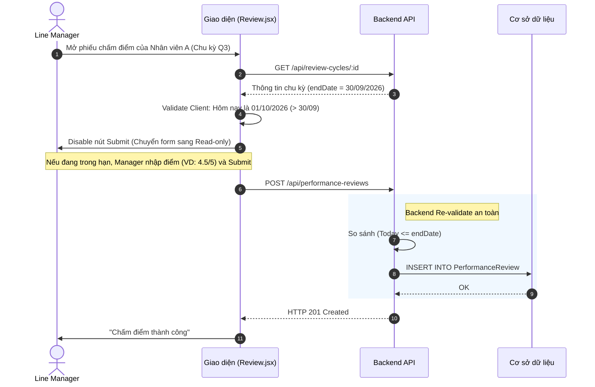

# Đặc tả chức năng: Chấm điểm Hiệu suất (Performance Review)

## 1. Giới thiệu chức năng
Chức năng dành cho Trưởng phòng (Sếp) chốt điểm cuối cùng cho nhân viên dựa trên các KPI đã hoàn thành.

## 2. Các quy tắc nghiệp vụ cốt lõi
- **Khung thời gian cứng:** Manager **CHỈ** được phép Submit form chấm điểm nếu ngày hiện tại nằm trong khung thời gian `startDate` đến `endDate` của ReviewCycle. Vượt quá hạn chót, hệ thống tự động khóa form thành Read-only.

## 3. Sơ đồ luồng chi tiết (Sequence Diagrams)

### 3.1. Luồng Chấm điểm & Khóa hạn (Lock deadline)

