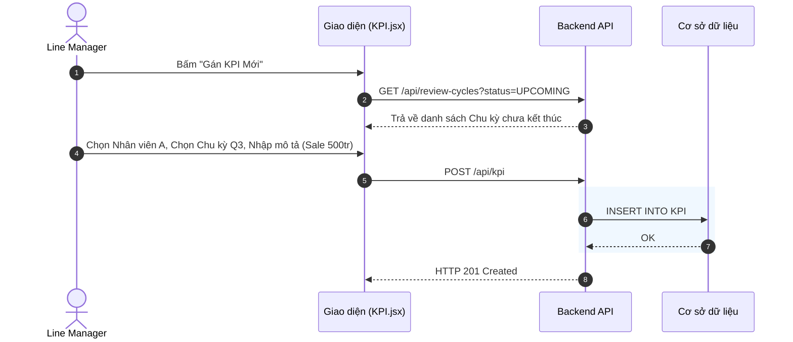

# Đặc tả chức năng: Quản lý Chu kỳ & Gán KPI

## 1. Giới thiệu chức năng
Cung cấp công cụ cho HR Admin tạo đợt đánh giá toàn công ty. Sau đó, Trưởng phòng (Line Manager) sẽ vào giao các mục tiêu KPI xuống cho từng nhân viên của mình.

## 2. Các quy tắc nghiệp vụ cốt lõi
- **Khóa chỉnh sửa Mục tiêu:** Nếu một Chu kỳ đánh giá đã kết thúc (`status = CLOSED`), Trưởng phòng không được phép xóa hay sửa đổi các mục tiêu KPI (Để đảm bảo minh bạch, nhân viên không bị đổi mục tiêu lén lút).

## 3. Sơ đồ luồng chi tiết (Sequence Diagrams)

### 3.1. Luồng Gán KPI cho nhân sự

