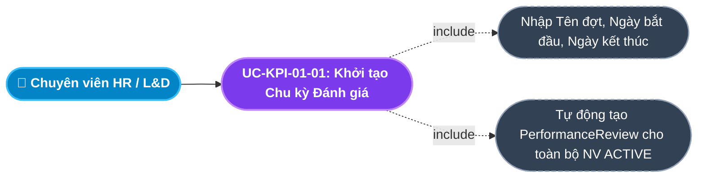
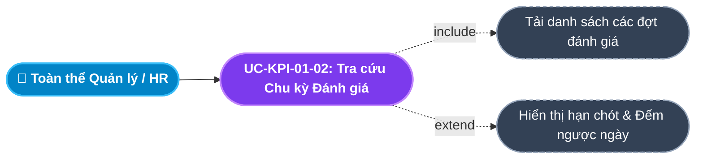
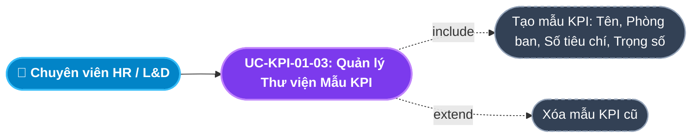
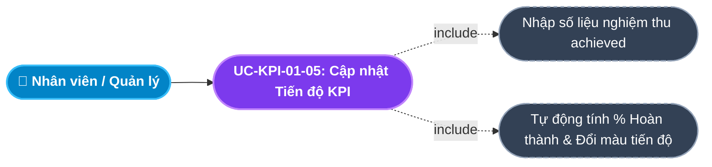
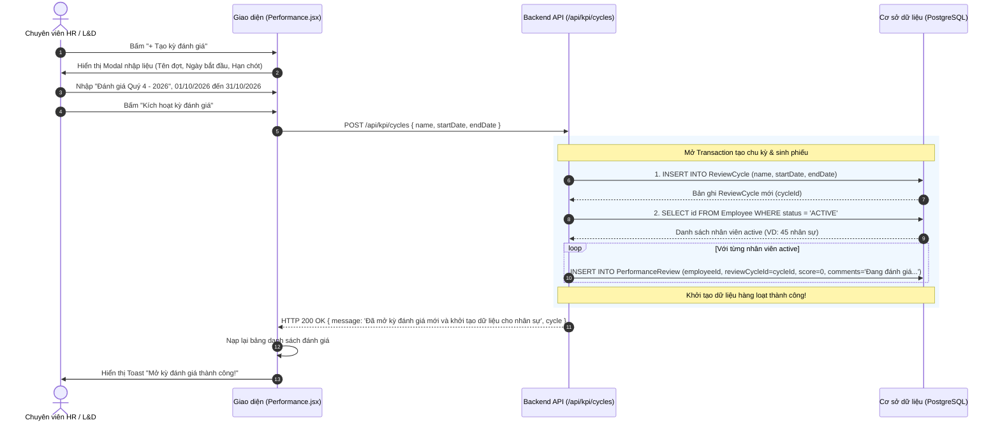

# Usecase: UC-KPI-01 - Quản lý Chu kỳ Đánh giá và Gán Mục tiêu KPI (Review Cycles & KPI Goal Setting)

## 1. Giới thiệu chức năng
- **Mục đích**: Cung cấp công cụ chuẩn hóa cho Ban Giám đốc và Phòng Nhân sự để thiết lập các đợt đánh giá hiệu suất định kỳ (Tháng, Quý, Năm), xây dựng Thư viện Tiêu chí Mẫu (KPI Templates) phân theo từng khối phòng ban và cho phép Trưởng bộ phận (Line Manager) giao chỉ tiêu định lượng (Target Goals) xuống từng nhân viên cấp dưới một cách minh bạch.
- **Actor (Tác nhân)**: Chuyên viên Đào tạo & Phát triển (HR / L&D), Trưởng bộ phận (Line Manager), Quản trị hệ thống (Admin).
- **Điều kiện tiên quyết**: Nhân viên đã có hồ sơ hoạt động (`ACTIVE`) trong cơ cấu tổ chức phòng ban.

### Danh mục các chức năng con (Sub-features):
1. **UC-KPI-01-01: Khởi tạo Chu kỳ Đánh giá mới (Create Review Cycle)**: Mở đợt đánh giá toàn công ty (VD: "Đánh giá Hiệu suất Quý 4/2026"), tự động sinh hàng loạt phiếu đánh giá nháp cho toàn thể nhân sự đang làm việc.
2. **UC-KPI-01-02: Tra cứu & Quản lý Danh mục Chu kỳ Đánh giá (View & Track Cycles)**: Theo dõi tiến độ các đợt đánh giá, xem thời hạn nộp điểm (`startDate` đến `endDate`) và trạng thái chu kỳ.
3. **UC-KPI-01-03: Thiết lập Thư viện Mẫu KPI theo Phòng ban (Manage KPI Templates)**: Quản lý ngân hàng chỉ số đo lường hiệu suất tiêu chuẩn (Tên mẫu, Phòng ban áp dụng, Số tiêu chí, Trọng số %) để tái sử dụng nhanh chóng.
4. **UC-KPI-01-04: Gán Chỉ tiêu Mục tiêu KPI cho Nhân viên (Assign KPI Goals)**: Trưởng phòng phân bổ mục tiêu cụ thể kèm con số kỳ vọng (`target`) cho từng nhân sự (VD: "Doanh số 500 triệu", "Đóng 50 tickets hỗ trợ").
5. **UC-KPI-01-05: Cập nhật Kết quả Thực tế & Theo dõi Tiến độ (Update KPI Progress)**: Cập nhật số liệu thực hiện (`achieved`) định kỳ, tự động tính tỷ lệ % hoàn thành mục tiêu.

---

## 2. Dữ liệu nghiệp vụ đầu vào (Input Data & Parameters)

### 2.1. Biểu mẫu Chu kỳ Đánh giá (Review Cycle Data)
| Tên trường | Kiểu dữ liệu | Tính chất | Ý nghĩa nghiệp vụ & Ràng buộc |
|---|---|---|---|
| `Tên chu kỳ đánh giá` (name) | Chuỗi (String) | Bắt buộc | Tiêu đề kỳ đánh giá (VD: "Đánh giá Hiệu suất Quý 4 - 2026"). |
| `Ngày bắt đầu` (startDate) | Ngày (Date) | Bắt buộc | Mốc thời gian mở cổng cho phép chấm điểm (`YYYY-MM-DD`). |
| `Ngày kết thúc` (endDate) | Ngày (Date) | Bắt buộc | Hạn chót cuối cùng để nộp kết quả đánh giá (`YYYY-MM-DD`, $\ge startDate$). |

### 2.2. Biểu mẫu Chỉ tiêu Mục tiêu KPI (KPI Goal Data)
| Tên trường | Kiểu dữ liệu | Tính chất | Ý nghĩa nghiệp vụ & Ràng buộc |
|---|---|---|---|
| `Nhân viên thực hiện` (employeeId) | UUID / Chuỗi | Bắt buộc | Định danh của nhân sự được giao chỉ tiêu. |
| `Mô tả mục tiêu` (description) | Chuỗi (String) | Bắt buộc | Chi tiết nội dung công việc (VD: "Doanh số hợp đồng phần mềm mới"). |
| `Chỉ tiêu kỳ vọng` (target) | Chuỗi / Số | Bắt buộc | Con số đo lường mục tiêu (VD: "500000000" hoặc "100%"). |
| `Kết quả thực tế đạt được` (achieved) | Chuỗi / Số | Cập nhật dần | Con số nghiệm thu thực tế của nhân viên. Mặc định: "0". |

---

## 3. Quy tắc nghiệp vụ (Business Rules)

| Mã Quy tắc | Tình huống nghiệp vụ | Cách hệ thống xử lý | Thông báo hiển thị |
|---|---|---|---|
| **BR-KPI-01-01** | **Tự động Khởi tạo Phiếu Đánh giá Nháp (Auto-provision Draft Reviews)**: Khởi tạo thành công chu kỳ đánh giá mới (`POST /api/kpi/cycles`). | Backend quét toàn bộ nhân viên có `status = 'ACTIVE'`, tự động tạo sẵn một bản ghi `PerformanceReview` tương ứng cho từng người với `score = 0` và `comments = 'Đang đánh giá...'`. | "Đã mở kỳ đánh giá mới và tự động khởi tạo phiếu đánh giá cho toàn thể nhân sự!" |
| **BR-KPI-01-02** | **Ràng buộc Thời gian Chu kỳ (Cycle Timeline Validation)**: Nhập ngày kết thúc nhỏ hơn hoặc bằng ngày bắt đầu. | Hệ thống chặn lưu và yêu cầu điều chỉnh: `endDate > startDate`. | "Hạn chót kết thúc đánh giá phải sau ngày bắt đầu mở đợt!" |
| **BR-KPI-01-03** | **Khóa Chỉnh sửa Mục tiêu khi Đóng chu kỳ (Goal Immutability)**: Chu kỳ đánh giá đã hết hạn hoặc đóng lại. | Khóa toàn bộ các mục tiêu KPI thuộc chu kỳ ở chế độ chỉ đọc (Read-only) nhằm đảm bảo tính minh bạch, ngăn chặn việc sửa đổi chỉ tiêu sau khi đã có kết quả. | "Chu kỳ đánh giá đã kết thúc, không thể thay đổi mục tiêu KPI!" |
| **BR-KPI-01-04** | **Tính toán Tỷ lệ Hoàn thành Tự động (Progress Metric)**: Cập nhật kết quả `achieved`. | Hệ thống tự động tính tỷ lệ phần trăm: $\text{Tiến độ} = (\text{achieved} / \text{target}) \times 100\%$ và hiển thị thanh tiến độ màu trực quan (Đỏ: $< 50\%$, Vàng: $50 - 79\%$, Xanh: $\ge 80\%$). | "Cập nhật tiến độ hoàn thành mục tiêu thành công!" |
| **BR-KPI-01-05** | **Ràng buộc Xóa mục tiêu KPI**: Người dùng bấm xóa một KPI. | Cho phép xóa khi chưa bước vào giai đoạn chấm điểm chính thức. Nếu đã chấm điểm hoàn tất $\rightarrow$ Chặn xóa để phục vụ thanh tra. | "Không thể xóa mục tiêu KPI đã được sử dụng để chấm điểm hiệu suất!" |

---

## 4. Đặc tả chi tiết các Use Case chức năng con (Sub-Use Cases Specification)

---

### 4.1. UC-KPI-01-01: Khởi tạo Chu kỳ Đánh giá mới (Create Review Cycle)

#### Sơ đồ Use Case:

#### Bảng đặc tả nghiệp vụ:

| STT | Hạng mục | Nội dung chi tiết |
|:---:|---|---|
| **1** | **Thông tin chung** | - **UC ID**: `UC-KPI-01-01` - **UC Name**: Khởi tạo Chu kỳ Đánh giá mới (Create Review Cycle) - **Actor**: Chuyên viên L&D/HR Admin, Giám đốc Nhân sự - **Mục tiêu**: Kích hoạt đợt đánh giá định kỳ trên toàn doanh nghiệp và tự động chuẩn bị phiếu đánh giá sẵn sàng cho quản lý vào chấm điểm. - **Mô tả**: Người dùng nhập tên đợt, ngày mở cổng và hạn chót nộp điểm. Hệ thống lưu chu kỳ và chạy tiến trình sinh tự động hàng loạt phiếu đánh giá nháp cho toàn bộ nhân sự đang hoạt động. - **Priority**: High (Bắt buộc) |
| **2** | **Trigger** | Người dùng bấm nút **"+ Tạo kỳ đánh giá"** trên màn hình Đánh giá Hiệu suất (`/internal/performance`). |
| **3** | **Pre-condition** | Người dùng có quyền quản trị hiệu suất (`MANAGE_PERFORMANCE`, `ADMIN`). |
| **4** | **Post-condition** | 1. Bản ghi `ReviewCycle` mới được lưu vào CSDL. 2. Toàn bộ nhân viên có `status = 'ACTIVE'` đều có bản ghi `PerformanceReview` nháp liên kết với chu kỳ này. 3. Chu kỳ hiển thị trên danh sách đợt đánh giá hiện hành. |
| **5** | **Main Flow** | 1. Người dùng bấm **"+ Tạo kỳ đánh giá"**. 2. Hệ thống mở Modal Form, nhập Tên chu kỳ (VD: "Đánh giá Quý 4 - 2026"), Ngày bắt đầu (`2026-10-01`), Hạn chót nộp (`2026-10-31`). 3. Người dùng bấm **"Kích hoạt kỳ đánh giá"**. 4. Giao diện kiểm tra `startDate < endDate`. 5. Hệ thống gửi request `POST /api/kpi/cycles` kèm payload. 6. Backend tạo bản ghi `ReviewCycle`. 7. Backend quét danh sách `Employee` (`where status = 'ACTIVE'`) và tạo tự động `PerformanceReview` cho từng người (BR-KPI-01-01). 8. Backend trả về `HTTP 200 OK`. Giao diện báo Toast: *"Đã mở kỳ đánh giá mới và khởi tạo dữ liệu cho nhân sự!"*. |
| **6** | **Alternative / Exception Flow** | - **EF-01 (Ngày kết thúc sớm hơn ngày bắt đầu)**: Nhập sai ngày $\rightarrow$ Báo lỗi *"Hạn chót kết thúc đánh giá phải sau ngày bắt đầu mở đợt!"* (BR-KPI-01-02). |
| **7** | **Business Rules & Validation** | - Tự động sinh phiếu đánh giá hàng loạt giúp giảm 100% thao tác khởi tạo thủ công từng nhân viên (BR-KPI-01-01). |
| **8** | **Acceptance Criteria** | - **AC-01**: Khởi tạo chu kỳ thành công toàn bộ nhân viên active đều xuất hiện trên bảng danh sách đánh giá. - **AC-02**: Nhập ngày kết thúc trước ngày bắt đầu bị chặn và báo lỗi rõ ràng. |

---

### 4.2. UC-KPI-01-02: Tra cứu & Quản lý Danh mục Chu kỳ Đánh giá (View & Track Cycles)

#### Sơ đồ Use Case:

#### Bảng đặc tả nghiệp vụ:

| STT | Hạng mục | Nội dung chi tiết |
|:---:|---|---|
| **1** | **Thông tin chung** | - **UC ID**: `UC-KPI-01-02` - **UC Name**: Tra cứu & Quản lý Danh mục Chu kỳ Đánh giá (View & Track Cycles) - **Actor**: Toàn bộ Quản lý bộ phận, HR Admin, Ban Giám đốc - **Mục tiêu**: Giúp người quản lý nắm bắt thời gian mở đợt và hạn chót nộp điểm để chủ động hoàn thành đánh giá cho nhân viên. - **Mô tả**: Hiển thị danh sách các đợt đánh giá đã và đang diễn ra kèm thời gian hiệu lực và tình trạng còn hạn hay đã hết hạn. - **Priority**: Medium |
| **2** | **Trigger** | Người dùng xem danh mục chu kỳ tại trang Quản lý Đánh giá. |
| **3** | **Pre-condition** | Người dùng đã đăng nhập vào hệ thống. |
| **4** | **Post-condition** | Danh sách chu kỳ đánh giá hiển thị chi tiết và trực quan. |
| **5** | **Main Flow** | 1. Người dùng mở trang Đánh giá Hiệu suất. 2. Hệ thống tải danh sách các `ReviewCycle`. 3. Hiển thị thông tin: Tên đợt, Ngày mở, Hạn chót kết thúc, Số lượng nhân sự tham gia. 4. Hiển thị badge trạng thái: Xanh lá *"Đang diễn ra"* (nếu `today <= endDate`), hoặc Xám *"Đã kết thúc"* (nếu `today > endDate`). |
| **6** | **Alternative / Exception Flow** | - **AF-01 (Chưa có đợt đánh giá nào)**: Hiển thị thông báo *"Chưa có chu kỳ đánh giá nào được mở"*. |
| **7** | **Business Rules & Validation** | - Tự động đối chiếu ngày máy chủ để gắn nhãn trạng thái chính xác. |
| **8** | **Acceptance Criteria** | - **AC-01**: Hiển thị đúng hạn chót và trạng thái của từng kỳ đánh giá. |

---

### 4.3. UC-KPI-01-03: Thiết lập Thư viện Mẫu KPI theo Phòng ban (Manage KPI Templates)

#### Sơ đồ Use Case:

#### Bảng đặc tả nghiệp vụ:

| STT | Hạng mục | Nội dung chi tiết |
|:---:|---|---|
| **1** | **Thông tin chung** | - **UC ID**: `UC-KPI-01-03` - **UC Name**: Thiết lập Thư viện Mẫu KPI theo Phòng ban (Manage KPI Templates) - **Actor**: Chuyên viên L&D, Trưởng phòng Nhân sự - **Mục tiêu**: Chuẩn hóa bộ tiêu chí đánh giá cho từng vị trí và phòng ban, giúp Trưởng phòng không phải gõ lại tiêu chí thủ công mỗi kỳ. - **Mô tả**: Quản lý danh mục các mẫu KPI (`KPITemplate`): Tên mẫu (VD: "KPI Khối Kinh doanh", "KPI Kỹ thuật phần mềm"), Phòng ban áp dụng, Số tiêu chí con, Trọng số % và Trạng thái áp dụng (`Active`). - **Priority**: Medium |
| **2** | **Trigger** | Người dùng truy cập tab **"Mẫu KPI"** (`/internal/performance/templates`). |
| **3** | **Pre-condition** | Người dùng có quyền quản trị hiệu suất. |
| **4** | **Post-condition** | Mẫu KPI mới được lưu vào thư viện dùng chung cho toàn bộ phòng ban. |
| **5** | **Main Flow** | 1. Người dùng mở tab Mẫu KPI. 2. Bấm nút **"+ Thêm mẫu KPI"**. 3. Nhập: Tên mẫu, Chọn Phòng ban áp dụng, Số tiêu chí (VD: 5), Trọng số % (VD: "30% Doanh số, 70% Khách hàng"). 4. Bấm nút **"Lưu mẫu KPI"**. 5. Giao diện gửi request `POST /api/kpi/templates` kèm payload. 6. Backend tạo bản ghi và trả về `HTTP 201 Created`. 7. Giao diện hiển thị Toast: *"Tạo mẫu KPI thành công!"*, nạp lại danh sách. |
| **6** | **Alternative / Exception Flow** | - **AF-01 (Xóa mẫu KPI)**: Bấm icon Thùng rác $\rightarrow$ Gửi request `DELETE /api/kpi/templates/:id` $\rightarrow$ Xóa bản ghi thành công khỏi CSDL. |
| **7** | **Business Rules & Validation** | - Mẫu KPI có thể tái sử dụng cho nhiều đợt đánh giá khác nhau. |
| **8** | **Acceptance Criteria** | - **AC-01**: Thêm mới và xóa mẫu KPI phản hồi nhanh chóng, lưu đúng phòng ban áp dụng. |

---

### 4.4. UC-KPI-01-04: Gán Chỉ tiêu Mục tiêu KPI cho Nhân viên (Assign KPI Goals)

#### Sơ đồ Use Case:

#### Bảng đặc tả nghiệp vụ:

| STT | Hạng mục | Nội dung chi tiết |
|:---:|---|---|
| **1** | **Thông tin chung** | - **UC ID**: `UC-KPI-01-04` - **UC Name**: Gán Chỉ tiêu Mục tiêu KPI cho Nhân viên (Assign KPI Goals) - **Actor**: Trưởng bộ phận (Line Manager), Quản lý trực tiếp - **Mục tiêu**: Phân bổ mục tiêu công việc cụ thể cho từng nhân viên dưới quyền vào đầu chu kỳ đánh giá. - **Mô tả**: Người dùng chọn nhân viên, nhập mô tả công việc cần đạt và gán con số chỉ tiêu (`target`). Hệ thống khởi tạo bản ghi mục tiêu KPI với kết quả ban đầu là 0. - **Priority**: High (Bắt buộc) |
| **2** | **Trigger** | Người dùng bấm nút **"+ Gán KPI mới"** trên trang Gán mục tiêu KPI (`KPIAssignments.jsx`). |
| **3** | **Pre-condition** | Chu kỳ đánh giá đang trong thời gian hiệu lực (chưa đóng). |
| **4** | **Post-condition** | Bản ghi `KPI` mới được tạo gắn với `employeeId`, hiển thị trên trang cá nhân của nhân viên. |
| **5** | **Main Flow** | 1. Trưởng phòng mở trang Gán KPI. 2. Bấm nút **"+ Gán KPI mới"**. 3. Chọn Nhân viên trong bộ phận từ dropdown. 4. Nhập Mô tả mục tiêu: "Hoàn thành 03 tính năng lớn cho Module Tiền lương". 5. Nhập Chỉ tiêu kỳ vọng: "3". 6. Bấm **"Giao chỉ tiêu"**. 7. Giao diện gửi request `POST /api/kpi/kpi` kèm `{ employeeId, description, target }`. 8. Backend tạo bản ghi và trả về `HTTP 201 Created`. 9. Giao diện báo Toast: *"Gán mục tiêu KPI thành công!"*, nạp lại danh sách. |
| **6** | **Alternative / Exception Flow** | - **EF-01 (Bỏ trống mô tả hoặc chỉ tiêu)**: Báo lỗi *"Vui lòng nhập đầy đủ mô tả mục tiêu và chỉ tiêu kỳ vọng!"*. |
| **7** | **Business Rules & Validation** | - Nhân viên có thể được giao nhiều mục tiêu KPI trong cùng một chu kỳ. |
| **8** | **Acceptance Criteria** | - **AC-01**: Gán KPI thành công xuất hiện ngay trên danh sách mục tiêu của nhân viên tương ứng. |

---

### 4.5. UC-KPI-01-05: Cập nhật Kết quả Thực tế & Theo dõi Tiến độ (Update KPI Progress)

#### Sơ đồ Use Case:

#### Bảng đặc tả nghiệp vụ:

| STT | Hạng mục | Nội dung chi tiết |
|:---:|---|---|
| **1** | **Thông tin chung** | - **UC ID**: `UC-KPI-01-05` - **UC Name**: Cập nhật Kết quả Thực tế & Theo dõi Tiến độ (Update KPI Progress) - **Actor**: Toàn bộ nhân viên, Quản lý trực tiếp - **Mục tiêu**: Ghi nhận số liệu công việc hoàn thành thực tế định kỳ (hàng tuần, hàng tháng) để đo lường tiến độ trước khi bước vào kỳ chấm điểm chính thức. - **Mô tả**: Người dùng cập nhật trường `achieved` trên mục tiêu KPI. Hệ thống tự động tính tỷ lệ phần trăm hoàn thành và đổi màu thanh tiến độ trực quan. - **Priority**: High |
| **2** | **Trigger** | Người dùng bấm icon chiếc bút **(Cập nhật)** tại dòng mục tiêu KPI trên bảng. |
| **3** | **Pre-condition** | Bản ghi KPI tồn tại và chu kỳ đánh giá chưa bị đóng (BR-KPI-01-03). |
| **4** | **Post-condition** | Giá trị `achieved` được cập nhật trong CSDL, thanh tiến độ phần trăm nhảy số ngay lập tức. |
| **5** | **Main Flow** | 1. Người dùng bấm Sửa tại dòng KPI cần cập nhật. 2. Nhập số liệu thực tế đạt được: VD chỉ tiêu là `500`, thực tế đạt `450`. 3. Bấm **"Lưu tiến độ"**. 4. Giao diện gửi request `PUT /api/kpi/kpi/:id` với `{ achieved, description, target }`. 5. Backend cập nhật bản ghi và trả về `HTTP 200 OK`. 6. Giao diện tính toán: `450 / 500 = 90%` $\rightarrow$ Thanh tiến độ chuyển sang màu xanh lá (`>= 80%`). 7. Báo Toast: *"Cập nhật tiến độ KPI thành công!"*. |
| **6** | **Alternative / Exception Flow** | - **EF-01 (Chu kỳ đã đóng)**: Báo lỗi *"Chu kỳ đánh giá đã kết thúc, không thể thay đổi mục tiêu KPI!"* (BR-KPI-01-03). |
| **7** | **Business Rules & Validation** | - Tiến độ có thể vượt quá 100% nếu nhân viên hoàn thành vượt mức chỉ tiêu. |
| **8** | **Acceptance Criteria** | - **AC-01**: Cập nhật thành công con số thực tế được lưu lại chính xác. - **AC-02**: Thanh tiến độ hiển thị đúng màu theo ngưỡng hoàn thành. |

---

## 5. Sơ đồ tuần tự nghiệp vụ (Sequence Diagrams)

### 5.1. Luồng Mở Kỳ Đánh giá & Sinh Phiếu Nháp Hàng loạt (UC-KPI-01-01)

---

## 6. Ma trận kịch bản kiểm thử (Test Scenarios & Acceptance Matrix)

| Mã kịch bản | Use Case liên quan | Điều kiện kiểm thử | Các bước thực hiện | Kết quả mong đợi (Expected Outcome) | Đánh giá |
|---|---|---|---|---|:---:|
| **TC-KPI-01-01** | UC-KPI-01-01 | Khởi tạo chu kỳ hợp lệ | Nhập tên đợt, ngày 01/10 đến 31/10 $\rightarrow$ Bấm Kích hoạt | Tạo chu kỳ thành công, tự sinh phiếu đánh giá nháp cho toàn bộ nhân viên active. | **Pass** |
| **TC-KPI-01-02** | UC-KPI-01-01 | Ngày kết thúc không hợp lệ | Nhập ngày kết thúc sớm hơn ngày bắt đầu $\rightarrow$ Bấm Kích hoạt | Báo lỗi *"Hạn chót kết thúc đánh giá phải sau ngày bắt đầu mở đợt!"*. | **Pass** |
| **TC-KPI-01-03** | UC-KPI-01-03 | Tạo mẫu KPI mới | Nhập mẫu KPI Phòng Kinh doanh, 5 tiêu chí, trọng số 100% | Lưu thành công, mẫu xuất hiện trên danh mục thư viện KPI. | **Pass** |
| **TC-KPI-01-04** | UC-KPI-01-04 | Gán KPI cho nhân viên | Chọn nhân viên, nhập mô tả và chỉ tiêu target = 100 $\rightarrow$ Bấm Lưu | Bản ghi KPI được tạo thành công, `achieved` mặc định là 0. | **Pass** |
| **TC-KPI-01-05** | UC-KPI-01-05 | Cập nhật tiến độ | Nhập `achieved = 90` trên `target = 100` $\rightarrow$ Bấm Lưu | Cập nhật thành công, thanh tiến độ đạt 90% đổi sang màu xanh lá. | **Pass** |
