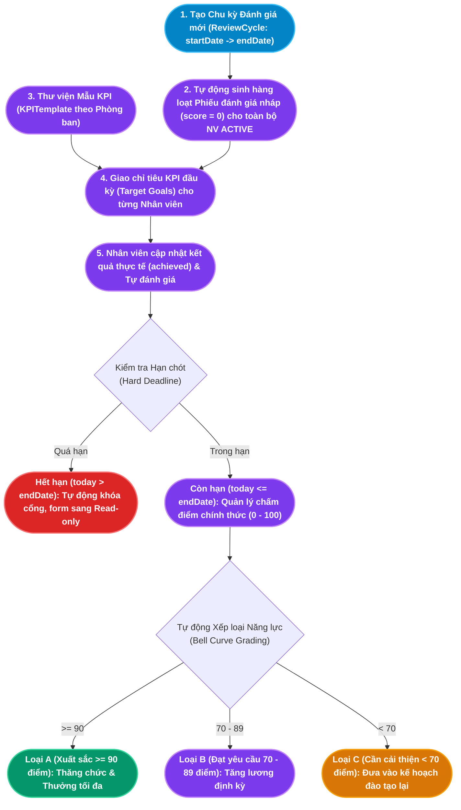

# TÀI LIỆU PHÂN TÍCH NGHIỆP VỤ - MODULE ĐÁNH GIÁ HIỆU SUẤT & KPI (PERFORMANCE MANAGEMENT)

## 1. Giới thiệu tổng quan Module
**Module Đánh giá Hiệu suất & KPI (Performance Management)** là "thước đo giá trị đóng góp" của nguồn nhân lực đối với mục tiêu chiến lược của doanh nghiệp. Module này lượng hóa toàn bộ kết quả công tác của nhân viên theo định kỳ (Tháng, Quý, Năm) thông qua hệ thống Chỉ số Hiệu suất Cốt lõi (Key Performance Indicators - KPI), cung cấp bức tranh minh bạch 360 độ phục vụ công tác quy hoạch nhân sự, xét duyệt tăng lương, chi trả tiền thưởng KPI và sàng lọc nhân sự kém hiệu quả.

Module đóng vai trò kết nối trực tiếp với các phân hệ khác:
- **Module Tổ chức (Organization)**: Cung cấp danh mục phòng ban và vị trí chức danh để thiết lập Thư viện Mẫu KPI chuẩn hóa (`KPITemplate`).
- **Module Quản lý Nhân sự (Core HR)**: Cung cấp danh sách nhân sự đang hoạt động (`ACTIVE`) để tự động tạo phiếu đánh giá, đồng thời lưu vết kết quả xếp loại vào Lịch sử việc làm (`EmploymentHistory`) làm căn cứ thăng chức, điều chuyển hoặc chấm dứt hợp đồng.
- **Module Tiền lương (Payroll)**: Cung cấp kết quả xếp loại (A, B, C) làm cơ sở để nhân hệ số thưởng hiệu suất cuối năm.

### Đối tượng sử dụng (Actors):
1. **Chuyên viên L&D / HR Admin**: Khởi tạo chu kỳ đánh giá mới, xây dựng ngân hàng mẫu KPI theo phòng ban, giám sát tiến độ hoàn thành đánh giá toàn công ty.
2. **Trưởng bộ phận / Quản lý trực tiếp (Line Manager)**: Giao mục tiêu KPI đầu kỳ cho nhân viên, nghiệm thu số liệu thực tế (`achieved`), thực hiện chấm điểm chính thức (0 - 100) và viết nhận xét phát triển.
3. **Nhân viên (Employee)**: Tự theo dõi tiến độ hoàn thành mục tiêu cá nhân, cập nhật kết quả công việc, tự chấm điểm (Self-review) trước buổi họp đánh giá.
4. **Ban Giám đốc (CEO / BOD)**: Phê duyệt kết quả đánh giá chung toàn công ty, xem báo cáo phân bổ tỷ lệ xếp loại và ra quyết định khen thưởng / kỷ luật.

---

## 2. Kiến trúc Luồng Dữ liệu Đánh giá Hiệu suất (Performance Cycle Architecture)

---

## 3. Ma trận Phân rã Chức năng Chi tiết (Functional Breakdown Matrix)

Hệ thống Đánh giá Hiệu suất & KPI bao gồm **2 nhóm chức năng trụ cột** với tổng cộng **10 Use Case con (Sub-Use Cases)** được chuẩn hóa toàn diện:

| Nhóm chức năng (Epic) | Mã Use Case | Tên Chức năng Con (Sub-Use Case) | Actor chính | Endpoint Backend |
|---|---|---|---|---|
| **1. Chu kỳ & Mục tiêu KPI** *(Cycles & Goal Setting)* | `UC-KPI-01-01` | Khởi tạo Chu kỳ Đánh giá mới (Tự sinh phiếu nháp) | HR / L&D | `POST /api/kpi/cycles` |
| | `UC-KPI-01-02` | Tra cứu & Quản lý Danh mục Chu kỳ Đánh giá | Toàn hệ thống | Quản lý Đợt đánh giá |
| | `UC-KPI-01-03` | Thiết lập Thư viện Mẫu KPI theo Phòng ban | Chuyên viên HR | `POST, GET, DELETE /api/kpi/templates` |
| | `UC-KPI-01-04` | Gán Chỉ tiêu Mục tiêu KPI cho Nhân viên | Quản lý trực tiếp | `POST /api/kpi/kpi` |
| | `UC-KPI-01-05` | Cập nhật Kết quả Thực tế & Theo dõi Tiến độ | Nhân viên / Quản lý | `PUT /api/kpi/kpi/:id` |
| **2. Chấm điểm & Xếp loại** *(Scoring & Grading)* | `UC-KPI-02-01` | Thẩm định & Chấm điểm Hiệu suất Nhân viên | Quản lý trực tiếp | `PUT /api/kpi/reviews/:id` |
| | `UC-KPI-02-02` | Kiểm soát Khung Thời hạn Đánh giá (Hard Deadline) | Hệ thống Backend | Check `today <= endDate` (403) |
| | `UC-KPI-02-03` | Xếp loại Nhân sự & Phân loại Bell Curve (A, B, C) | Hệ thống Backend | Quy đổi điểm số sang Grade |
| | `UC-KPI-02-04` | Ghi nhận Nhận xét & Kế hoạch Phát triển | Quản lý trực tiếp | Lưu trường `comments` |
| | `UC-KPI-02-05` | Tra cứu & Thống kê Kết quả Đánh giá Toàn diện | Lãnh đạo / HR | `GET /api/kpi/reviews` |

---

## 4. Danh mục Hồ sơ Phân tích Chi tiết (Detailed Specifications)

Vui lòng tham khảo tài liệu đặc tả chi tiết của từng chức năng con tại các liên kết dưới đây:

1. [Đặc tả Chức năng Quản lý Chu kỳ Đánh giá và Gán Mục tiêu KPI](file:///c:/Users/truclh/Desktop/HRM-ĐATN/docs/Tài%20liệu%20phân%20tích%20nghiệp%20vụ%20từng%20module/Module%20Đánh%20giá%20KPI/Chuc-nang-Chu-ky-Danh-gia.md)
   - Đặc tả 5 Use Case con: Mở đợt đánh giá toàn công ty (tự động sinh phiếu đánh giá nháp cho toàn bộ nhân sự active), Tra cứu quản lý chu kỳ, Thư viện mẫu tiêu chí KPI phân theo khối phòng ban, Gán mục tiêu định lượng đầu kỳ, Cập nhật số liệu thực tế đo lường tiến độ %.
   - Sơ đồ tuần tự và 5 kịch bản kiểm thử mẫu.

2. [Đặc tả Chức năng Chấm điểm Hiệu suất và Xếp loại Nhân sự](file:///c:/Users/truclh/Desktop/HRM-ĐATN/docs/Tài%20liệu%20phân%20tích%20nghiệp%20vụ%20từng%20module/Module%20Đánh%20giá%20KPI/Chuc-nang-Cham-diem.md)
   - Đặc tả 5 Use Case con: Nhập điểm số đánh giá thang 100 và nhận xét chi tiết, Cơ chế kiểm soát hạn chót cứng (Hard Deadline Enforcement - từ chối lưu và khóa form khi quá hạn), Tự động xếp loại năng lực chuẩn Bell Curve (Loại A $\ge 90$, Loại B $70 - 89$, Loại C $< 70$), Ghi nhận kế hoạch đào tạo phát triển, Tra cứu lịch sử đánh giá và thống kê tỷ lệ phân bổ toàn công ty.
   - Sơ đồ tuần tự và 5 kịch bản kiểm thử mẫu.

---

## 5. Điểm nhấn Kỹ thuật & Nghiệp vụ (Key Business Highlights)

1. **Cơ chế Khởi tạo Phiếu Đánh giá Tự động (Auto-provisioning Review Records)**:
   - Khi chuyên viên HR bấm mở một chu kỳ đánh giá mới (`ReviewCycle`), hệ thống không yêu cầu HR phải tạo thủ công từng phiếu đánh giá cho từng nhân viên.
   - Thay vào đó, Backend tự động quét toàn bộ bảng `Employee` (`where status = 'ACTIVE'`) và tạo sẵn một bản ghi `PerformanceReview` nháp (`score = 0`, `comments = 'Đang đánh giá...'`) gắn liền với chu kỳ đó. Điều này giúp các Trưởng phòng chỉ việc mở hệ thống là có sẵn danh sách nhân viên cần chấm điểm.

2. **Kiểm soát Hạn chót Đánh giá Cứng (Hard Deadline Enforcement)**:
   - Để ngăn chặn tình trạng nộp điểm muộn làm chậm kỳ tính thưởng cuối năm, hệ thống thiết lập cơ chế khóa hạn chót 2 lớp:
     - Lớp 1 (Frontend): Nếu ngày hiện tại vượt quá `endDate`, các nút bấm lưu điểm tự động bị làm mờ (Disabled) và form chuyển sang chế độ chỉ đọc.
     - Lớp 2 (Backend Validation): Mọi request gửi lên API `PUT /api/kpi/reviews/:id` đều được so sánh với mốc `endDate 23:59:59`. Nếu quá hạn, hệ thống trả về mã lỗi `HTTP 403 Forbidden` và từ chối cập nhật dữ liệu.

3. **Thuật toán Phân loại Hiệu suất Chuẩn hóa (Standardized Performance Grading)**:
   - Loại bỏ hoàn toàn sự cảm tính trong đánh giá thông qua thuật toán quy đổi điểm định lượng tự động:
     $$\text{Grade} = \begin{cases} \text{A (Xuất sắc)} & \text{khi Score} \ge 90 \\ \text{B (Đạt yêu cầu)} & \text{khi } 70 \le \text{Score} < 90 \\ \text{C (Cần cải thiện)} & \text{khi Score} < 70 \end{cases}$$
