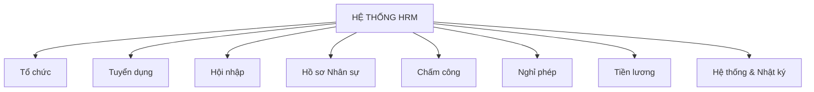
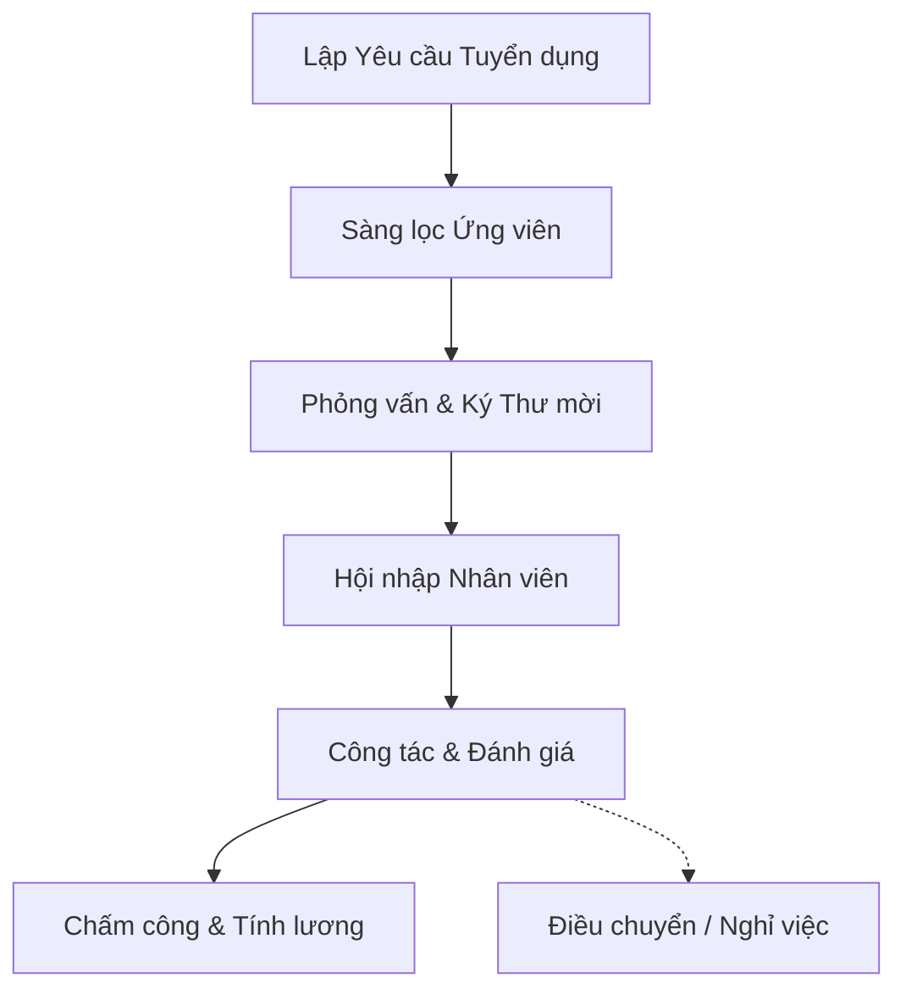
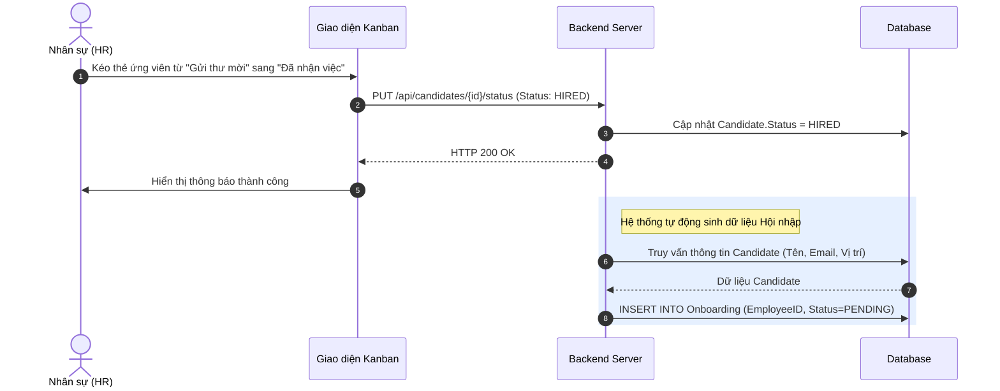
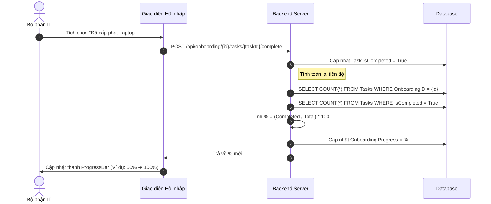
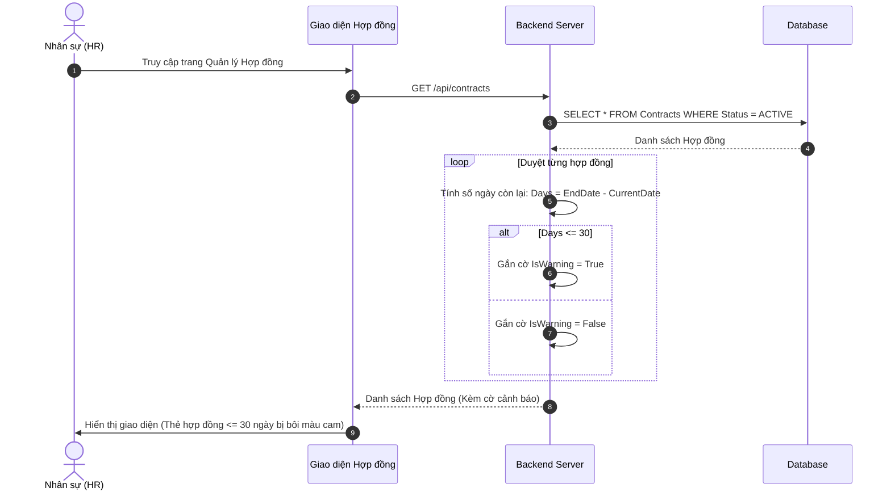
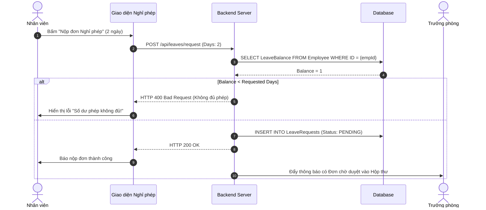
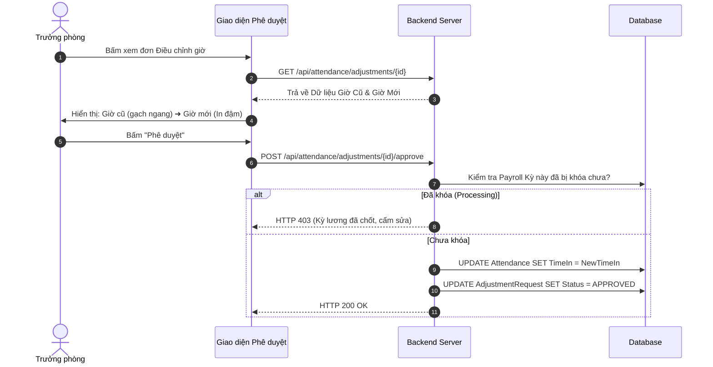
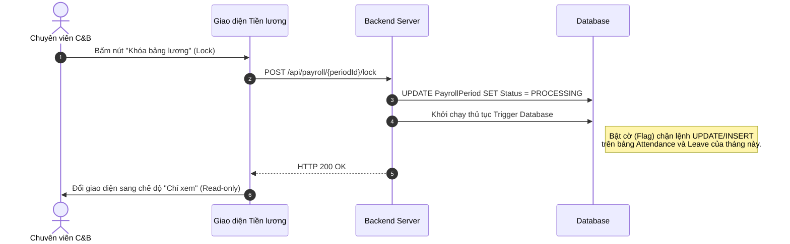
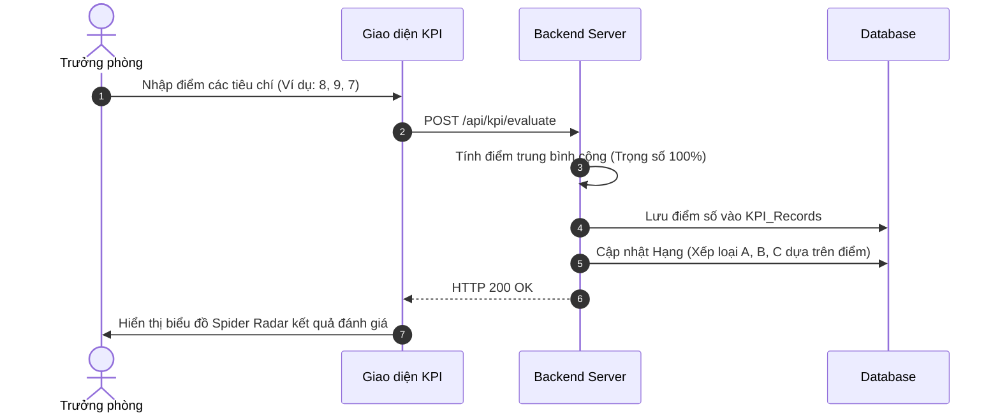
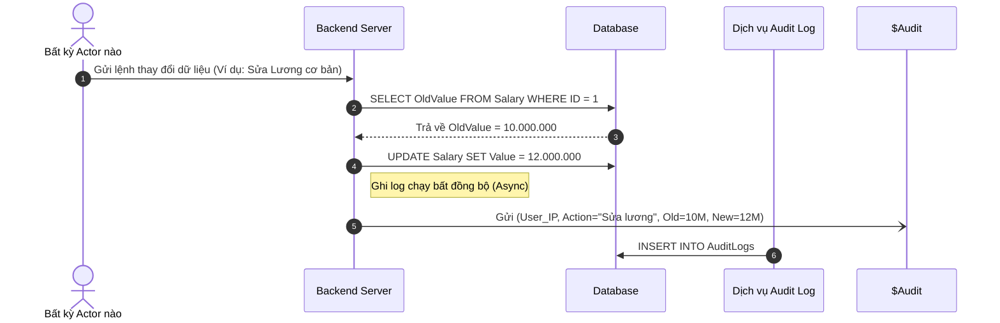

# TÀI LIỆU PHÂN TÍCH NGHIỆP VỤ HỆ THỐNG
**Dự án:** Quản trị Nhân sự Tổng thể (Enterprise HRM Portal) - Ứng dụng tại Công ty TNHH LLA

---

## A. TÓM TẮT TỔNG QUAN (Executive Summary)
Tài liệu này cung cấp bản phân tích và đặc tả nghiệp vụ chi tiết cho dự án phần mềm Enterprise HRM Portal dành cho Công ty TNHH LLA. Hệ thống được xây dựng dưới dạng ứng dụng web độc lập với kiến trúc 3 Cổng (Portals) kết nối liên thông:
- **Enterprise Portal:** Cổng quản trị lõi dành cho Ban Giám đốc, HR và C&B.
- **Employee Portal:** Cổng tự phục vụ (Self-service) dành cho Nhân viên.
- **Candidate Portal:** Cổng đăng tin và nộp hồ sơ dành cho Ứng viên bên ngoài.

Hệ thống số hóa các quy trình từ tuyển dụng, tiếp nhận, quản lý hợp đồng, đến chấm công và tính lương. Hệ thống thiết lập phân quyền người dùng thông qua cơ chế Phân quyền theo vai trò (RBAC) và lưu vết các thay đổi thông qua Nhật ký hệ thống (Audit Logs).

---

## B. BÀI TOÁN VÀ MỤC TIÊU NGHIỆP VỤ (Business Problem & Objective)

### B.1. Bài toán thực tế
- **Hiện trạng:** Dữ liệu nhân sự được lưu trữ phân tán trên nhiều nguồn không liên thông (Excel, Email).
- **Vấn đề:** Khó khăn trong việc truy xuất dữ liệu vòng đời nhân viên. Quy trình tính lương dễ sai sót do không có cơ chế khóa (lock) dữ liệu giờ công. Thiếu công cụ lưu vết sửa đổi.

### B.2. Mục tiêu nghiệp vụ
- Lưu trữ tập trung toàn bộ dữ liệu nhân sự.
- Số hóa quy trình chấm công và tính lương, hạn chế lỗi nhập liệu.
- Lưu trữ đầy đủ lịch sử thay đổi thông tin nhạy cảm.

---

## C. PHẠM VI HỆ THỐNG (Scope)

**Trong phạm vi (In Scope):**
- Quản lý cấu trúc tổ chức (Phòng ban, Vị trí).
- Quản lý tuyển dụng (Phễu ứng viên - ATS).
- Tiếp nhận nhân sự mới (Hội nhập).
- Quản lý hồ sơ, lịch sử việc làm, hợp đồng.
- Quản lý chấm công, ca làm việc, và đơn nghỉ phép.
- Tính toán và phát hành phiếu lương.
- Phê duyệt chứng từ tập trung.

**Ngoài phạm vi (Out of Scope):**
- Quản lý kho, quản lý bán hàng.
- Kế toán tài chính nội bộ.
- Đào tạo nhân sự.

---

## D. BẢN ĐỒ PHÂN HỆ (Module Map)



---

## E. MÔ HÌNH VAI TRÒ NGƯỜI DÙNG (Actor & Role Model)

| Người dùng (Actor) | Vai trò | Mục đích sử dụng | Quyền hạn chính |
| ----- | ------- | ---------------- | -------- |
| **Quản trị viên** | Quản trị hệ thống | Cấu hình tham số lõi, thiết lập phân quyền. | Toàn quyền, quản lý RBAC. |
| **Nhân sự (HR)** | Quản trị nhân sự | Tuyển dụng, tạo hợp đồng, tiếp nhận. | Quản lý vòng đời nhân sự. |
| **Lương thưởng (C&B)**| Chuyên viên lương | Xử lý bảng công và tính lương. | Khóa dữ liệu, tính lương. |
| **Trưởng phòng** | Trưởng phòng | Phê duyệt yêu cầu từ cấp dưới. | Duyệt đơn trong phạm vi phòng. |
| **Nhân viên** | Nhân viên | Tra cứu hồ sơ và gửi đơn yêu cầu. | Xem dữ liệu cá nhân (Self-service). |

---

## F. DANH MỤC THUẬT NGỮ (Business Glossary)

| Thuật ngữ | Định nghĩa nghiệp vụ | Ý nghĩa trong hệ thống |
| -------- | -------------------- | ---------------------- |
| Yêu cầu tuyển dụng | Phiếu yêu cầu bổ sung nhân sự cho một vị trí. | Căn cứ hợp lệ để mở phễu tuyển dụng. |
| Phễu ứng viên | Bảng quản lý ứng viên theo dạng cột. | Thể hiện trạng thái hiện tại của ứng viên. |
| Kỳ tính lương | Chu kỳ tính toán thu nhập. | Đóng gói toàn bộ công/phép của một tháng để tính tiền. |
| Nhật ký hệ thống | Bản ghi lưu vết lịch sử thao tác. | Kiểm soát sự thay đổi dữ liệu (Cũ ➜ Mới). |

---

## G. MÔ HÌNH ĐỐI TƯỢNG NGHIỆP VỤ (Business Object Model)

```text
Nhân viên
   │
   ├── Hợp đồng (Quản lý thời hạn lao động)
   ├── Đơn xin phép (Quản lý lịch sử nghỉ phép)
   ├── Bảng công (Quản lý giờ làm việc thực tế)
   ├── Lịch sử công tác (Quản lý lịch sử thăng tiến)
   └── Phiếu lương (Lịch sử nhận lương)
```

| Đối tượng | Quan hệ | Thuộc tính chính | Vòng đời |
| ------ | ------- | ---------------- | -------- |
| Ứng viên | Liên kết 1 Yêu cầu tuyển dụng | Vòng phỏng vấn, Hồ sơ CV | Nguồn CV ➜ Đã nhận việc |
| Hợp đồng | Thuộc 1 Nhân viên | Ngày kết thúc, Loại HĐ | Đang hiệu lực ➜ Hết hạn |

---

## H. SƠ ĐỒ QUY TRÌNH TỔNG THỂ (Overall Business Process)



---

## I. ĐẶC TẢ CHI TIẾT NGHIỆP VỤ VÀ SƠ ĐỒ TUẦN TỰ (Process Catalog & Sequences)

## 1. Phân hệ Tuyển dụng (ATS Kanban)

**Mô tả nghiệp vụ:** Luồng luân chuyển thẻ ứng viên qua các vòng phỏng vấn. Khi ứng viên chấp nhận thư mời nhận việc (Hired), hệ thống tự động sinh hồ sơ bên phân hệ Hội nhập.



---

## 2. Phân hệ Hội nhập (Onboarding)

**Mô tả nghiệp vụ:** Quá trình chuẩn bị đón nhân sự mới. Thanh tiến độ (ProgressBar) tự động cập nhật phần trăm khi IT/HR hoàn thành các tác vụ yêu cầu.



---

## 3. Phân hệ Hợp đồng & Cảnh báo

**Mô tả nghiệp vụ:** Khi người dùng truy cập màn hình Hồ sơ, hệ thống tự động quét và đánh dấu cảnh báo màu cam đối với các hợp đồng sắp hết hạn (<= 30 ngày).



---

## 4. Phân hệ Nghỉ phép (Leave Management)

**Mô tả nghiệp vụ:** Nhân viên nộp đơn xin nghỉ, hệ thống kiểm tra số dư phép trước khi gửi cho Trưởng phòng phê duyệt.



---

## 5. Phân hệ Chấm công (Điều chỉnh giờ)

**Mô tả nghiệp vụ:** Luồng xử lý khi nhân viên gửi đơn xin sửa giờ chấm công do bị lỗi hoặc quên quẹt thẻ.



---

## 6. Phân hệ Tiền lương (Quy trình Khóa sổ)

**Mô tả nghiệp vụ:** Hành động quan trọng nhất của phân hệ Lương. Chuyên viên C&B chốt dữ liệu để chuẩn bị chuyển khoản, cấm mọi hành vi sửa công.



---

## 7. Phân hệ Đánh giá KPI

**Mô tả nghiệp vụ:** Trưởng phòng tiến hành chấm điểm hiệu suất của nhân viên cuối kỳ.



---

## 8. Phân hệ Hệ thống (Nhật ký kiểm toán / Audit Logs)

**Mô tả nghiệp vụ:** Bất kể hệ thống nào thay đổi dữ liệu nhạy cảm (như Tiền lương, Cấp quyền), hệ thống sẽ ngầm (background) ghi vết lại IP và dữ liệu thay đổi.



---

## J. DANH MỤC QUY TẮC KINH DOANH (Business Rule Catalog)

| Mã Quy tắc | Nội dung quy tắc | Phân loại | Áp dụng cho |
| ------- | ---- | ---- | ----------- |
| **QT-01** | Hợp đồng có ngày hết hạn cách hiện tại <= 30 ngày sẽ hiển thị cảnh báo. | Ràng buộc kiểm tra | Hợp đồng |
| **QT-02** | Kỳ lương ở trạng thái `Đang xử lý` (Khóa) không cho phép thay đổi dữ liệu công/phép. | Luồng quy trình | Tiền lương |
| **QT-03** | Không ai được quyền xóa bản ghi Nhật ký hệ thống. | Bảo mật | Nhật ký |
| **QT-04** | Thâm niên > 5 năm được cộng +1 ngày phép. | Tính toán | Quỹ phép |

---

## K. VÒNG ĐỜI TRẠNG THÁI (Workflow & State Transition)

**Vòng đời Kỳ tính lương**
| Đối tượng | Trạng thái hiện tại | Hành động | Điều kiện | Trạng thái tiếp theo | Người thực hiện |
| ------ | ------------- | ------------ | --------- | ---------- | ----- |
| Kỳ lương| Bản nháp | Bấm Khóa sổ | Không | Đang xử lý | Lương thưởng |
| Kỳ lương| Đang xử lý | Bấm Mở khóa | Phê duyệt cấp cao | Bản nháp | Lương thưởng/Quản trị |
| Kỳ lương| Đang xử lý | Bấm Hoàn tất | Đã chuyển khoản | Đã hoàn tất | Lương thưởng |

---

## L. MA TRẬN PHÂN QUYỀN (Permission Matrix)

| Vai trò | Cấu hình hệ thống | Xem lương | Chốt lương | Phê duyệt đơn |
| ----- | :---: | :---: | :---: | :---: |
| Quản trị viên | Có | Có | Có | Không |
| Nhân sự (HR) | Không | Không | Không | Không |
| Lương thưởng | Không | Có | Có | Không |
| Trưởng phòng | Không | Không | Không | Có |

---

## M. LUỒNG DỮ LIỆU NGHIỆP VỤ (Business Data Flow)

**Luồng Tuyển dụng ➜ Hội nhập:**
1. Trạng thái Ứng viên chuyển thành `Đã nhận việc`.
2. Hệ thống đọc thông tin Ứng viên (Tên, Email, Vị trí, Phòng ban).
3. Hệ thống tạo lập một hồ sơ Nhân viên tại phân hệ Hội nhập (Trạng thái `Chờ xử lý`).
4. Bắt đầu luồng kiểm soát Công việc hội nhập (Checklist).

---

## N. DANH MỤC CHỨC NĂNG (Functional Inventory)

| Mã CN | Chức năng | Người thực hiện | Phục vụ Quy trình | Tình trạng |
| -- | -------- | ----- | ---------------- | ------ |
| CN-01 | Bảng Phễu Tuyển dụng | Nhân sự | Sàng lọc ứng viên | Đã triển khai |
| CN-02 | Hộp thư Phê duyệt | Trưởng phòng | Phê duyệt chứng từ | Đã triển khai |
| CN-03 | Bảng Nhật ký hệ thống | Quản trị | Kiểm soát rủi ro | Đã triển khai |

---

## O. MA TRẬN ĐỐI CHIẾU NGHIỆP VỤ (Traceability Matrix)

| Mục tiêu nghiệp vụ | Quy trình | Quy tắc | Chức năng | Giao diện | Tình trạng |
| ------------------ | ---------------- | ------------- | -------- | -- | -------------- |
| Quản lý rủi ro pháp lý | Quản lý tái ký hợp đồng | QT-01 | Quét ngày hết hạn HĐ | `/contracts` | Đã triển khai |
| Bảo vệ dữ liệu kế toán | Chốt kỳ lương | QT-02 | Nút Khóa Bảng lương | `/payroll` | Đã triển khai (UI) |

---

## P. XỬ LÝ NGOẠI LỆ (Exception & Edge Case)

| Mã Lỗi | Tình huống | Điều kiện | Hệ thống xử lý | Kết quả |
| -- | -------- | --------- | --------------- | ------ |
| NL-01 | Điều chỉnh công khi bảng lương đã khóa. | Kỳ lương = Đang xử lý | Từ chối nộp đơn. | Yêu cầu bị hủy |
| NL-02 | Chỉnh sửa thông tin lương. | Có thay đổi ở Input | Ghi Log: Cũ ➜ Mới. | Lưu vết IP |

---

## Q. KỊCH BẢN NGHIỆP VỤ (End-to-End Scenarios)

**Kịch bản: Ứng viên vượt qua phỏng vấn và nhận việc**
1. Nhân sự kéo thẻ ứng viên từ cột `Phỏng vấn` sang `Gửi thư mời`.
2. Ứng viên đồng ý mức lương. Nhân sự kéo thẻ sang `Đã nhận việc`.
3. Hệ thống tự động sinh ra bản ghi Hồ sơ nhân sự ở phân hệ `Hội nhập`.
4. Bộ phận IT tiếp nhận tiến trình Hội nhập, tạo email và tích chọn hoàn thành (Checklist).
5. Khi thanh Tiến độ đạt 100%, hệ thống ghi nhận quá trình Hội nhập kết thúc.
6. Nhân viên chính thức bắt đầu vòng đời tính công và tính lương.

---

## R. ĐÁNH GIÁ MỨC ĐỘ ĐÁP ỨNG (Gap Analysis)

| Nhu cầu nghiệp vụ | Tình trạng hiện tại | Khoảng trống | Tình trạng | Đề xuất |
| ------------- | ---------------------- | --- | ------ | -------------- |
| Chấm công vật lý | Chưa có kết nối máy | Không có API | Chưa triển khai | Cần tích hợp thiết bị (ví dụ ZKTeco) trong giai đoạn sau. |
| Tính toán lương | Giao diện đang hiển thị số ảo | Logic tính thuế chưa có | Triển khai 1 phần | Lập trình các công thức thuế thu nhập cá nhân vào Backend. |

---

## S. CÂU HỎI MỞ (Open Questions)

| Mã CH | Câu hỏi | Tại sao cần xác nhận | Ảnh hưởng |
| -- | ------- | -------------------- | --------- |
| CH-01 | Luật tính phép theo thâm niên có được áp dụng tự động 100% không? | Cần để xác định Quy tắc QT-04. | Logic tính toán số dư phép năm. |

---

## T. TỔNG KẾT TRIỂN KHAI (Implementation Summary)
Dự án đã hoàn thiện 30+ màn hình cho tất cả 11 phân hệ lõi của một hệ thống quản trị nhân sự. Tương lai hệ thống sẽ được xây dựng kiến trúc API Backend để hiện thực hóa triệt để các Quy tắc nghiệp vụ (Khóa lương, Phân quyền thực tế, Tính thuế).
