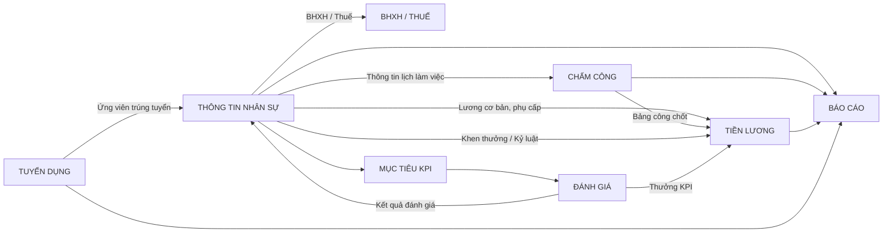

# BUSINESS ARCHITECTURE & ORGANIZATIONAL STRUCTURE

**Dự án:** Hệ thống quản trị nguồn nhân lực (HRM) - Ứng dụng tại Công ty TNHH LLA

---

## 1. Mục đích tài liệu

Tài liệu này mô tả kiến trúc nghiệp vụ tổng thể của hệ thống HRM, bao gồm:
- Cấu trúc tổ chức doanh nghiệp
- Danh sách tác nhân sử dụng hệ thống
- Mô hình quản lý nhân sự và vòng đời nhân viên
- Các miền nghiệp vụ chính
- Mối quan hệ giữa các thực thể nghiệp vụ
- Luồng khởi tạo hệ thống

Tài liệu là cơ sở để xây dựng BRD, Use Case Diagram, Activity Diagram và ERD.

---

## 2. Kiến trúc tổ chức doanh nghiệp

Hệ thống được thiết kế cho Công ty TNHH LLA, với cơ cấu tổ chức linh hoạt đặc thù của công ty công nghệ.

### 2.1 Cấu trúc phân cấp

```
Enterprise (Doanh nghiệp)
  → Department (Phòng ban / Ban / Trung tâm)
    → Position (Chức vụ / Vị trí công việc)
      → Employee (Nhân viên)
```

### 2.2 Mô tả

| Cấp        | Mô tả                                                                    | Ví dụ                  |
| ---------- | ------------------------------------------------------------------------ | ---------------------- |
| **Enterprise** | Thực thể cao nhất đại diện cho công ty, nơi quản lý toàn bộ cấu hình hệ thống. | Công ty TNHH LLA     |
| **Department** | Đơn vị nghiệp vụ, phòng ban, trung tâm trực thuộc công ty.          | Delivery (Dev, QA, BA), PMO, Infra, HR, BOD |
| **Position** | Chức danh, vị trí công việc cụ thể nằm trong một phòng ban.               | Developer, QA/Tester, Business Analyst, PM, DevOps |

---

## 3. Danh sách Actor (Tác nhân)

### 3.1 Admin (Internal Portal)
- **Vai trò:** Quản trị viên hệ thống (IT Admin / System Admin).
- **Quyền hạn:**
  - Quản lý cấu hình toàn hệ thống (Thiết lập email, cấu hình chung).
  - Quản lý cơ cấu tổ chức (Tạo Department, Position).
  - Tạo và phân quyền tài khoản cho người dùng (Role Management).
  - Khóa/mở khóa tài khoản.

### 3.2 HR & C&B (Internal Portal)
- **Vai trò:** Chuyên viên nhân sự, tiền lương.
- **Quyền hạn:**
  - Tuyển dụng (tạo yêu cầu, đăng tin, sàng lọc, PV, offer).
  - Onboarding, tạo hồ sơ nhân viên mới, ký hợp đồng.
  - Xử lý điều chuyển, thăng tiến, nghỉ việc.
  - Quản lý chính sách BHXH, thuế TNCN.
  - Quản lý ca làm việc, tổng hợp công.
  - Chạy động cơ tính lương, tính phụ cấp, khấu trừ, chốt lương.

### 3.3 Manager (Internal Portal)
- **Vai trò:** Quản lý trực tiếp của một nhóm/phòng ban.
- **Quyền hạn:**
  - Xem dashboard nhân sự của team mình.
  - Duyệt yêu cầu tuyển dụng cho team.
  - Duyệt đơn nghỉ phép, đơn làm thêm giờ (OT) của nhân viên cấp dưới.
  - Giao mục tiêu (KPI) và đánh giá KPI cuối kỳ cho nhân viên.
  - Đánh giá năng lực sau thời gian thử việc.

### 3.4 Employee (Employee Portal)
- **Vai trò:** Cán bộ nhân viên của Công ty TNHH LLA.
- **Quyền hạn:**
  - Xem và cập nhật hồ sơ cá nhân.
  - Chấm công (Check-in/Check-out).
  - Gửi đơn xin nghỉ phép, xin đi muộn/về sớm, đơn OT.
  - Xem bảng công, phiếu lương (Payslip).
  - Xem và cập nhật tiến độ KPI cá nhân.

### 3.5 Candidate (Candidate Portal - External)
- **Vai trò:** Ứng viên bên ngoài.
- **Quyền hạn:**
  - Đăng ký tài khoản ứng viên.
  - Xem tin tuyển dụng, nộp CV ứng tuyển.
  - Theo dõi trạng thái hồ sơ ứng tuyển.
  - Xem lịch phỏng vấn và phản hồi Offer Letter.

---

## 4. Kiến trúc nhân sự cốt lõi

Thay vì sử dụng mô hình phức tạp phân tách `Person` và `Employment` (chỉ phù hợp cho Đa công ty), hệ thống này tối ưu hóa kiến trúc bằng cách gộp thành thực thể **Employee** duy nhất, gắn chặt với vòng đời làm việc tại LLA.

### 4.1 Khái niệm Employee
**Employee** đại diện cho một hồ sơ nhân sự toàn diện. Dữ liệu của một Employee bao gồm:
- **Thông tin cá nhân (Personal Info):** Họ tên, Ngày sinh, CCCD, Email cá nhân, SĐT, Địa chỉ, Thông tin giảm trừ gia cảnh, TK Ngân hàng.
- **Thông tin công việc (Employment Info):** Mã nhân viên, Ngày gia nhập, Department, Position, Trạng thái làm việc (Thử việc, Chính thức, Đã nghỉ việc), Quản lý trực tiếp (ManagerID).

Mỗi nhân sự chỉ có một hồ sơ `Employee` duy nhất. Lịch sử thay đổi chức vụ, phòng ban, lương sẽ được lưu trong bảng lịch sử riêng.

---

## 5. Employee Lifecycle (Vòng đời nhân viên)

Hệ thống tự động hóa toàn bộ vòng đời nhân viên theo luồng sau:

```
Candidate (Ứng viên)
  ↓
Interview (Phỏng vấn)
  ↓
Offer (Mời nhận việc)
  ↓
Hired (Đồng ý nhận việc)
  ↓
Onboarding (Tiếp nhận & Cấp phát tài sản)
  ↓
Probation (Thử việc - tạo Employee profile)
  ↓
Probation Evaluation (Đánh giá thử việc)
  ↓
Active Employee (Nhân viên chính thức)
  ↓
Transfer / Promotion (Điều chuyển / Thăng tiến)
  ↓
Resignation (Nghỉ việc & Thu hồi tài sản)
  ↓
Inactive (Khóa tài khoản)
```

---

## 6. Các Domain Nghiệp vụ chính

| Domain                               | Quản lý                                                               |
| ------------------------------------ | --------------------------------------------------------------------- |
| **Domain 1: Organization**           | Department, Position                                                  |
| **Domain 2: Recruitment**            | Job Requisition, Candidate, Interview, Offer, Candidate Portal        |
| **Domain 3: Core HR**                | Employee Profile, Contract, Decision, Onboarding, Offboarding         |
| **Domain 4: Attendance**             | Shift (Ca làm việc), Check-in/out, Overtime (OT), Attendance Record   |
| **Domain 5: Leave Management**       | Leave Policy, Leave Request, Leave Balance (Quỹ phép)                 |
| **Domain 6: Performance (KPI)**      | KPI Template, KPI Assignment, KPI Evaluation                          |
| **Domain 7: Payroll & Tax**          | Salary Component, Payroll Engine, Payslip, Tax, Social Insurance      |
| **Domain 8: Asset & Document**       | Asset Catalog, Asset Assignment, Document Upload                      |
| **Domain 9: System & RBAC**          | User Account, Role, Permission, System Config, Notification           |
| **Domain 10: Reporting**             | HR Dashboard, Headcount Report, Payroll Report                        |

---

## 7. Kiến trúc nghiệp vụ tổng thể (Thực thể)

Mối quan hệ cốt lõi của các thực thể trong hệ thống:

```
Enterprise
  │
  ├── Department
  │     └── Position
  │           └── Employee (Liên kết với 1 User Account)
  │                 ├── Contract (Hợp đồng)
  │                 ├── Attendance (Dữ liệu chấm công hàng ngày)
  │                 ├── Leave Request (Đơn xin nghỉ phép)
  │                 ├── KPI (Mục tiêu đánh giá)
  │                 └── Payslip (Phiếu lương hàng tháng)
```

Tất cả các nghiệp vụ phát sinh (Chấm công, Lương, Phép) đều quy tụ về trung tâm là thực thể `Employee`.

---

## 8. Luồng khởi tạo hệ thống (System Bootstrapping)

Hệ thống được khởi tạo theo trình tự logic để đảm bảo dữ liệu danh mục có sẵn trước khi tạo hồ sơ nhân viên.

### 8.1. Luồng chi tiết

**Bước 1 — System Admin cấu hình danh mục:**
Người quản trị hệ thống (Admin) đăng nhập bằng tài khoản Root mặc định:
- Cấu hình sơ đồ tổ chức: Tạo các Phòng ban (Department) và Chức vụ (Position).
- Cấu hình danh mục hệ thống: Định nghĩa các Ca làm việc (Shift), Loại nghỉ phép (Leave Type), Loại phụ cấp.
- Phân quyền: Tạo tài khoản cho nhân sự HR & C&B.

**Bước 2 — HR & C&B nhập liệu nhân sự:**
HR & C&B đăng nhập và bắt đầu nhập liệu (hoặc import từ Excel):
- Cập nhật hồ sơ nhân sự hiện tại (Tạo Employee profile).
- Gán nhân sự vào Phòng ban và Chức vụ tương ứng.
- Cấu hình thông tin lương cơ bản, bảo hiểm cho từng người.
- Hệ thống tự động sinh tài khoản User cho Employee và gửi email kích hoạt.

**Bước 3 — Nhân viên & Quản lý vận hành hàng ngày:**
- Manager đăng nhập để thấy danh sách nhân viên thuộc quyền quản lý của mình.
- Employee đăng nhập bằng tài khoản được cấp để tự check-in, xin nghỉ, xem lương.

---

## 9. End-to-End Integration Map (Luồng tích hợp dữ liệu)

Dữ liệu trong hệ thống được thiết kế để chảy xuyên suốt qua các module theo mô hình Data-Centric, lấy `Employee` làm trung tâm:



---

## 10. Core Master Data (Dữ liệu danh mục lõi)

Hệ thống yêu cầu thiết lập các nhóm Master Data sau trước khi vận hành các quy trình nghiệp vụ:

| Nhóm | Dữ liệu cần thiết lập (Master Data) |
|---|---|
| **Organization (Tổ chức)** | Sơ đồ phòng ban (Department), Chức vụ (Position), Chức danh (Job Title). |
| **Contract (Hợp đồng)** | Loại hợp đồng (Contract Type). |
| **Attendance (Chấm công)** | Ca làm việc (Shift), Loại ngày nghỉ (Leave Type), Chính sách nghỉ phép. |
| **Payroll (Tiền lương)** | Thành phần lương (Salary Component), Loại phụ cấp, Loại khấu trừ, Công thức lương. |
| **Performance (Đánh giá)** | Tiêu chí đánh giá, Chu kỳ đánh giá. |
| **Compliance (Tuân thủ)** | Tỷ lệ đóng BHXH, Biểu thuế TNCN lũy tiến. |
