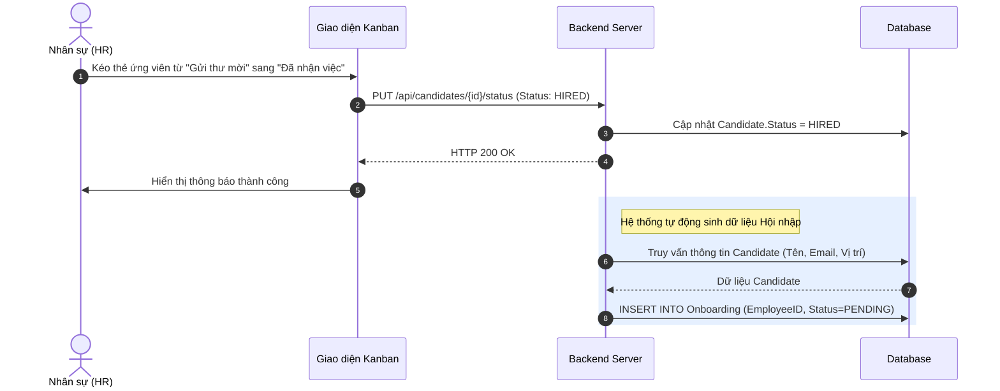
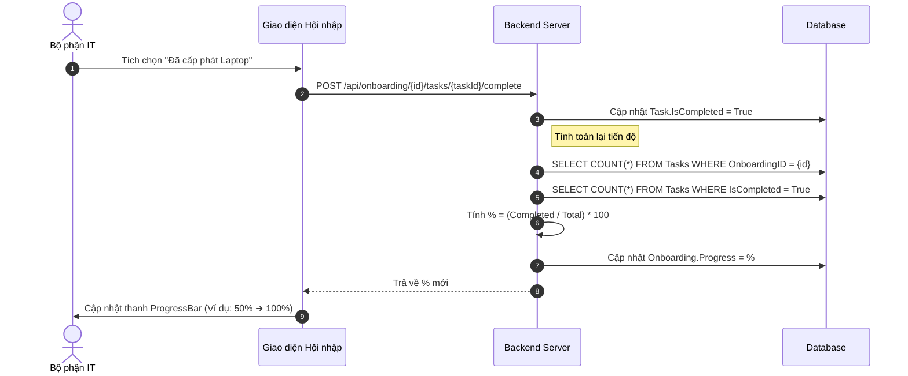
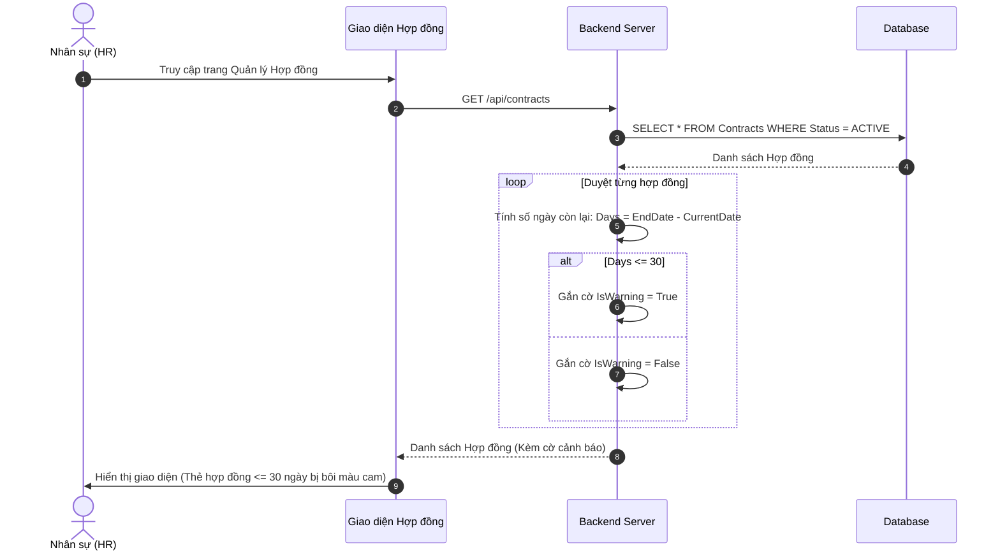
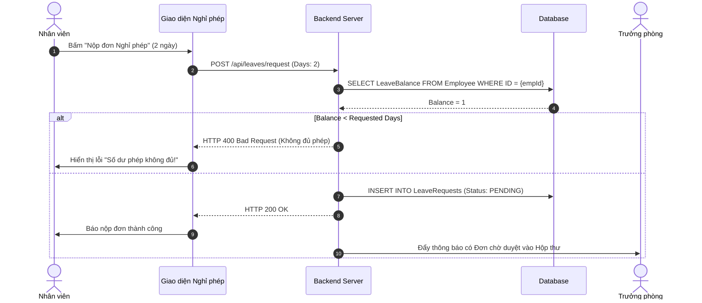
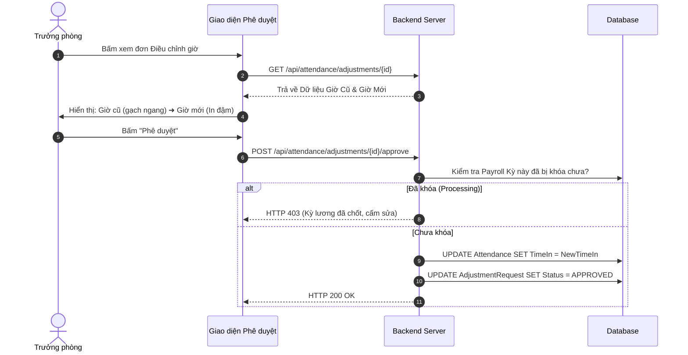
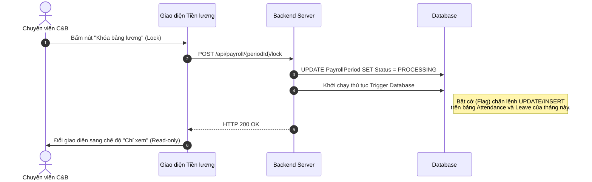
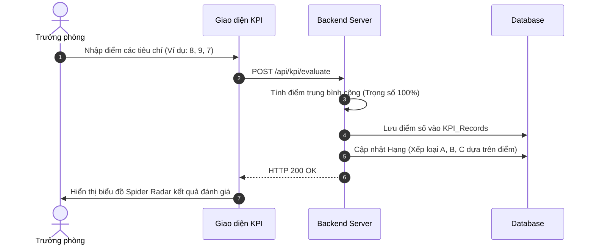
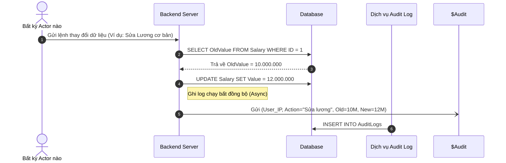

# ĐẶC TẢ CHI TIẾT NGHIỆP VỤ & SƠ ĐỒ TUẦN TỰ (SEQUENCE DIAGRAMS)
**Dự án:** Quản trị Nhân sự Tổng thể (Enterprise HRM Portal)

Tài liệu này đặc tả luồng xử lý dữ liệu chi tiết của 8 phân hệ cốt lõi trong hệ thống. Sơ đồ tuần tự (Sequence Diagram) minh họa sự tương tác giữa Người dùng (Actor), Giao diện (Frontend), Hệ thống máy chủ (Backend), và Cơ sở dữ liệu (Database).

---

## 1. Phân hệ Tuyển dụng (ATS Kanban)

**Mô tả nghiệp vụ:** Luồng luân chuyển thẻ ứng viên qua các vòng phỏng vấn. Khi ứng viên chấp nhận thư mời nhận việc (Hired), hệ thống tự động sinh hồ sơ bên phân hệ Hội nhập.

---

## 2. Phân hệ Hội nhập (Onboarding)

**Mô tả nghiệp vụ:** Quá trình chuẩn bị đón nhân sự mới. Thanh tiến độ (ProgressBar) tự động cập nhật phần trăm khi IT/HR hoàn thành các tác vụ yêu cầu.

---

## 3. Phân hệ Hợp đồng & Cảnh báo

**Mô tả nghiệp vụ:** Khi người dùng truy cập màn hình Hồ sơ, hệ thống tự động quét và đánh dấu cảnh báo màu cam đối với các hợp đồng sắp hết hạn (<= 30 ngày).

---

## 4. Phân hệ Nghỉ phép (Leave Management)

**Mô tả nghiệp vụ:** Nhân viên nộp đơn xin nghỉ, hệ thống kiểm tra số dư phép trước khi gửi cho Trưởng phòng phê duyệt.

---

## 5. Phân hệ Chấm công (Điều chỉnh giờ)

**Mô tả nghiệp vụ:** Luồng xử lý khi nhân viên gửi đơn xin sửa giờ chấm công do bị lỗi hoặc quên quẹt thẻ.

---

## 6. Phân hệ Tiền lương (Quy trình Khóa sổ)

**Mô tả nghiệp vụ:** Hành động quan trọng nhất của phân hệ Lương. Chuyên viên C&B chốt dữ liệu để chuẩn bị chuyển khoản, cấm mọi hành vi sửa công.

---

## 7. Phân hệ Đánh giá KPI

**Mô tả nghiệp vụ:** Trưởng phòng tiến hành chấm điểm hiệu suất của nhân viên cuối kỳ.

---

## 8. Phân hệ Hệ thống (Nhật ký kiểm toán / Audit Logs)

**Mô tả nghiệp vụ:** Bất kể hệ thống nào thay đổi dữ liệu nhạy cảm (như Tiền lương, Cấp quyền), hệ thống sẽ ngầm (background) ghi vết lại IP và dữ liệu thay đổi.

